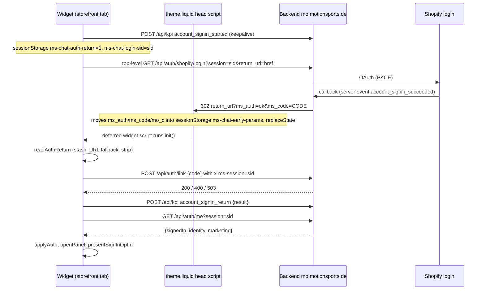
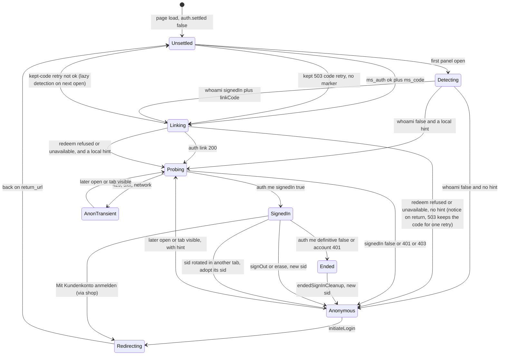

# 04 — Customer accounts, sign-in and consent

This chapter covers everything the Mo widget does about **who the visitor is** and **what they agreed to**. That includes the three identity tiers and how the widget picks one, every "Anmelden" entry point and the full sign-in round trip with the one-time code, shop recognition through `/apps/chat/whoami`, the signed-in account UI (history, export, erase, sign-out) with its cleanup rules, the anonymous sign-in popup, and every marketing-consent surface. For consent it also shows how the legal golden rules are enforced in code.
It describes `main` at `8d0a0c4`: PR #73 "customer platform" (`a0df103`, merged) plus five follow-up fixes. **PR #73 is live since 2026-10-04**; the `8d0a0c4` fixes are not uploaded yet (see §16).
Backend behaviour is not re-specified. Cross-references use these abbreviations (all paths are in the backend repo `4motionsports-gmbh/mo`):
`API §n` = `docs/API_CONTRACT.md` · `CA §n` = `docs/frontend-handoff/CUSTOMER_ACCOUNT.md` · `CF §n` = `docs/frontend-handoff/CONSENT_FLOW.md` · `COS` = `docs/frontend-handoff/CHAT_ORDER_STATUS.md` · `FP task n` = `docs/frontend-handoff/FRONTEND_PROMPT_2026-10.md`.
Code locations are given as `ms-chat-widget.js → function / KEY`. Line numbers are left out on purpose because they drift. The widget file is `assets/ms-chat-widget.js` throughout.

**Contents**

1. [At a glance](#1-at-a-glance)
2. [Identity tiers and how the widget decides](#2-identity-tiers-and-how-the-widget-decides)
3. [Sign-in entry points](#3-sign-in-entry-points)
4. [The sign-in round trip](#4-the-sign-in-round-trip)
5. [Shop recognition via `/apps/chat/whoami`](#5-shop-recognition-via-appschatwhoami)
6. [Auth state diagram](#6-auth-state-diagram)
7. [Signed-in UI](#7-signed-in-ui)
8. [Cleanup and safety rules](#8-cleanup-and-safety-rules)
9. [The sign-in popup (`presentLoginGate`)](#9-the-sign-in-popup-presentlogingate)
10. [Consent surfaces](#10-consent-surfaces)
11. [Legal golden rules as enforced in code](#11-legal-golden-rules-as-enforced-in-code)
12. [Storage keys in scope](#12-storage-keys-in-scope)
13. [Network calls and data leaving the browser](#13-network-calls-and-data-leaving-the-browser)
14. [KPI events in scope](#14-kpi-events-in-scope)
15. [DOM hooks](#15-dom-hooks)
16. [Operational status and dependencies](#16-operational-status-and-dependencies)
17. [Implications for backend decisions and KPI work](#17-implications-for-backend-decisions-and-kpi-work)
18. [Known issues and risks found while documenting](#18-known-issues-and-risks-found-while-documenting)
19. [Open questions / uncertainties](#19-open-questions--uncertainties)

---

## 1. At a glance

| Topic | Fact (from code) |
|---|---|
| Identity reference | The device's session id `sid` (`localStorage['ms-chat-sid']`) **is** the link to the signed-in customer. It is never rotated around sign-in. It is rotated on sign-out, on erase, when the server says a sign-in has ended, on anonymous "Neuen Chat starten", and by the campaign deep link `?mo=open&mo_new=1` when there is no sign-in hint (`handleMoDeepLink`; with a hint the sid is kept and only the local thread is dropped). |
| Tokens | The widget never sees OAuth tokens, the customer's e-mail, address or orders. Identity comes only from `GET /api/auth/me` (name, tier, marketing state). |
| Sign-in mechanic | Top-level redirect to `{apiBase}/api/auth/shopify/login?session=&return_url=`. The return carries `?ms_auth=ok&ms_code=…`, and the widget must redeem `ms_code` at `POST /api/auth/link` before the chat counts as signed in (since 2026-10-03, CA §2a). |
| Shop recognition | Same-origin `GET /apps/chat/whoami?session=` runs **once per tab session** (sessionStorage) on first panel open. Its `linkCode` is redeemed the same way. The App Proxy is **not set up yet**, so today it is a silent no-op. Since PR #73 went live (2026-10-04) it may be set up; confirm first that live runs the PR #73 code (§16). |
| Anonymous ask | One **sign-in popup** per tab session, decided ~0.7 s after a send while the reply is still streaming (§9.1). "Später" snoozes it for 24 h. There is no anonymous e-mail consent gate any more. |
| Signed-in ask | One **marketing consent popup** (served `surface=signin` copy, button-consent), or the **inline opt-in card** after a mid-conversation sign-in. Shown only when `/api/auth/me` says `marketing.optInActionable === true`. A decline is remembered for 30 days on the device, a dismissal for the tab session. |
| Anonymous / email-only capture | The two-checkbox capture form (`offer_email_summary` tool card or the header "Per E-Mail teilen"). It is suppressed for signed-in customers. |
| Consent text | Always backend-served and rendered verbatim. `consentTextShown` is echoed byte-for-byte. Nothing is pre-selected, and decline is as reachable as accept. |
| Current live status | PR #73 is merged and was uploaded to the live theme on 2026-10-04, so sign-in in the live chat **works again** (the live widget now redeems `ms_code`), pending a real check on live by the backend. Between the backend change of 2026-10-03 and that upload, live sign-ins were never linked. See §16. |

**"Session" in this chapter.** Every "once per session" rule below is stored in `sessionStorage` (`ssGet` / `ssSet`), which is **per top-level tab**, not per browser session. The `sid` lives in localStorage and is shared by all tabs of the device. So a new tab starts with empty flags: it runs whoami again (today one more storefront 404 fetch) and can show the sign-in or consent popup again under the **same sid**. One `sid` can therefore carry several `login_gate_shown` / `consent_gate_shown` events (see also `05-engagement-and-kpi.md` §3.2).

---

## 2. Identity tiers and how the widget decides

### 2.1 The three tiers

| Tier | How a visitor gets there | What the widget holds | What it changes |
|---|---|---|---|
| **1 — anonymous** | Default. | `sid` only. | Welcome sign-in card, header "Anmelden", sign-in popup, capture form allowed. |
| **2 — email-only** | Successful `POST /api/capture-email` in **this page view** (`buildCaptureCard` → `capturedEmail = email`). | `capturedEmail` **in memory only**. A navigation, reload, sign-out or erase drops it (`dropSessionHistory`). | `/api/chat` body gets `customer: { email }` (returning-customer memory, API §2). Feedback gets `tier: 'email'` + `email`. Otherwise the UI is the same as tier 1 (the auth UI does not know about tier 2). |
| **3 — signed in** | `/api/auth/me` answers `signedIn: true` after a redeemed code (chat sign-in or whoami). | `auth = { settled, signedIn, name, tier, marketing, optInActionable }` + device hints (§12). | Name pill, history drawer, summary download, export / erase, `conversationKey` on `/api/chat`, consent popup / inline card. The capture form and "Per E-Mail teilen" are suppressed. |

The widget does **not** gate tier-3 behaviour on `auth.tier === 3`. Everything keys off `auth.signedIn` (`applyAuth` stores `identity.tier` or defaults to `3`, but nothing reads it). In practice that is the same thing (CA §6.0).

**Edge case: a signed-in customer with a typed e-mail.** `buildCaptureCard` sets `capturedEmail = email` on any 2xx without checking `auth.signedIn`. A signed-in customer reaches that form through the 422 `no_verified_email` fallback (`presentConsentGate` / `buildMarketingOptInCard` → `openCaptureForm()`) or the public hook `window.MS_CHAT.openEmailSummary`. After such a submit, the **typed** address is sent to `/api/capture-email` and, for the rest of the page view, also as `customer.email` on every `/api/chat` and as `email` on `/api/feedback` (with `tier: 'signed-in'`, because `feedbackTier()` checks `auth.signedIn` first). The account e-mail itself is never sent.

### 2.2 The `auth` object (`ms-chat-widget.js → var auth`, `applyAuth()`)

| Field | Source | Notes |
|---|---|---|
| `settled` | Set `true` by every `applyAuth` call. | While `false`, neither the "Anmelden" pill nor the welcome sign-in card is shown, and no popup is decided. |
| `signedIn` | `/api/auth/me` → `signedIn`. | Fails closed. Any error means `false`. |
| `name` | `identity.name`. | Can be `null`. The pill then shows "Konto" / "Account". |
| `tier` | `identity.tier` or `3`. | Informational only. |
| `marketing` | `/api/auth/me` → `marketing` object. | Kept verbatim. |
| `optInActionable` | `marketing.optInActionable === true`. | Trusted verbatim, never re-derived from `status` (CA §4). |

`applyAuth(data, transient)` always calls `reflectAuthState()` (header, share button, welcome slot, account-menu sign-in link, closes the drawer when not signed in) and `flushAutoHistory()`.

### 2.3 When detection runs

| Moment | Code path | Network |
|---|---|---|
| Page load **with** `?ms_auth=` (or the stash) | `init → handleAuthReturn` (§4) | `/api/auth/link`, then `/api/auth/me` |
| Page load **without** a marker, but a kept 503 code | `handleAuthReturn → retryPendingLink` | `/api/auth/link` (+ `/api/auth/me` on success) |
| Page load, nothing pending | No detection at all. `auth.settled` stays `false` until the panel opens. | none |
| **First panel open** of the page | `openPanel → resolveAuthOnOpen → detectSignedIn()` | whoami (once per tab session), then `/api/auth/me` **only if** a hint exists (`shouldProbeAuth`) |
| Later panel opens (not signed in) | `resolveAuthOnOpen → detectSignedIn(true)` | whoami is skipped (flag set). `/api/auth/me` only with a hint. |
| Tab becomes visible, panel open, not signed in, no redeem running | `visibilitychange` handler in `buildShell → detectSignedIn(true)` | Same as a later open |
| Already signed in | `resolveAuthOnOpen` returns immediately | none |

`shouldProbeAuth()` is true when `localStorage['ms-chat-signed-in'] === '1'` (set by any earlier signed-in answer on this device) **or** `ShopifyAnalytics.meta.page.customerId` is present (the shop's own login, a best-effort hint only). A pure anonymous visitor with no hint makes **no** `/api/auth/me` call. It becomes "settled anonymous" right after whoami resolves.

Consequence: for every visitor, the welcome sign-in card and the "Anmelden" pill appear only after the whoami round trip on first open. Today that round trip fetches Shopify's full 404 HTML page (§5.4).

### 2.4 `detectSignedIn(force)` decision order

1. If a whoami chain is in flight (`whoamiInflight`), wait for it and decide nothing else (no race).
2. `detectViaStorefront()`. If it resolves `true`, the visitor is signed in (it already probed `/api/auth/me`).
3. Otherwise, if `shouldProbeAuth()`, call `probeAuth(force)`.
4. Otherwise `applyAuth(null)`, which settles anonymous **definitively** (also deletes the device hints).

### 2.5 Transient vs definitive answers (`probeAuth`)

| `/api/auth/me` outcome | Classified as | UI | Device hints (`ms-chat-signed-in`, `ms-chat-auth-via:<sid>`) | Cleanup |
|---|---|---|---|---|
| 200 `signedIn: true` | signed in | signed-in UI | `ms-chat-signed-in = '1'` | — |
| 200 `signedIn: false`, or 401 / 403 / other 4xx | **definitive** not signed in | anonymous | deleted | If the device **was** signed in (`auth.signedIn` or the hint), `endedSignInCleanup()` wipes the local history and rotates `sid` (§8). |
| 429, 5xx, network error, unparsable JSON | **transient** | anonymous (fails closed) | **kept**, so the next open re-probes | none |
| Answer arrives after `sid` changed | ignored (**success path only**: the `sid !== reqSid` check sits in the success `.then`) | — | — | — |
| Network / JSON-parse failure arrives after `sid` changed | still applied: the `.catch` calls `applyAuth(null, true)` without a sid check | transient anonymous, applied to the **new** session's UI | kept | none |

`probeAuth` without `force` runs at most once per page load (`authProbed`). Every call path above passes `force = true` except the very first open.

---

## 3. Sign-in entry points

All of them call `initiateLogin(source)`. Only the popup passes a `source`.

| # | Entry point | Element / selector | Visible when | `account_signin_started.data` | Code |
|---|---|---|---|---|---|
| 1 | **Welcome card** "Hol mehr aus deiner Beratung" → button **"Jetzt anmelden"** | `.ms-chat-signin-card .ms-chat-signin-cta` inside `.ms-chat-welcome-auth` | Empty conversation (welcome state) **and** `auth.settled && !auth.signedIn` | `{}` | `buildSignInCard`, `updateWelcomeAuth` |
| 2 | **Header pill "Anmelden"** (aria "Mit Konto anmelden") | `.ms-chat-signin-btn` (+ `--visible`) | `auth.settled && !auth.signedIn`, any conversation state | `{}` | `buildShell`, `reflectAuthState` |
| 3 | **Sign-in popup** button "Anmelden" | `.ms-chat-gate .ms-chat-gate-accept` | §9 eligibility | `{ source: 'login_gate' }`, preceded by `login_gate_signin_clicked` | `presentLoginGate` |
| 4 | **Account menu "Mit Kundenkonto anmelden"** | `.ms-chat-history-foot .ms-chat-history-link` (first link) | Signed in **and** `ms-chat-auth-via:<sid> === 'shop'` (recognised through whoami only) | `{}` | `buildHistoryDrawer`, `updateShopSignInBtn` |
| 5 | **Link-failed notice** "Die Anmeldung ist abgelaufen — bitte melde dich erneut an." → button "Anmelden" | `.ms-chat-notice` above the composer | After a refused redeem on return (§4.4) | `{}` | `showLinkFailedNotice(false)` |

The welcome card copy (UI chrome, `ACCOUNT_COPY`) is:
"Hol mehr aus deiner Beratung" / "Mit deinem motion sports Konto wird Mo zu deinem persönlichen Berater:" / bullets "An frühere Beratungen anknüpfen", "Bestellungen & Adresse einbeziehen", "Persönliche Angebote & Aktionen zuerst sehen" / button "Jetzt anmelden" / hint "Kein Konto? Einfach lostippen — Mo hilft dir sofort."

KPI limitation: `source` is set **only** for the popup (the code comment cites API §5: "source only when it came from the popup"). The welcome card, header, account menu and notice cannot be told apart in the KPI data. See §17.

---

## 4. The sign-in round trip

### 4.1 Sequence

### 4.2 `initiateLogin(source)`

1. `track('account_signin_started', source ? {source} : {})`. The `fetch` uses `keepalive: true` and is dispatched before `location.assign()` as a best effort. It is a cross-origin request with `Content-Type: application/json` and `x-ms-session`, so it needs a CORS preflight. Whether a preflighted keepalive request survives the navigation depends on the browser and is **not verified**. `05-engagement-and-kpi.md` (§2.2 and its open questions) describes how to detect loss: compare `login_gate_signin_clicked` vs `account_signin_started` vs `account_signin_succeeded` per session.
2. `sessionStorage['ms-chat-auth-return'] = '1'`, which tells the return to re-open the panel.
3. `sessionStorage['ms-chat-login-sid'] = sid` **pins the sid** this login used.
4. `window.location.assign(apiBase + '/api/auth/shopify/login?session=<sid>&return_url=<window.location.href>')`. This is a top-level navigation: no popup window, no XHR, no `prompt=none`.

The KPI `sessionId`, the `session` URL parameter and the later `x-ms-session` on `/api/auth/link` are the same `sid`. The admin "Anmelde-Popup" funnel joins on it (API §5).

`return_url` is the full current URL (`window.location.href`), including any query string still present. `ms_auth`, `ms_code` and `mo_c` are always stripped by then (head script, `readAuthReturn`, `captureCampaignToken`). `mo`, `mo_new` and `mo_view` are stripped only together with `mo=open` / `#mo-open` (`handleMoDeepLink` returns early otherwise). Any other query parameters (`utm_*` etc.) stay in `return_url`. The backend only accepts allow-listed storefront origins (CA §2).

### 4.3 Getting the code off the address bar

| Step | Where | What |
|---|---|---|
| 1 | `layout/theme.liquid` inline `<head>` script. It is rendered only when `settings.ai_advisor_enabled` and runs **before** `content_for_header`. | Moves `ms_auth`, `ms_code`, `mo_c` into `sessionStorage['ms-chat-early-params'] = {at, ms_auth?, ms_code?, mo_c?}` and calls `history.replaceState`, so Shopify analytics / Customer Events web pixels never see the code in a page URL. If sessionStorage can't be written, the URL is left alone. |
| 2 | `ms-chat-widget.js → earlyParam(name)` | Reads the stash **once**, deletes it on read, and honours it only if it is younger than 10 min (`LINK_RETRY_MAX_MS`). |
| 3 | `readAuthReturn()`, the second call in `init()` (after `captureCampaignToken`) | Takes `ms_auth` / `ms_code` from the stash, or from the URL as a fallback (theme without the head script). Strips both from the URL. Keeps them in memory only. |
| 4 | `handleAuthReturn()`, near the end of `init()` | Consumes them exactly once. |

### 4.4 `handleAuthReturn()` per marker

Any non-empty marker (`ok`, `login_required`, `logged_out`, `error`, anything else) first deletes a kept 503 code (`ssDel(LINK_RETRY_KEY)`, "a fresh return supersedes any older kept code"), before the branches below.

| `ms_auth` | Widget action | `account_signin_return` | Panel |
|---|---|---|---|
| *(none)* | `retryPendingLink()` (§4.6) | none | unchanged |
| `ok` | Redeems `ms_code` (§4.5) **unless** `ms-chat-login-sid` exists and differs from the current `sid` (treated as refused). | `ok` **after** a 200 redeem; otherwise `link_failed` | Opens if `ms-chat-auth-return` was set or the result is signed in |
| `ok` → redeem not ok | Kept code on 503 (§4.6). Settles via `probeAuth(true)` if `shouldProbeAuth()` (so an earlier valid 'shop' link of this sid is not undone), else `applyAuth(null)`. Then `showLinkFailedNotice(unavailable)`, **whatever the settle returned**. If the probe finds the sid already signed in (an earlier `'shop'` link), the visitor stays signed in, but the "abgelaufen" notice and its "Anmelden" button are still shown next to the signed-in UI. `presentSignInOptIn` is not called on this path. | `link_failed` | Opens only if `ms-chat-auth-return` was set |
| `ok` → redeem ok | `probeAuth(true)`, then `openPanel()`, then `presentSignInOptIn()` if signed in (§10.3) | `ok` | Opens |
| `login_required` | `applyAuth(null)`. Only the `prompt=none` flow produces this, and **the widget never starts `prompt=none`**, so the branch is effectively dead. Settles anonymous definitively without probing (see the note below the table). | `login_required` | Opens if requested |
| `logged_out` | Sets the whoami-done flag. Probes `/api/auth/me` if there is a hint (the probe's own cleanup decides whether history is wiped; the marker alone proves nothing), else `applyAuth(null)`. **The widget never sends anyone to the backend logout** (§7.8), so this only fires for links made elsewhere. | none | unchanged |
| `error` / anything else | `applyAuth(null)`. Settles anonymous definitively without probing (see the note below). | `error` | Opens if requested |

**`error` / `login_required` on an already signed-in sid.** Unlike the `link_failed` path, these two branches call a definitive `applyAuth(null)` without checking `shouldProbeAuth()`. A sid can already be signed in when it starts a login: a shop-recognised visitor using "Mit Kundenkonto anmelden" (§3 #4), or a visitor who clicks "Anmelden" in the "abgelaufen" notice shown next to the signed-in UI (row "redeem not ok" above). If that login returns `?ms_auth=error`, the visitor is shown as anonymous and loses `ms-chat-signed-in` and `ms-chat-auth-via:<sid>`. No `endedSignInCleanup` runs, so the local history stays, and the server link of the sid still resolves. On later opens in that tab whoami is skipped (its flag is normally already set for a `'shop'` visitor), so `/api/auth/me` is re-probed only if the `ShopifyAnalytics` customer hint is present (§2.3). Without that hint the sid stays shown as anonymous for the tab session. See §18.

Notice copy (`showLinkFailedNotice`), widget chrome:
- refused: "Die Anmeldung ist abgelaufen — bitte melde dich erneut an." + button "Anmelden" (starts a **new** login with the same sid)
- unavailable (503 / network): "Die Anmeldung ist gerade nicht möglich — wir versuchen es beim nächsten Seitenaufruf noch einmal." (no button)

`account_signin_return: ok` means the redeem returned 200. If the following `/api/auth/me` probe fails transiently, the UI still shows anonymous for this page view (§18).

### 4.5 Redeem rules (`redeemLinkCode(code, kind)`)

`POST {apiBase}/api/auth/link`, body `{ "code": "<code>" }`, headers `x-ms-chat-key`, `x-ms-session: sid`, `x-ms-locale`, `Content-Type: application/json` (CA §2a).

| Response | Result | Effect |
|---|---|---|
| 200 with body `signedIn !== false` | `'ok'` | `setAuthVia(kind)` stores `'chat'` or `'shop'` |
| 200 with body `signedIn: false` | `'refused'` | — |
| 400 / other 4xx | `'refused'` | Never retried, never with another sid |
| 503, 429, other 5xx, network error | `'unavailable'` | Kept for one retry (§4.6) |
| `code` missing / empty | `'refused'` | `ms_auth=ok` without `ms_code` = `link_failed` |

The function never rejects. The backend writes `account_signin_linked` / `account_signin_link_refused` itself (API §5). The widget never sends them.

### 4.6 One retry after a 503 (`retryPendingLink`)

- Stored in `sessionStorage['ms-chat-link-retry'] = {code, sid, at, kind?}`, **never** in localStorage, because it is a short-lived credential.
- Written by `handleAuthReturn` (kind omitted, so the retry uses `'chat'`) and by the whoami chain (`kind: 'shop'`).
- Read on the **next page load without a marker** in the same tab and deleted on read. It is used only if `p.sid === sid` and it is younger than 10 min.
- Silent: no notice and no second `account_signin_return`. On `'ok'` it runs `probeAuth(true)`. Anything else falls back to normal lazy detection on the next open.

### 4.7 Login-sid mismatch

If another tab rotated the device's `sid` while this tab was at Shopify (sign-out, erase, anonymous new chat), the returning tab's `sid` no longer equals `ms-chat-login-sid`. The code is **not** redeemed. The result is `link_failed` with the "abgelaufen" notice. The backend would refuse a mismatched session anyway (`session_mismatch`, API §5). If `ms-chat-login-sid` is missing (for example the return landed in a different tab), the widget redeems with its current `sid` and the backend decides.

### 4.8 `authLinkInflight`

While a redeem + probe chain runs, `resolveAuthOnOpen` waits for it instead of starting a second detection, and the `visibilitychange` re-detect is skipped.

---

## 5. Shop recognition via `/apps/chat/whoami`

### 5.1 Purpose

This recognises a customer who logged in with the **shop's own** account icon (`sections/header.liquid` → `routes.account_url`). `/api/auth/me` alone can never see that login. Contract: CA §3a, FP task 5.

### 5.2 Request (`detectViaStorefront`)

- `GET /apps/chat/whoami?session=<sid>`. The path comes from `CFG.whoamiPath`, default `/apps/chat/whoami`; the snippet does not set `whoamiPath`, so the default is used. The call is **same-origin**: no `apiBase` and no `x-ms-chat-key`, because Shopify's App Proxy HMAC is the guard. It sends `credentials: 'include'` and `Accept: application/json`.
- It runs **once per tab session**. `sessionStorage['ms-chat-whoami-done'] = '1'` is set **before** the call, so a failure is never retried in that tab. A new tab has no flag and asks again.
- It runs on the first `detectSignedIn()` of the tab session while the flag is unset. Normally that is the first panel open. After a sign-in return it can also be a later open, or a `visibilitychange` re-check (`buildShell`, panel open, not signed in, no redeem running): the panel that the `ok` / `link_failed` branch opens is opened inside the `authLinkInflight` chain, and `resolveAuthOnOpen` returns early there because auth is already settled, so whoami has not run yet. After an `error` / `login_required` return (no `authLinkInflight`), the return's own `openPanel()` → `resolveAuthOnOpen` → `detectSignedIn(true)` is the trigger.

### 5.3 Response handling

| Answer | Outcome |
|---|---|
| Non-2xx, or a `content-type` that is not JSON (Shopify's storefront 404 page), non-JSON body, network error | `false`, silent fallback to `/api/auth/me` with hint / anonymous |
| JSON `signedIn !== true` | `false` |
| `signedIn: true` but `linkCode` missing / `null` | `false`. This is **deliberately stricter than CA §3a** ("display only, stay unlinked"): an unlinked session would show a name while every `/api/account/*` call returns 401. |
| `sid` rotated while waiting | `false` (never redeem with another id) |
| `linkCode` → redeem `'ok'` | `probeAuth(true)`, then `auth.signedIn`. Records `auth-via = 'shop'`. |
| `linkCode` → redeem `'unavailable'` | Kept for one retry (`kind: 'shop'`), `false` |
| `linkCode` → redeem `'refused'` | `false` |

The whoami body (name, `shopify_customer_id`, marketing) is **never displayed, logged or forwarded**. Only `linkCode` is used. The displayed name always comes from `/api/auth/me`.

### 5.4 Current state

The App Proxy is **not configured** in Shopify, so the path returns Shopify's 404 HTML page. The widget treats that as "not signed in". Each tab session pays one storefront 404 page fetch on first open (a new tab pays again), and the anonymous sign-in affordances wait for it (§2.3).

**The proxy may now be set up**, because PR #73 has been live since 2026-10-04. First confirm that the live `assets/ms-chat-widget.js` really is the PR #73 version (it contains `redeemLinkCode`; see the drift check in §16). Historical note: the pre-PR #73 widget (`44a076b → detectViaStorefront(force)`) applied a whoami `signedIn: true` answer directly as identity (`applyAuth(data)`) and never redeemed `linkCode`. Under that widget a proxy would have produced a signed-in UI whose `/api/account/*` calls all return 401. A live-editor revert to that version would bring the problem back.

### 5.5 `auth-via` and why it matters

`localStorage['ms-chat-auth-via:<sid>']` is `'chat'` (the chat's own "Anmelden" redeemed `ms_code`) or `'shop'` (recognised through whoami only). `setAuthVia` never downgrades `'chat'` to `'shop'`.

The backend serves **order status (`get_order_status`) only to the `'chat'` kind** (COS). So a `'shop'` visitor keeps **"Mit Kundenkonto anmelden"** in the account menu (§3 #4) to do the chat sign-in once. A `'shop'` visitor is signed in, so they never see the anonymous sign-in popup. They get the consent popup instead (§10).

`auth-via` is device-local. If localStorage is cleared, the record is missing and the menu link stays hidden. The backend keeps its own record.

### 5.6 Limits

- A shop **logout** during the same tab session is not noticed. whoami is not asked again, and the backend ends a shop-native link only when it receives a signed whoami request for a logged-out shop session (CA §3a).
- A shop **login** in another tab is not noticed by an already-open tab either (that tab has asked whoami already; a newly opened tab does ask). The `visibilitychange` re-check uses `/api/auth/me` only, and the `ShopifyAnalytics` hint is static per page load.
- After sign-out / erase / a server-confirmed end of sign-in / a rotation in another tab (when this tab was signed in), the whoami-done flag is set, so the shop cannot silently re-link the fresh sid in that tab session. The flag is per tab: `onSidChangedElsewhere` sets it in each signed-in tab that receives the `storage` event, but a tab opened later starts without it, so whoami runs there and (once the proxy exists) can link the fresh sid if the shop session is still logged in.

---

## 6. Auth state diagram

`AnonTransient` looks exactly like `Anonymous` in the UI (the "Anmelden" pill shows, and the sign-in popup is eligible). The difference is that the device hints are kept and no cleanup runs. It is reached **only** from `Probing` (429 / 5xx / network on `/api/auth/me`). A failed redeem never produces it directly: in `handleAuthReturn` and in the whoami chain (`detectViaStorefront` → `detectSignedIn`) a non-ok redeem continues to `probeAuth(true)` when there is a hint, or to a definitive `applyAuth(null)` (hints deleted) when there is none. The silent kept-code retry (`retryPendingLink`) does nothing on a non-ok result, so auth stays unsettled until the next open.

---

## 7. Signed-in UI

### 7.1 Header (`buildShell`, `reflectAuthState`, `updateShareBtn`, `updateDownloadBtn`)

| Control | Selector | Signed in | Anonymous / email-only |
|---|---|---|---|
| "Anmelden" pill | `.ms-chat-signin-btn--visible` | hidden | shown once settled |
| Name pill (user icon + name, or "Konto") → opens history | `.ms-chat-account-btn--shown`, `.ms-chat-account-name` | shown | hidden |
| "Per E-Mail teilen" | `.ms-chat-share--visible` | **hidden** | shown once the conversation has ≥ 1 message |
| "Zusammenfassung" (download icon) | `.ms-chat-download--visible` | shown when `activeConversationKey` is set **and** messages exist | hidden |
| ↻ "Neuen Chat starten" (refresh icon) → `startNewChat()` | `.ms-chat-iconbtn` with aria-label "Neuen Chat starten" | keeps `sid`, clears local messages, mints a fresh `conversationKey`. **No KPI**, no optimistic history row. | rotates `sid` (`rotateSession`), local history deleted, no thread key. No KPI. |

Both branches of `startNewChat()` first cancel a reply that is still streaming (`abortActiveStream()` + `removeTyping()`, added in `8d0a0c4`, not live yet, §18 item 1).

### 7.2 Welcome state and auto-opened history

- Signed-in welcome = **orb only** (`updateWelcomeAuth` renders nothing for signed-in). There is no greeting and no opt-in card. That was the owner's request (MANIFEST 2026-10-01).
- On **every** panel open, `autoHistoryArmed` is set. Once auth has settled, `maybeAutoOpenHistory` opens the drawer **if signed in and the local conversation is empty**. A reopen in the middle of a conversation is left alone.

### 7.3 History drawer (`buildHistoryDrawer`, `.ms-chat-history`)

| Element | Behaviour | Endpoint (CA §7) | KPI |
|---|---|---|---|
| Title | "Hallo <name>" or "Deine Beratungen" | — | — |
| Open | `openHistory()` (name pill or auto-open), only when signed in | `GET /api/account/conversations` | `account_history_opened` (also on auto-open) |
| List | Server list (most recent first), plus at most one **optimistic** "Neue Beratung" row (`addOptimisticConversation`), reconciled by `conversationKey`. Skeleton rows only on the first load. A network or JSON-parse failure (`loadConversations` → `.catch`) shows "Verlauf konnte nicht geladen werden." only if nothing else can be shown, and otherwise keeps the rows already on screen. An HTTP error other than 401 (e.g. 503, 403, 404) is **treated as an empty list** (`r.ok ? r.json() : null` → `historyServerList = []`): it clears the previously loaded server rows and shows "Noch keine gespeicherten Beratungen." (or only the optimistic row, if there is one). See §18. Meta line: "N Nachrichten · dd.mm.yyyy". | — | — |
| "Neue Beratung" | `startNewChat()` (signed-in branch: **keeps sid**, mints a fresh `conversationKey`, clears local messages), then adds the optimistic row and closes the drawer. Since `8d0a0c4`, `startNewChat()` first cancels a reply that is still streaming (`abortActiveStream()` + `removeTyping()`, in both branches), so that reply is never drawn into or saved with the new thread. | — | `account_new_consultation` |
| Open a row | `openConversation(id)`: once the GET has returned a conversation, it first cancels a reply that is still streaming (`abortActiveStream()` + `removeTyping()`, since `8d0a0c4`; a failed open leaves the stream running), then loads the transcript into the local view (**text bubbles only**; product cards / tool parts are not restored because the endpoint returns readable turns only, CA §7.2), last 40 kept. Adopts `conversationKey`. Error: "Diese Beratung konnte nicht geöffnet werden." | `GET /api/account/conversations/{id}` | `conversation_opened` |
| Rename (pencil) | Inline form, `maxlength=80`. Shows the server's echoed title. A 404 / 5xx closes the form silently; a network error re-enables "Speichern" (no message either way). | `PATCH …/{id}` `{title}` | `conversation_renamed` |
| Delete (trash) | Two-step inline confirm "Dieser Chat wird gelöscht." → "Löschen". If it was the active thread, the local view is cleared. A non-`deleted` answer just closes the confirm. | `DELETE …/{id}` | `conversation_deleted` |
| Footer: "Mit Kundenkonto anmelden" | Only for `auth-via = 'shop'` (§5.5) | login redirect | `account_signin_started {}` |
| Footer: "Abmelden" | `signOut()` (§7.8) | none (local) | `account_signout` |
| Footer: "Meine Daten herunterladen" | §7.6 | `GET /api/account/export` | `account_export_started`, `account_exported` |
| Footer: "Alle meine Daten löschen" | §7.7 | `GET /api/consent-copy?surface=erase`, `POST /api/account/erase` | none (server emits `account_erased`) |

All `/api/account/*` calls use `accountHeaders()` = `x-ms-chat-key`, `x-ms-session`, `x-ms-locale` (the opt-in POSTs build the same headers inline). A **401** on the list, open, rename, delete, summary, export and marketing-opt-in calls goes to `accountUnauthorized()` (§8). An erase POST 401 goes to `clearAfterErase` (the same cleanup, §7.7). A 401 on the erase-copy GET (`fetchEraseCopy`) is treated like any other failure: it only shows "Die Löschung kann gerade nicht vorbereitet werden.", with no sign-out cleanup.

### 7.4 Threads (`conversationKey`, API §2, CA §7.6)

- Sent on `/api/chat` **only** when `auth.signedIn && activeConversationKey`. Anonymous and email-only visitors never send it.
- It is minted (`maybeMintConversationKey`) only on the **first turn of a fresh thread** while signed in, or by `startNewChat()` while signed in. `startNewChat()` has three callers: the drawer's "Neue Beratung", the header ↻ "Neuen Chat starten" (`buildShell`) and the `payload_too_large` notice button "Neuen Chat starten" (`handleChatHttpError`). All three keep the sid and mint a fresh key, but only "Neue Beratung" sends `account_new_consultation` and adds the optimistic history row (`addOptimisticConversation`). A thread that started before a mid-conversation sign-in keeps **no key**. It stays the legacy per-session thread, and **the summary download button does not appear** for it.
- Persisted in `localStorage['ms-chat-convkey:<sid>']`.

### 7.5 Summary download (`downloadSummary`, CA §8)

`GET /api/account/summary?conversationKey=<key>` returns a Blob saved as `motionsports-zusammenfassung.pdf`. 404 shows "Für diese Beratung gibt es noch keine Zusammenfassung."; other errors show "Zusammenfassung konnte gerade nicht erstellt werden — bitte später erneut versuchen."; 401 drops to anonymous. KPIs: `summary_download_started`, `summary_downloaded`. There is no client timeout.

### 7.6 Data export (`buildExportControl`)

`GET /api/account/export` returns a Blob saved as `motionsports-meine-daten.json`. There is no confirm step. Busy label: "Wird vorbereitet…". On any non-200 except 401 it shows "Download fehlgeschlagen — bitte später erneut versuchen.". KPIs: `account_export_started`, `account_exported` (the server also counts `account_export_requested`).

### 7.7 Erase (`buildEraseControl`, `openEraseConfirm`, `clearAfterErase`, `showEraseDone`)

1. "Alle meine Daten löschen" opens an inline confirm box in the drawer footer, which first shows "Wird geladen…".
2. `GET /api/consent-copy?surface=erase&locale=…` (account headers, **no cache**, fetched on every open). It needs `confirmHeading`, `confirmBody` and `confirmButton`. If any is missing or the request fails, the box shows "Die Löschung kann gerade nicht vorbereitet werden." + "Erneut versuchen" / "Abbrechen". **There is no fallback copy, so erasing is impossible without the served text.**
3. The confirm renders `confirmHeading`, `confirmBody` and a destructive `confirmButton` **verbatim**, plus the chrome button "Abbrechen". Esc cancels. Focus goes to the heading.
4. `POST /api/account/erase` (no body):
   - 200 `erased: true` → `clearAfterErase` (whoami flag, close drawer, `applyAuth(null)`, `dropSessionHistory()`), then the served `doneHeading` / `doneBody` in the shared gate dialog with the button "Schließen".
   - 401 → same cleanup, with no done dialog.
   - 503 → the served `failedBody` (falls back to the chrome text "Löschen gerade nicht möglich — bitte später erneut versuchen." if absent), retry possible.
   - Other → the chrome error, retry possible.
5. The widget does **not** send the customer through the Shopify logout afterwards (CA §7.5 says "consider").

### 7.8 Sign-out (`signOut`)

This is **local only**: there is no call to `/api/auth/shopify/logout` (CA §5).
1. `track('account_signout')` under the old sid.
2. Sets the whoami-done flag, so the shop can't re-link in this tab session.
3. `closeHistory`, `applyAuth(null)` (definitive: deletes `ms-chat-signed-in` and `auth-via`).
4. `dropSessionHistory()` wipes the local transcript and continues on a **fresh sid**.

Effects: the old sid's server-side link **still resolves** (the backend is never told), which is why the stale-reply guards exist (§8). The Shopify session and the shop login stay alive. Other devices stay signed in.

---

## 8. Cleanup and safety rules

The local transcript can hold order status (`get_order_status` output and Mo's text, COS). So every way a sign-in ends wipes it.

| Trigger | Function | What happens |
|---|---|---|
| "Abmelden" | `signOut` | §7.8 |
| Erase 200 / 401 | `clearAfterErase` | whoami flag, `applyAuth(null)`, `dropSessionHistory()`, a fresh erase footer |
| `/api/auth/me` **definitive** not-signed-in while the device was signed in | `probeAuth → endedSignInCleanup` | whoami flag, close drawer, `dropSessionHistory()`. This also happens after a logout on another device or in the shop, after expiry or after an erase elsewhere. |
| 401 on the `/api/account/*` list, open, rename, delete, summary, export and opt-in POST (not erase, see above; not the erase-copy GET, §7.3) | `accountUnauthorized` | `applyAuth(null)`, close drawer, then `endedSignInCleanup` if the device was signed in |
| Another tab changed `localStorage['ms-chat-sid']` | `onSidChangedElsewhere` (`storage` event) | If signed in: whoami flag. Closes any open gate, closes the drawer, `applyAuth(null)`, `dropSessionHistory(newSid)`, which **adopts** the other tab's sid instead of minting one. This fires for every rotation, including an anonymous "Neuen Chat starten" in another tab. |

`dropSessionHistory(adoptSid)` cancels the in-flight `/api/chat` stream (`abortActiveStream`) and stops TTS. It removes the typing row and clears `capturedEmail`, the composer draft, the loaded history list / optimistic rows, the thread key, the active conversation, the rate-limit lock and any notice. It then either adopts `adoptSid` (and loads that sid's stored history) or calls `rotateSession()` (new sid, old history deleted, attribution reset), and finally re-renders the empty welcome state.

Guards against late answers:
- `accountReplyStale(reqSid)` (`sid !== reqSid || !auth.signedIn`) guards the history list / open / rename / delete, summary and export responses (`loadConversations`, `openConversation`, `startRename`, `startDelete`, `downloadSummary`, `buildExportControl`). A late 200 for the previous customer is never drawn or saved, and an export / summary is never downloaded.
- **Not guarded:** the marketing-opt-in POST (popup `presentConsentGate` and card `buildMarketingOptInCard`) and the erase POST (`openEraseConfirm`). A late opt-in 2xx after a sign-out or rotation still runs `recordMktDecision('accepted')` and `markOptInDone()`, and sends `consent_gate_accepted` under the **new** sid (`track()` reads the current `sid`).
- `sidIsCurrent()`: `saveHistory` / `saveConvKey` write only while this tab's sid is still the device's.
- `startStream` captures `streamSid`. A late reply is not persisted into a different session.
- Within the same sid, `startNewChat()` and `openConversation()` cancel the running stream (`abortActiveStream()`) before switching threads (since `8d0a0c4`, §18 item 1), so a reply is never saved into another thread of the same customer.
- `probeAuth` ignores a successful answer if the sid changed meanwhile. A late network / parse failure is not checked and still applies a transient anonymous state (§2.5).

---

## 9. The sign-in popup (`presentLoginGate`)

### 9.1 Trigger

`sendMessage()` schedules `maybeShowConsentGate(0, userMsg)` **700 ms after every user send**, including the product-page CTA primer (`openWithProduct`). The context greeting (`sendContextGreeting`) does not schedule it. The same dispatcher decides between this popup (anonymous) and the consent popup (signed in, §10.2).

`maybeShowConsentGate` aborts when, **at the moment it runs**:
- the panel is closed,
- the triggering message has already been rolled back (`messages.indexOf(userMsg) === -1`: a network / 4xx / 5xx / 429 failure that arrived before the check), or
- the composer is rate-locked.

If auth has not settled yet, it polls every 500 ms, up to 10 times (≈ 5 s), re-checking the same conditions each time. After that it gives up for this turn without setting the session flag, so a later message may still trigger it.

**It does not wait for the reply.** The popup is decided about 700 ms after the send (or up to ~5 s later while auth settles), while the reply is still streaming. A failure that arrives after the check, or an `error` SSE chunk (which never rolls back the user message), neither prevents nor retracts the popup, and the tab's popup budget (`ms-chat-gate-shown`, set by `presentLoginGate` / `presentConsentGate` immediately) is used up anyway. For KPI work: `login_gate_shown` / `consent_gate_shown` can belong to turns that later failed.

### 9.2 Eligibility (`gateBaseEligible` + `loginGateEligible`)

| Rule | Implementation |
|---|---|
| One first-message popup per tab session (login **or** consent) | `sessionStorage['ms-chat-gate-shown']` is set when the popup is shown. A new tab can show it again under the same sid. |
| Never stacked | `gateEl` is null |
| Never in voice mode | `!voiceMode` |
| Tier known | `auth.settled` |
| Anonymous only | `!auth.signedIn`. The transient anonymous state counts as anonymous. |
| "Später" snooze | `localStorage['ms-chat-login-gate-snooze']` timestamp younger than **24 h** → not shown. This key is device-wide. |

In practice the popup appears ~0.7 s after the **first send** of a tab session that was not rolled back by then, once auth is known (§9.1). The reply keeps streaming behind it.

### 9.3 Content (UI chrome, allowed to live in the widget, FP "Rules")

Dialog `.ms-chat-gate` (role dialog, aria-modal, aria-label "Anmelden") with the brand orb, headline **"Hol mehr aus deiner Beratung"**, intro **"Mit deinem motion sports Konto wird Mo zu deinem persönlichen Berater:"**, the same three bullets as the welcome card, primary **"Anmelden"**, an equally sized secondary **"Später"**, and the hint **"Dein bisheriger Chat bleibt nach der Anmeldung erhalten."** The copy is reused from `ACCOUNT_COPY`, so the popup and the welcome card always say the same thing.

### 9.4 Actions

| Action | Effect | KPI |
|---|---|---|
| Shown | sets `ms-chat-gate-shown` | `login_gate_shown` |
| "Anmelden" | `login_gate_signin_clicked`. If no reply is streaming, `initiateLogin('login_gate')` runs now. Otherwise the button is disabled and reads "Antwort wird noch geladen…", the widget polls every 200 ms until the stream ends (max **20 s**), then redirects. This matters because the assistant reply is written to local history only when its stream finishes, so redirecting mid-stream would lose it. | `login_gate_signin_clicked`, then `account_signin_started {source:'login_gate'}` |
| "Später" | `ms-chat-login-gate-snooze = now` (24 h), close | `login_gate_declined` |
| Esc / backdrop | close. No snooze, but the session flag already keeps it quiet for this tab session. Also cancels a pending wait-then-redirect. | `login_gate_dismissed` |

Closing always scrolls to the answer and returns focus to the composer, or to the message list if the composer is disabled while streaming. Tab is trapped inside the dialog (`openGateDialog`).

Because the login popup consumes the session's one popup, **a visitor who signs in via the popup never gets the consent *popup* in the same tab session**. They get the **inline card** instead (it is a mid-conversation sign-in, §10.4).

---

## 10. Consent surfaces

### 10.1 Overview

| Surface | Who | Copy source | Mechanic | Submit | KPIs (widget) |
|---|---|---|---|---|---|
| **Consent popup** (`presentConsentGate`) | Signed in, `optInActionable` | `GET /api/consent-copy?surface=signin&locale=` | Button-consent: served label + footer fully visible, explicit accept tap | `POST /api/account/marketing-opt-in` | `consent_gate_shown/_accepted/_declined/_dismissed {surface:'signin'}` |
| **Inline opt-in card** (`buildMarketingOptInCard`) | Signed in mid-conversation via the chat return, `optInActionable` | same `surface=signin` | same | same | `consent_gate_shown/_accepted/_declined {surface:'signin'}` (no dismiss path) |
| **Capture form** (`buildCaptureCard`) | Anonymous / email-only (suppressed when signed in) | `GET /api/consent-copy?locale=` (or the 60 s memory cache, which a tool output `consentCopy` can seed for later cards, see below) | Two **unchecked** checkboxes + e-mail field | `POST /api/capture-email` | `email_capture_declined` only (others are server-side) |
| ~~Anonymous chat consent gate~~ (`surface=chat`, `/api/chat-marketing-opt-in`) | — | — | **Removed from the widget 2026-10-01**, replaced by the sign-in popup | — | — |

Copy caches (`fetchConsentCopy`, `fetchSignInConsentCopy`): in memory, **60 s TTL** (matching the endpoint's `Cache-Control`), de-duplicated in-flight, never persisted. The capture-copy validator needs `transactionalLabel`, `marketingLabel` and `consentTextShown`. The signin validator needs `marketingLabel` and `consentTextShown`. These GETs send only `x-ms-session` (no shared secret, API §7.4). The erase copy uses the full account headers.

**Seed timing.** A tool-triggered capture card is built at `tool-input-available` (`feedCanonical → renderPartIntoCtx → buildToolCard → buildCaptureCard → loadConsent → fetchConsentCopy()`, all synchronous). `seedConsentCopy(ev.output.consentCopy)` runs only later, at `tool-output-available`. So the GET for that card normally goes out **before** its tool output arrives (unless the cache is still warm), and the seed only warms the 60 s cache for later cards. A capture card restored from local history (`init → renderAllMessages`) also triggers the GET on page load.

**HTTP caching.** The backend answers every `/api/consent-copy` surface with `Cache-Control: public, max-age=60, stale-while-revalidate=300` and no `Vary` (`src/app/api/consent-copy/route.ts`). The widget uses a plain `fetch` (default cache mode) with the same URL for every session, so the browser may answer from its HTTP cache without a request. The in-memory caches are keyed by time only, not by sid. The served `version` field is never read by the widget.

### 10.2 Signed-in consent popup (`maybeShowConsentGate` → `presentConsentGate`)

**Eligibility** (`consentGateEligible`), checked before **and again after** the copy fetch:
- the base rules of §9.2 (one popup per session, not stacked, not in voice mode, settled),
- `auth.signedIn`,
- no unanswered inline opt-in card on screen (`lastOptInRow` contains `.ms-chat-optin-card`),
- `sessionStorage['ms-chat-optin-ask-shown'] !== '1'` (the inline card already asked this session),
- `optInActionable()` = `auth.optInActionable === true` **and** not answered/dismissed this session (`ms-chat-optin-done`) **and** no device decline within 30 days (`mktDecisionQuiet`).
- In addition the served copy must have **`lawyerApproved === true`**. Missing copy or a fetch error means **no popup** (fail closed, silent).

**Content:** the served `headline` (benefit framing, not part of `consentTextShown`), then **widget-authored** bullets "Persönliche Empfehlungen, passend zu deiner Beratung" and "Exklusive Angebote & Rabattaktionen zuerst erfahren", then the served `marketingLabel` (fully visible), the served `consentFooter`, the Impressum / Datenschutz links (served `imprintUrl` / `privacyUrl`, labels from the widget), primary **"Ja, Angebote aktivieren"** and an equally sized secondary **"Nein, danke"**. The widget-authored bullets (`GATE_COPY.benefits`) conflict with FP "Rules that do not change" ("the consent popup's text may not" live in the widget) and with CF §1, which places benefit framing in the served `headline` (§11, §18).

**Actions:**

| Action | Request | Device memory | KPI |
|---|---|---|---|
| Shown | — | `ms-chat-gate-shown`, `ms-chat-optin-ask-shown` | `consent_gate_shown` (once per tab session, shared with the card) |
| Accept | `POST /api/account/marketing-opt-in` `{marketingConsent: true, consentTextShown: <served, verbatim>, locale}` | on 2xx: `ms-chat-mkt-decision = accepted`, `ms-chat-optin-done` | `consent_gate_accepted` (only after the 2xx) |
| Accept → 2xx | Success view, then "Weiter zur Antwort" closes it (§10.6) | | |
| Accept → 422 | Close, then `openCaptureForm()` (typed-e-mail capture form, even though signed in). No KPI, `ms-chat-optin-done` not set. | | |
| Accept → 401 | `accountUnauthorized()`, close | | |
| Accept → 429 | "Zu viele Anfragen — bitte kurz warten.". Accept is re-enabled after `Retry-After` (default 30 s). Decline stays usable. | | |
| Accept → 502 / 503 / network | "Gerade nicht möglich — bitte versuch es später erneut." | | |
| Accept → other | The server's `error.message`, or "Das hat leider nicht geklappt. Bitte versuch es erneut." | | |
| "Nein, danke" | none | `ms-chat-mkt-decision = declined` (30 days), `ms-chat-optin-done` | `consent_gate_declined` |
| Esc / backdrop | none | `ms-chat-optin-done` (session only) | `consent_gate_dismissed` |

**Dismiss after or during an accept.** The `onDefer` handler that `presentConsentGate` passes to `openGateDialog` (`markOptInDone` + `track('consent_gate_dismissed')`) stays bound to the backdrop click and the Esc keydown for the whole life of the dialog. `showSuccess()` only replaces the card content. So closing the success view with Esc or the backdrop (instead of "Weiter zur Antwort") also sends `consent_gate_dismissed`, **after** `consent_gate_accepted`. `setBusy(true)` disables only the two buttons, not Esc / backdrop: a dismiss while the accept POST is in flight sends `consent_gate_dismissed`, and a later 2xx still records `accepted`, marks done and sends `consent_gate_accepted`, with the success view drawn on a detached card the customer never sees. One session can therefore carry both `_accepted` and `_dismissed`. Funnels should treat `accepted` as the final state (or the widget should detach `onDefer` once the accept starts). See §18.

### 10.3 Inline opt-in card (`presentSignInOptIn` → `buildMarketingOptInCard`)

- It is called **only** from `handleAuthReturn` after a successful chat sign-in (`ms_auth=ok` + redeem 200 + signed-in probe). A whoami sign-in never produces the card.
- Shown only if `optInActionable()` is true **and** the welcome state is **not** on screen (i.e. a conversation exists). It is never stacked: an existing card is scrolled into view instead.
- The card renders a loading line first. If the `surface=signin` copy is missing or `lawyerApproved !== true`, **the card removes itself** (nothing shown, no KPI).
- Content: served `headline`, served `marketingLabel` (fully visible), served `consentFooter`, "Ja, Angebote aktivieren", an equally sized "Nein, danke" button, Impressum / Datenschutz. It has **no** widget-authored benefit bullets, unlike the popup.
- `consent_gate_shown {surface:'signin'}` fires once the form is rendered, and once per tab session (shared key `ms-chat-optin-ask-shown`).
- Accept: the same POST as the popup, and the same `already` / `other` outcome copy (`MKT_RESULT_COPY`, §10.6). On success it records `accepted` + done and sends `consent_gate_accepted`. The other texts come from `OPTIN_COPY`, not `GATE_COPY`, and differ:

  | Text | Inline card (`OPTIN_COPY`) | Popup (`GATE_COPY`) |
  |---|---|---|
  | `pending` outcome body | "Bitte bestätige die Anmeldung über den Link in der E-Mail an deine hinterlegte Adresse." | "Bitte bestätige deine Anmeldung über den Link in der E-Mail — erst danach bekommst du unsere Angebote." |
  | 502 / 503 / `upstream_unavailable` / network | "Anmeldung gerade nicht möglich — bitte später erneut versuchen." | "Gerade nicht möglich — bitte versuch es später erneut." |
  | other error without server `error.message` | "Anmeldung fehlgeschlagen. Bitte versuch es erneut." | "Das hat leider nicht geklappt. Bitte versuch es erneut." |
  | 429 | "Zu viele Anfragen — bitte kurz warten." | same |

  Both use "Fast geschafft!" as the `pending` title. While sending, the card disables only the accept button ("Wird gesendet…"); its "Nein, danke" stays clickable. The popup's `setBusy` disables both.
- 422 / `no_verified_email` replaces the card body with "Für dein Konto ist keine bestätigte E-Mail-Adresse hinterlegt." and a button "E-Mail-Adresse eingeben". **Only a click** on that button marks the opt-in done, removes the card and opens the capture form (`openCaptureForm`). If the customer ignores it, nothing is marked. Neither path sends a KPI. 401 → `accountUnauthorized`, card removed.
- "Nein, danke": `declined` (30 d) + done + `consent_gate_declined`, card removed.
- The card is not persisted. A reload removes it, and the shared ask key then keeps the popup quiet for the rest of the tab session.

### 10.4 Which marketing ask a signed-in customer sees

| Scenario | First-message popup this session? | Result |
|---|---|---|
| Signs in from the **welcome card / header** with an empty chat, no popup yet this session | not yet shown | Back on the page: history drawer auto-opens, no card (welcome on screen). The **consent popup** is decided ~0.7 s after the first send (§9.1). |
| Signs in from the **header pill, the account-menu link or the link-failed notice** mid-conversation (the welcome card is only on screen in an empty chat, so it always falls under row 1) | not yet shown | **Inline card** right after the return. The popup stays quiet this session once the card was shown (`ms-chat-optin-ask-shown`). |
| Signs in from the **login popup** (always mid-conversation) | already used by the login popup | **Inline card** only. |
| Recognised by **whoami** | not yet shown | Consent popup ~0.7 s after the next send (§9.1). No card. |
| `optInActionable: false` (already decided in Mo or subscribed in the shop) | — | Nothing. |
| Declined on this device within 30 days (any customer) | — | Nothing. |

### 10.5 Anonymous / email-only capture form (`buildCaptureCard`)

**Entry points:**
- the `offer_email_summary` tool card (`buildToolCard`). It carries `message`, `productIds` and `trigger`, and its tool output seeds the consent copy.
- the header **"Per E-Mail teilen"** / `window.MS_CHAT.openEmailSummary` → `openCaptureForm()`. That one has the widget intro "Ich schicke dir gerne die Zusammenfassung deiner Beratung samt Warenkorb per E-Mail.", no trigger, and reuses the last header-opened card (`lastCaptureRow`) while it is still in the message list, submitted or not (reset only on decline, §18.13). Tool-triggered cards are never reused.

**Layout:**
1. Card head "Zusammenfassung per E-Mail", the intro, and "Im Warenkorb: …" (product names hydrated from `productIds`, advisory only).
2. The **returning-customer hint** above the e-mail field. It is rendered only if the served `returningHint.enabled === true`; the widget has no fallback text.
3. The e-mail field "E-Mail *".
4. The consent group: **transactional** checkbox (served `transactionalLabel`) and **marketing** checkbox (served `marketingLabel`, accent-edged `.ms-chat-consent--marketing`). **Both start unchecked.** Each is a real `<label>` wrapping a real checkbox, and the text is never truncated.
5. The served `consentFooter`.
6. Submit **"Zusammenfassung senden"**. It is disabled until the served copy is rendered. If the copy can't be loaded, the card shows "Die Einwilligungstexte konnten nicht geladen werden." + "Erneut versuchen".
7. Widget caption "Wir verwenden deine E-Mail nur wie oben angegeben. Für Angebote ist eine Bestätigung über den Doppel-Opt-in-Link in der E-Mail nötig.".
8. Impressum / Datenschutz links.
9. Decline **"Nein danke, vielleicht später"**.

**Validation:** e-mail regex `^[^@\s]+@[^@\s]+\.[^@\s]+$` ("Bitte gib eine gültige E-Mail-Adresse an."). An unchecked transactional box sends **nothing**. It triggers the attention treatment instead: outline + shake on the group (no shake under reduced motion), "Bitte wähle mindestens die Zusammenfassung aus.", and focus on the box. Checking any box clears it.

**Payload** `POST /api/capture-email` (headers `x-ms-chat-key`, `x-ms-session`, `x-ms-locale`):
`{ sessionId, email, transactionalConsent: true, marketingConsent: <box>, consentTextShown: <served, verbatim>, locale, trigger? }`.

**Responses:**

| Response | UI |
|---|---|
| 2xx | `capturedEmail = email` (tier 2, in memory). `ms-chat-mkt-decision = accepted` if marketing was ticked. Success "Erledigt!" + "Wir haben dir die Zusammenfassung geschickt." The marketing line is appended **only if the box was ticked**: `pending` (with `doiEmailSent`) adds "Bitte bestätige noch die Anmeldung über den Link in der E-Mail."; `already` adds "Du bist bereits für unsere Angebote angemeldet — es ist nichts weiter zu tun."; `other` adds nothing. |
| 400 `transactional_consent_required` | Same attention treatment as the client-side check |
| 429 | "Zu viele Anfragen — bitte kurz warten.", submit locked for `Retry-After` (default 30 s) |
| 502 / 503 / `upstream_unavailable` / network | "Senden gerade nicht möglich — bitte später erneut versuchen." |
| other | server `error.message` or "Senden fehlgeschlagen. Bitte versuch es erneut." |

The form stays filled for a retry.

**Decline:** `email_capture_declined` with `{trigger}` (or `{}` from the header entry point; `askNumber` is never sent). The card collapses to "Alles klar! Du findest die Option jederzeit oben unter „Per E-Mail teilen“.". There is **no device memory** for a capture decline: how often the capture is offered is the backend's choice (`offer_email_summary` triggers, API §2/§5). The widget sends no "submitted" event because the server records it.

### 10.6 Response classification (`marketingOutcome`)

Used by all three surfaces on a 2xx `marketing` object:

| Condition | Outcome | Copy |
|---|---|---|
| `alreadyConfirmed === true`, or `status === 'confirmed'` and `doiEmailSent !== true` | `already` | "Alles erledigt" / "Du bist bereits für unsere Angebote angemeldet — es ist nichts weiter zu tun." |
| `status === 'pending'` and `doiEmailSent === true` | `pending` | Popup: "Fast geschafft!" / "Bitte bestätige deine Anmeldung über den Link in der E-Mail — erst danach bekommst du unsere Angebote." |
| anything else (incl. pending without a mail sent) | `other` | "Danke!" / "Wir haben deine Anmeldung erhalten." (no inbox promise) |

### 10.7 Frequency and memory rules (summary)

| Rule | Key | Scope | Length |
|---|---|---|---|
| One first-message popup (login or consent) | `ms-chat-gate-shown` | sessionStorage | tab session |
| Login popup "Später" | `ms-chat-login-gate-snooze` | localStorage, device-wide | 24 h |
| Marketing ask answered or dismissed | `ms-chat-optin-done` | sessionStorage | tab session |
| Marketing ask shown (popup or card), so `consent_gate_shown` counts once | `ms-chat-optin-ask-shown` | sessionStorage | tab session |
| Marketing decline | `ms-chat-mkt-decision = {state:'declined', at}` | localStorage, **device-wide, not per customer** | 30 days (`MKT_DECLINE_SNOOZE_MS`) |
| Marketing accept | `ms-chat-mkt-decision = {state:'accepted', at}` | localStorage | Has **no** quieting effect (`mktDecisionQuiet` reads only `declined`). It overwrites an earlier decline. The backend's `optInActionable: false` is what stops re-asking, and it turns true again when a DOI link expires unconfirmed (API §7). |
| Capture decline | none | — | — |

### 10.8 Tier-3 suppression of the capture card (CA §6.0)

- `buildToolCard('offer_email_summary')` returns nothing when `auth.signedIn`.
- `updateShareBtn` hides "Per E-Mail teilen" when signed in.
- Exception 1: the 422 `no_verified_email` fallback deliberately opens the capture form for a signed-in customer.
- Exception 2: the public hook `window.MS_CHAT.openEmailSummary` (= `openCaptureForm`, set in `init`) has no `auth.signedIn` check, so it shows the typed-e-mail form even when the visitor is signed in. No theme file calls it today.
- In both cases a successful submit puts the typed address into `capturedEmail` (§2.1 edge case).
- Gap: history restored at page load is rendered **before** auth settles, so an `offer_email_summary` part stored in the local transcript renders a capture card even for a signed-in customer until the next re-render (§18).

### 10.9 Running an A/B test on consent surfaces

**What the server can vary without a widget release:**
- `surface=signin` copy: `headline`, `marketingLabel`, `consentFooter` (each variant must be `lawyerApproved: true`, otherwise popup and card render nothing).
- Capture copy: `transactionalLabel`, `marketingLabel`, `consentFooter`, `returningHint`.
- `marketing.optInActionable` on `/api/auth/me` (who is asked at all).
- When and how often `offer_email_summary` fires, and its `message` / `trigger`.

**What needs a widget release:** popup timing (+700 ms after send), the popup's benefit bullets (which should not be in the widget at all, §11), all button labels and error texts, the one-popup-per-tab budget, the 30-day device decline, the 24 h login snooze, the choice popup vs inline card.

**Assignment.** Bucket deterministically by `sid` (it is the KPI `sessionId` and the `x-ms-session` header on the consent-copy GET). Caveats:
- The consent-copy URL is the same for every session and is served `public, max-age=60, stale-while-revalidate=300` without `Vary` (§10.1). The browser may reuse a cached answer without a request, and the widget's 60 s memory cache is not keyed by sid. Per-session variants on that URL therefore need `Cache-Control: private, no-store` on the backend (or a variant parameter in the URL, which is a widget change). Whether Vercel's CDN also stores the `public` response is not verified here.
- The `offer_email_summary` tool output (`output.consentCopy`) is per turn and not HTTP-cached, but it is **not a reliable way to vary the capture card that same tool call shows**: that card has already requested `/api/consent-copy` by the time the tool output arrives (§10.1 "Seed timing"). The seed only affects later cards within 60 s. Varying capture copy per session therefore also needs the GET to be uncacheable.

**Measuring exposure.** KPI events carry no variant, and popup and inline card both send `consent_gate_* {surface:'signin'}`. Join exposure server-side by `sessionId` (the sid that fetched the copy), or at submit time by the echoed `consentTextShown`. The `headline` is **not** part of `consentTextShown`, so a headline-only variant needs the sessionId join. The widget ignores the served `version` field.

**Contamination.** The decline memory is device-wide for 30 days (any customer, any variant). One sid spans many tab sessions (`05-engagement-and-kpi.md` §3.2), so a sid can see the ask in several tabs. Popup budget and inline card interact (§10.4).

**Traffic today.** Signed-in traffic on live starts with the PR #73 upload of 2026-10-04 (§16). Before that date live had no linked sign-ins, so `surface=signin` exposure data exists only from 2026-10-04. Until the App Proxy is set up, it comes only from chat sign-ins (no whoami recognition), so expect low volumes at first.

---

## 11. Legal golden rules as enforced in code

Rules: CF §1, FP "Rules that do not change".

| Rule | Where enforced | Notes |
|---|---|---|
| Consent copy only from the backend, rendered verbatim | `renderConsent` (capture), `presentConsentGate`, `buildMarketingOptInCard`, `openEraseConfirm` all use `textContent` from the served object. `L()` (i18n) is never applied to served copy. | Without valid served copy, nothing renders: the capture submit stays disabled, the popup / card don't appear, erase is impossible. |
| `consentTextShown` echoed byte-for-byte | capture: `copy.consentTextShown`. Popup: `c.consentTextShown`. Card: `copy.consentTextShown`. | Never composed client-side. |
| Nothing pre-selected | `consentRow()` builds unchecked boxes and has no "checked" option. Button-consent surfaces send `marketingConsent: true` only from the accept click handler. | No auto-submit path. A dismiss never POSTs. |
| Separate consents | Two independent checkboxes. The marketing box is never toggled by the other. | |
| Decline equally reachable | Popup: "Nein, danke" is a full `.ms-chat-btn--secondary` directly under accept. Card: same. Login popup "Später": same. Capture: a text-style decline button below the form. | The capture decline is a quieter button (`.ms-chat-capture-decline`), which is allowed for the capture form (it has no button-consent mechanic). |
| Label + footer fully visible | Rendered as plain blocks, no truncation / "read more". | |
| Imprint + privacy next to consent | All three surfaces render the served URLs through `safeHref`. | Link labels "Impressum" / "Datenschutz" are widget chrome. |
| `lawyerApproved` gating | **`surface=signin` only** (popup + card render nothing unless `=== true`). | The capture form does **not** check `lawyerApproved` (API §7.4 calls it informational there). Erase copy has no such field. |
| Locale | All consent-copy GETs send `?locale=`. The submits carry `locale`. | Served per locale, never translated by the widget. |
| `enLegalReviewed` | **Not checked.** The widget never reads the field. | The backend serves `enLegalReviewed: false` for `locale=en` on the capture and `surface=signin` copy (`src/lib/consent-copy.ts`, `CONSENT_COPY_EN_LEGAL_REVIEWED = false` in `consent-copy-core.mjs`). On `/en` the capture form and the signin popup / card still render the English copy. Only `lawyerApproved` gates the signin surface. |
| The sign-in popup is UI, not consent | `presentLoginGate` uses only `ACCOUNT_COPY` / `GATE_COPY`. | FP: "its text may live in the widget". |

**Widget-authored text (UI chrome) vs served text:**

| Widget may word it (in `ms-chat-widget.js`) | Must come from the backend |
|---|---|
| `ACCOUNT_COPY` (welcome card, header, history, export / erase chrome), `GATE_COPY` (login popup; consent-popup accept / decline labels, success / errors), `OPTIN_COPY`, `CONSENT_COPY` (capture title, intro, field label, submit, **privacy caption**, errors, decline), `MKT_RESULT_COPY`, link-failed notices, `DOWNLOAD_COPY`, "Impressum" / "Datenschutz" link labels | `transactionalLabel`, `marketingLabel`, `consentFooter`, `consentTextShown`, `headline` (signin), `returningHint.text`, `imprintUrl`, `privacyUrl`, `lawyerApproved`; erase `confirmHeading`, `confirmBody`, `confirmButton`, `doneHeading`, `doneBody`, `failedBody`. Served but **ignored** by the widget: `enLegalReviewed` (see the rules table), `version`. |

**Not allowed in the widget, but there today:** the consent popup's benefit bullets (`GATE_COPY.benefits`: "Persönliche Empfehlungen, passend zu deiner Beratung", "Exklusive Angebote & Rabattaktionen zuerst erfahren"). `presentConsentGate` renders them between the served `headline` and the served `marketingLabel`. FP "Rules that do not change" says the sign-in popup's text may live in the widget, but "the consent popup's text may not", and CF §1 allows benefit framing only in the served `headline`. This is a compliance risk (§18). The fix is to remove the bullets or serve them from the backend (e.g. inside `headline` or a new served field).

One more widget-authored string sits right next to consent text and might deserve a legal look (§19): the capture caption about the double opt-in.

---

## 12. Storage keys in scope

| Key | Store | Content | Set by | Cleared by |
|---|---|---|---|---|
| `ms-chat-sid` | localStorage | session id (UUID) | `getSid`, `rotateSession` | never deleted; replaced on rotation |
| `ms-chat-history:<sid>` | localStorage | last 40 messages (can contain order status) | `saveHistory` | `rotateSession`, `startNewChat`, delete-active, `dropSessionHistory`, `handleMoDeepLink` (`mo_new=1`) |
| `ms-chat-convkey:<sid>` | localStorage | active `conversationKey` | `saveConvKey` | `clearConvKey` (incl. via `handleMoDeepLink` with `mo_new=1` and a sign-in hint) |
| `ms-chat-signed-in` | localStorage | `'1'` = "worth re-probing `/api/auth/me`" (no identity) | `applyAuth` (signed in) | `applyAuth` definitive not-signed-in |
| `ms-chat-auth-via:<sid>` | localStorage | `'chat'` / `'shop'` | `redeemLinkCode → setAuthVia` | `applyAuth` definitive not-signed-in |
| `ms-chat-mkt-decision` | localStorage | `{state, at}` with state `'accepted'` or `'declined'` | consent surfaces, capture with marketing ticked | never |
| `ms-chat-login-gate-snooze` | localStorage | timestamp of "Später" | `presentLoginGate` | never (expires logically after 24 h) |
| `ms-chat-early-params` | sessionStorage | `{at, ms_auth?, ms_code?, mo_c?}` | `theme.liquid` head script | `earlyParam` (on read) |
| `ms-chat-auth-return` | sessionStorage | `'1'` = re-open the panel on return | `initiateLogin` | `handleAuthReturn` |
| `ms-chat-login-sid` | sessionStorage | the sid pinned for this login | `initiateLogin` | `handleAuthReturn` (`ok`) |
| `ms-chat-link-retry` | sessionStorage | `{code, sid, at, kind?}` after a 503 | `handleAuthReturn`, `detectViaStorefront` | `retryPendingLink` (on read), and any return that carries an `ms_auth` marker (`handleAuthReturn`) |
| `ms-chat-whoami-done` | sessionStorage | `'1'` = whoami already asked / must not be asked | `detectViaStorefront`, `signOut`, `endedSignInCleanup`, `clearAfterErase`, `handleAuthReturn(logged_out)`, `onSidChangedElsewhere` (when signed in) | never |
| `ms-chat-gate-shown` | sessionStorage | one first-message popup used | `presentLoginGate`, `presentConsentGate` | never |
| `ms-chat-optin-done` | sessionStorage | marketing ask answered / dismissed | `markOptInDone` | never |
| `ms-chat-optin-ask-shown` | sessionStorage | marketing ask shown | popup / card | never |
| `ms_mo_c` | sessionStorage | campaign token (adjacent; it rides on the first `/api/chat`) | `captureCampaignToken` | `startStream` on `res.ok` |

`capturedEmail` and the `auth` object are **memory only**. When localStorage / sessionStorage throw, `lsGet/lsSet` / `ssGet/ssSet` fall back to in-memory maps, so "per tab session" degrades to "per page load". All sessionStorage keys above are per tab: a new tab starts without them. The full key list is in `02-widget-architecture.md` §6.

---

## 13. Network calls and data leaving the browser

| Call | Headers | Sends | Trigger |
|---|---|---|---|
| `GET /api/auth/shopify/login` (top-level) | — | `session=sid`, `return_url=<current URL>` | any "Anmelden" |
| `POST /api/auth/link` | key, session, locale | `{code}` | return with `ms_code`, whoami `linkCode`, retry |
| `GET /api/auth/me?session=` | key, session, locale | sid | §2.3 |
| `GET /apps/chat/whoami?session=` (same origin) | Accept; cookies | sid | first open per tab session (a new tab asks again) |
| `GET /api/consent-copy?locale=` | `x-ms-session` | — | capture card render (tool card at `tool-input-available`, header button, or a card restored from local history on page load), unless the memory cache is younger than 60 s. A tool output seed normally arrives after this GET (§10.1). |
| `GET /api/consent-copy?surface=signin&locale=` | `x-ms-session` | — | popup / card |
| `GET /api/consent-copy?surface=erase&locale=` | key, session, locale | — | erase confirm |
| `POST /api/capture-email` | key, session, locale | e-mail, two consents, `consentTextShown`, `locale`, `trigger?`, `sessionId` | capture submit |
| `POST /api/account/marketing-opt-in` | key, session, locale | `{marketingConsent:true, consentTextShown, locale}` | accept tap |
| `GET /api/account/conversations[/{id}]`, `PATCH`, `DELETE` | key, session, locale | title on PATCH | drawer |
| `GET /api/account/summary?conversationKey=` | key, session, locale | thread key | download |
| `GET /api/account/export` | key, session, locale | — | export |
| `POST /api/account/erase` | key, session, locale | — | erase confirm |
| `POST /api/chat` (auth-related fields) | key, session, locale | `conversationKey` (signed in only), `customer.email` whenever `capturedEmail` is set (tier 2, or a signed-in customer who submitted the typed-e-mail form, §2.1) | every turn |
| `POST /api/feedback` (auth-related fields) | key, session, locale | `tier` (`signed-in` / `email` / `anonymous`), `email` whenever `capturedEmail` is set (same rule as `/api/chat`), `conversationId` = the **conversationKey** when signed in | feedback |
| `POST /api/kpi` | `x-ms-session` | event name + sid + small `data` (§14). Never names, e-mails, codes or message text. | §14 |

Notes:
- KPI telemetry is sent **regardless of the Shopify Customer Privacy (cookie) consent**. Only the order-attribution feature checks `analyticsProcessingAllowed()`. This is a fact, not a judgement; the backend documents the KPI data as pseudonymous.
- A signed-in customer's **account** e-mail is never sent by the widget; the backend knows it from the account. Exception: if a signed-in customer submits the typed-e-mail capture form (422 `no_verified_email` fallback or `window.MS_CHAT.openEmailSummary`), that **typed** address goes to `/api/capture-email` and then, for the rest of the page view, as `customer.email` on every `/api/chat` and as `email` on `/api/feedback` (with `tier: 'signed-in'`).

---

## 14. KPI events in scope

All are sent by `track()` (fire-and-forget, `keepalive`, API §5).

| Event | `data` | Fired when |
|---|---|---|
| `account_signin_started` | `{}` or `{source:'login_gate'}` | before every login redirect |
| `account_signin_return` | `{result}`: `'ok'`, `'link_failed'`, `'login_required'` or `'error'` | on return, after the redeem decided (none for `logged_out`, none for the silent 503 retry) |
| `login_gate_shown` / `_signin_clicked` / `_declined` / `_dismissed` | `{}` | §9.4 |
| `consent_gate_shown` | `{surface:'signin'}` | once per tab session, popup or card |
| `consent_gate_accepted` | `{surface:'signin'}` | after a 2xx opt-in |
| `consent_gate_declined` | `{surface:'signin'}` | "Nein, danke" (popup or card) |
| `consent_gate_dismissed` | `{surface:'signin'}` | popup Esc / backdrop, **including** on the success view after an accept and while the accept POST is in flight (§10.2) |
| `email_capture_declined` | `{trigger}` or `{}` | capture decline |
| `account_signout` | `{}` | "Abmelden" |
| `account_history_opened` | `{}` | drawer opened (**including the automatic open**) |
| `account_new_consultation` | `{}` | "Neue Beratung" in the drawer only (not the header ↻ or the `payload_too_large` button, §7.4) |
| `conversation_opened` / `_renamed` / `_deleted` | `{}` | drawer actions |
| `summary_download_started` / `summary_downloaded` | `{}` | §7.5 |
| `account_export_started` / `account_exported` | `{}` | §7.6 |

Per-tab budgets mean one `sessionId` can carry several `login_gate_shown` / `consent_gate_shown` events (one per tab session). Both can also belong to a turn that failed after the popup was decided (§9.1).

Server-only (the widget never sends them): `account_signin_succeeded`, `account_signin_linked`, `account_signin_link_refused`, `email_capture_ask_shown/_submitted/_marketing_opted_in/_marketing_confirmed`, `account_export_requested`, `account_erased`. Retired: `starter_shown/_clicked`, `consent_gate_* {surface:'chat'}`.

**The signed-in opt-in is counted twice.** Every 2xx `POST /api/account/marketing-opt-in` (popup or inline card) also records server-side `email_capture_submitted {marketingConsent:true, trigger:'signin_optin'}` and `email_capture_marketing_opted_in {doiStatus, trigger:'signin_optin'}` (backend `src/app/api/account/marketing-opt-in/route.ts`; API §5; `05-engagement-and-kpi.md` §4.6). So `consent_gate_accepted` (widget, the tap) and these server events count the same act. The effective subscription is `email_capture_marketing_confirmed` (after the DOI click).

---

## 15. DOM hooks

| Selector | Meaning |
|---|---|
| `.ms-chat-signin-btn` / `--visible` | header "Anmelden" |
| `.ms-chat-account-btn` / `--shown`, `.ms-chat-account-name` | header name pill |
| `.ms-chat-share` / `--visible` | "Per E-Mail teilen" |
| `.ms-chat-download` / `--visible` / `--busy` | summary download |
| `.ms-chat-welcome-auth` → `.ms-chat-signin-card`, `.ms-chat-signin-benefits`, `.ms-chat-signin-cta`, `.ms-chat-signin-hint` | welcome sign-in card |
| `.ms-chat-notice` / `--info` / `--warn` | notice row above the composer (link-failed, download errors) |
| `.ms-chat-gate`, `.ms-chat-gate-backdrop`, `.ms-chat-gate-card`, `-headline`, `-intro`, `-benefits`, `-consent`, `-accept`, `-decline`, `-hint`, `-logo` | the shared popup shell (login, consent, erase-done). Overlays the panel, `z-index: 7` above the history drawer. |
| `.ms-chat-optin-card`, `.ms-chat-optin`, `.ms-chat-optin-headline`, `.ms-chat-optin-decline` | inline opt-in card (`.ms-chat-optin-card` is also the JS marker for "card pending") |
| `.ms-chat-capture`, `.ms-chat-consent-group` / `--attn`, `.ms-chat-consent`, `.ms-chat-consent--marketing`, `.ms-chat-consent-footer`, `.ms-chat-returning-hint`, `.ms-chat-capture-decline`, `.ms-chat-legal-links` | capture form |
| `.ms-chat-history` / `--open`, `.ms-chat-history-list`, `.ms-chat-history-new`, `.ms-chat-history-foot`, `.ms-chat-history-link` / `--quiet` | history drawer |
| `.ms-chat-conv` / `--active` / `--editing` / `--confirm`, `.ms-chat-conv-skel` | history rows |
| `.ms-chat-erase-confirm`, `-heading`, `-text`, `-actions`, `-yes`, `-msg`; `.ms-chat-export-msg` | erase / export |
| `window.MS_CHAT.openEmailSummary()` | opens the capture form (public hook; not used by any theme file today) |

---

## 16. Operational status and dependencies

| Item | Status (2026-10-04) | Consequence |
|---|---|---|
| PR #73 (`a0df103`) | **Merged to `main`, live since 2026-10-04** (owner upload of `assets/ms-chat-widget.js`, `assets/ms-chat-widget.css`, `layout/theme.liquid`; uploaded together with `snippets/product-qa.liquid`, `sections/header.liquid` and `snippets/product-detail-accordions.liquid` from the 2026-10-01 round) | Chat sign-in works again on live (the widget redeems `ms_code`), **pending a real check on live by the backend** (one full sign-in with `account_signin_linked` in `kpi_events`). History, export, erase, the consent popup / inline card and the login gate now get real traffic. **KPI data for tier 3, the consent popup and the login-gate funnel is meaningful only from 2026-10-04.** Historical (2026-10-03 until the upload): the pre-PR #73 widget (`44a076b → handleAuthReturn`) never redeemed `ms_code`, so chat sign-ins were never linked, and it sent `account_signin_return {result:'ok'}` on every `ms_auth=ok` return before any redeem. Its "ok" counts for that window are inflated; use the server's `account_signin_linked` instead. That widget also stripped only `ms_auth` from the URL, and the old `layout/theme.liquid` had no early-param head script, so `ms_code` (and any `mo_c`) could reach Shopify analytics / web pixels and copied URLs. |
| `main` `8d0a0c4` (five follow-up fixes) | **Merged, not uploaded yet.** The owner will upload `assets/ms-chat-widget.js`, `snippets/ms-chat-widget.liquid` and three product templates (MANIFEST 2026-10-04 b) | In scope here: `startNewChat()` / `openConversation()` cancel a reply that is still streaming (§7.3, §18 item 1). Until the upload, live still has that bug. The other fixes (contact-form `sessionId`, `order_support` label, CTA hiding, CTA on three more templates) are in chapters 05 and 06. |
| Shopify App Proxy `/apps/chat/whoami` | **Not set up** (Shopify 404 page) | Shop-login recognition is a silent no-op. Setup steps: CA §3a (subpath `apps/chat` → `https://mo.motionsports.de/api/auth/storefront`, env `SHOPIFY_APP_PROXY_SECRET`). **It may now be set up**, because PR #73 is live. First confirm that the live widget is the PR #73 version (it contains `redeemLinkCode`). Historical note: the pre-PR #73 widget (`44a076b → detectViaStorefront(force)`) applied a whoami `signedIn: true` answer directly as identity (`applyAuth(data)`) without redeeming `linkCode`, so under that widget a proxy would have shown a signed-in UI with 401s on every `/api/account/*` call. A live-editor revert to that widget would bring the problem back. |
| `CHAT_ORDER_STATUS_ENABLED` (backend) | off | May now be turned on, because PR #73 (silent `get_order_status` rendering + history wipe on sign-out) is live. First verify on live that a `get_order_status` part renders nothing in the chat. |
| Deployment | Manual copy into the Shopify code editor | Live-editor drift has reverted widget work before (Aug 12 2026 sync overwrote PR #67 / #62, restored 2026-10-01). After any re-sync, verify that `presentLoginGate`, `redeemLinkCode` and the head script are present in the live files. |

---

## 17. Implications for backend decisions and KPI work

- **Measure entry points.** Only the popup tags `source`. Adding values like `welcome_card`, `header`, `account_menu`, `link_failed_notice` is a small frontend task. The backend has no event allowlist, so nothing changes server-side except dashboard grouping.
- **The popup and the consent ask compete.** One popup per tab session is shared. Anyone who signs in via the login popup is offered marketing only through the inline card (no popup). If the consent popup converts better than the card, consider letting a fresh sign-in reopen the popup budget. That is a frontend rule change in `gateBaseEligible`, and it must stay within the legal anti-nag rules.
- **Sign-in affordances wait for whoami.** Until the App Proxy exists, the anonymous welcome card / pill appear only after a storefront 404 page fetch on first open (`detectSignedIn` always awaits `detectViaStorefront` first, and `updateWelcomeAuth` / `reflectAuthState` show the card and pill only once `auth.settled`). Only making the widget skip whoami when there is no `ShopifyAnalytics` customer hint would remove that latency for anonymous visitors. Setting up the proxy keeps the round trip (a proxied JSON answer from `/api/auth/storefront` instead of the 404 page; for shop-logged-in customers followed by `POST /api/auth/link` and `GET /api/auth/me`), but it turns shop-logged-in visitors into signed-in chat users with **no click**, which is the cheapest lever for sign-in KPIs. Since PR #73 went live on 2026-10-04, the App Proxy may be set up; confirm first that the live widget is the PR #73 version (the pre-PR #73 widget applied a whoami `signedIn: true` answer as identity without redeeming `linkCode`, §5.4, §16).
- **Shop-recognised ≠ order status.** `'shop'` sessions need one chat sign-in for `get_order_status`. Mo can answer `sign_in_required` and point at "Mit Kundenkonto anmelden" in the account menu. That link is the only `'shop'`-specific entry point (there is no popup for them).
- **Decline memory is per device, not per customer.** On a shared device, one customer's "Nein" silences the ask for anyone for 30 days. If you want per-customer behaviour, the backend would need to record declines (today it records none, CA §6.1) and expose that in `optInActionable`.
- **`optInActionable` is the master switch.** Any server-side change to when it is true (e.g. re-ask after an expired DOI) takes effect immediately with no widget release. The same goes for all served copy (headline, labels, erase body, returning hint), which ships as a backend deploy.
- **Reopened past conversations lose product cards.** Transcripts are text-only (CA §7.2). Product clicks and add-to-cart from history are therefore impossible. Returning tool parts in the transcript would need a contract + widget change.
- **Signed-in threads that started anonymously have no `conversationKey`.** So no summary download until "Neue Beratung" (code-verified: `updateDownloadBtn` / `downloadSummary` need `activeConversationKey`). Whether that legacy thread (key defaults to `session_id` server-side, API §2) appears as a row in `GET /api/account/conversations` is backend behaviour and not documented (CA §7.1 does not say); treat it as uncertain.
- **A/B tests on consent surfaces** have caching and measurement constraints; see §10.9 before designing one.
- **`account_new_consultation` undercounts new signed-in threads.** It fires only for the drawer's "Neue Beratung". The header ↻ and the `payload_too_large` notice button also start a fresh signed-in thread (new `conversationKey`, §7.4) without any KPI, and a `mo_new=1` deep link starts one via the first-turn mint. Count new threads server-side by distinct `conversationKey` instead.
- **`account_history_opened` is inflated** by the automatic open on an empty signed-in chat. Don't read it as intent.
- **Sign-out is local.** The backend never learns about it, and the old sid stays linked server-side until expiry or a backend logout. If server-side session hygiene matters (e.g. for order-status exposure), the widget could call `/api/auth/shopify/logout` (CA §5). That is a top-level redirect and a product decision.
- **The 422 `no_verified_email` path** sends a signed-in customer into the typed-e-mail capture form without a KPI. That conversion is invisible in the consent-gate funnel (it shows up as a server-side capture with no trigger). Contrast the accepted opt-in itself, which the server records as `email_capture_submitted` / `email_capture_marketing_opted_in` with `trigger:'signin_optin'` (§14).
- **Consent funnel: dedupe accept and dismiss.** One session can carry both `consent_gate_accepted` and `consent_gate_dismissed` (Esc / backdrop on the success view or during the POST, §10.2). Count `accepted` as the final state, or count the server's `signin_optin` events instead.

---

## 18. Known issues and risks found while documenting

Not fixed unless marked **Fixed in `8d0a0c4`** (merged to `main`, not uploaded to live yet, §16). The verdict is from reading the code, not a runtime test.

1. **Fixed in `8d0a0c4`: opening a past conversation or "Neue Beratung" while a reply is streaming.** `startNewChat()` (both branches) and `openConversation()` (after a successful GET) now call `abortActiveStream()` + `removeTyping()` first. The cancelled turn's `finalizeStream` is then a no-op (`cancelStream` sets `finished`), so the old reply is never drawn into or saved with the new thread. The header ↻ and the `payload_too_large` button go through `startNewChat()` too. Before the fix (and on live until the upload), the signed-in branches appended the old thread's reply to the newly loaded thread's local history (`sid === streamSid`), and it then rode along in `messages` on the next `/api/chat` turn. In the anonymous branch the reply was not saved (the sid rotates), but `ensureCtx()` could still draw it into the fresh view.
2. **Restored `offer_email_summary` renders a capture card for signed-in customers on reload.** `init → renderAllMessages` runs before auth settles, and `reflectAuthState` doesn't re-render messages. This happens when the offer was made before a mid-conversation sign-in.
3. **A transient `/api/auth/me` failure makes a signed-in customer look anonymous** for that page view. The "Anmelden" pill shows and the **sign-in popup is eligible** (`loginGateEligible` only checks `!auth.signedIn`). A click would run a fresh login, which is harmless but confusing.
4. **`account_signin_return: ok` is sent before `/api/auth/me` confirms.** If that probe fails, "ok" is counted while the UI shows anonymous.
5. **Stale / contradictory comments around the marketing memory.** The anti-nag header says "an ACCEPT is remembered forever", and the `optInActionable()` comment says "mktDecisionQuiet: accepted, or declined…", but `mktDecisionQuiet()` deliberately ignores `accepted`. The behaviour follows the backend (correct). The comments mislead.
6. **Stale comments in `handleAuthReturn` / `openPanel`.** "The welcome state renders it [the opt-in] in its own auth slot" is no longer true: the signed-in welcome is orb-only. "No network for pure-anonymous visitors" on open is also outdated: whoami runs for everyone once per tab session. Several code comments also say "per browser session" for what is per tab (sessionStorage).
7. **422 paths differ slightly.** The consent popup's 422 closes the popup and opens the capture form directly, without marking the opt-in done. The inline card's 422 shows a button; only a click on "E-Mail-Adresse eingeben" marks it done. Neither sends a KPI.
8. **The capture form does not check `lawyerApproved`.** That is consistent with API §7.4 ("informational"), but differs from the signin surface. If the backend ever flips capture copy to `lawyerApproved: false`, the form still renders.
9. **Rename / delete failures are silent** (404 / 5xx just re-enable or close). No user feedback.
10. **Confusing naming, not a bug:** the feedback payload's `conversationId` carries the thread key (`activeConversationKey`), while the history API uses `conversationId` for the numeric id. API §9 defines feedback `conversationId` as "the conversationKey/thread the comment is about", so the widget follows the contract.
11. **`logged_out` and `login_required` branches are unreachable** from this widget: it never starts the backend logout or `prompt=none`.
12. **Shop logout / login during a tab session is not reflected** (whoami runs once per tab session, §5.6).
13. **The header "Per E-Mail teilen" reuses a submitted card.** `openCaptureForm` reuses `lastCaptureRow` whenever it is still in the list (the comment says "not-yet-submitted"). It is reset only on decline, so after a successful share-button capture another click just scrolls to the success message.
14. **`capturedEmail` survives an anonymous "Neuen Chat starten"** (`startNewChat` → `rotateSession` does not clear it). It then rides on the new sid's `/api/chat` as `customer.email`. The backend ignores it (the capture belongs to the old sid, API §2), so this is harmless but untidy.
15. **Consent popup sends `consent_gate_dismissed` after an accept.** Esc / backdrop on the success view, or during the in-flight accept POST, still runs the `onDefer` handler (§10.2). A dismiss during the POST also leaves the later 2xx to record `accepted` and send `consent_gate_accepted` on a detached card the customer never sees.
16. **History list: HTTP errors look like "no conversations".** `loadConversations` turns any non-401 error status into an empty list, clears the loaded server rows and shows "Noch keine gespeicherten Beratungen." (§7.3). Only network / parse failures show the load error.
17. **Consent popup benefit bullets live in the widget** (`GATE_COPY.benefits`, §11). This conflicts with FP "Rules that do not change" (the consent popup's text may not live in the widget) and CF §1 (benefit framing in the served `headline`). Compliance risk until the bullets are removed or served.
18. **`enLegalReviewed` is ignored.** On `/en` the capture form and the signin popup / card render English copy that the backend marks `enLegalReviewed: false` (§11).
19. **`error` / `login_required` return de-authenticates an already signed-in sid in the UI** (§4.4). It deletes `ms-chat-signed-in` and `auth-via`, keeps the local history, and is not re-probed in that tab without the `ShopifyAnalytics` hint, although the server link still resolves.

---

## 19. Open questions / uncertainties

- **Shopify account type.** The theme has classic `templates/customers/*.json`, while the backend sign-in uses the Customer Account API (new customer accounts). It is not determinable from this repo whether a shop login and the chat's Shopify login share a session (i.e. whether a customer logged into the shop gets a one-click return at `/api/auth/shopify/login`). CA §3a also warns that `logged_in_customer_id` was historically empty for new customer accounts. Re-verify once the proxy exists.
- **Legal status of widget-authored text near consent.** The consent popup's benefit bullets are already a conflict with FP's rules (§11, §18), whatever the sign-off says. Still open: the capture caption about the double opt-in, which is written in the widget, not served. The backend root doc `docs/CONSENT_FLOW.md` (not the frontend-handoff file `CF`) has the section "Customer platform (2026-10) — open, not yet recorded as reviewed". Whether that widget string is covered by the sign-off is unknown.
- **Return in a different tab.** If Shopify's login flow ever finishes in a new tab (e.g. a mail-based login link), `ms-chat-login-sid` / `ms-chat-auth-return` (sessionStorage) are missing there. The widget then redeems with that tab's sid (localStorage, normally the same device sid). If that succeeds, the panel still opens, because the ok branch opens on `wantsOpen || auth.signedIn`. Only a failed redeem (`link_failed`), or a successful redeem whose `/api/auth/me` probe fails, leaves the panel closed; in the `link_failed` case the notice is then shown in a closed panel. Whether Shopify's hosted login can produce this was not verified.
- **Server-side expiry of a locally signed-out sid.** Sign-out leaves the old sid linked on the server. How long it stays resolvable is backend behaviour and is not in the handoff docs.
- **`/api/auth/link` 200 body.** The widget treats `signedIn: false` in a 200 body as refused. Whether the backend ever sends that is not documented (CA §2a lists only `200 {ok:true, signedIn:true}`).
- **Runtime verification.** Nothing in this chapter was tested in a browser. All behaviour is from reading `main` at `8d0a0c4`. Whether live really runs the PR #73 files uploaded on 2026-10-04 (and not an editor-reverted copy) still needs one real sign-in on live (§16).
