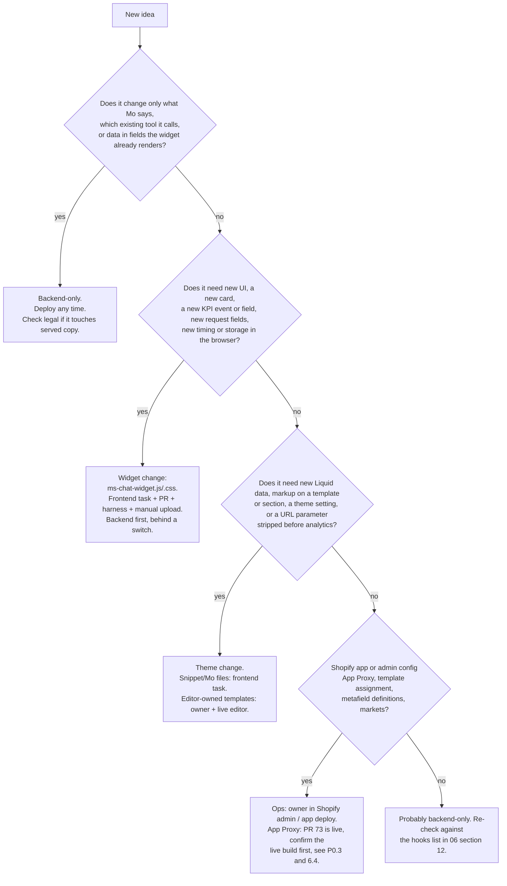

# 07 — Feature and KPI playbook (for backend agents planning new work)

> **Audience:** backend coding agents of Mo (`4motionsports-gmbh/mo`) who plan features, KPI work or contract changes that touch the storefront.
> **Basis:** chapters 01–06 of this folder (theme repo `ms_shopify_clone`, `main` at `8d0a0c4` = merged PR #73 `a0df103` + five fixes; live runs PR #73 since the owner's upload on 2026-10-04, `8d0a0c4` is not uploaded yet), the backend's `docs/API_CONTRACT.md` (**AC §n**) and `docs/frontend-handoff/*.md` (**CA** = `CUSTOMER_ACCOUNT.md`, **CF** = `CONSENT_FLOW.md`, **COS** = `CHAT_ORDER_STATUS.md`, **FP** = `FRONTEND_PROMPT_2026-10.md`), and the widget test logs of the PR #73 session. Code locations are `file → function / key`; line numbers are left out on purpose.
> Effort scale (same as chapter 05): **S** = under half a day of widget work, no new endpoint. **M** = 1–3 days, or needs a small backend addition. **L** = new UI flow and/or several backend changes. **Ops** = a person in Shopify admin, the theme editor or a lawyer.

This chapter turns the facts of chapters 01–06 into decisions. It tells you whether an idea needs only a backend deploy, a widget release or a theme/admin change; how to extend the widget for each kind of feature and what that costs on the frontend; how to write a frontend task the frontend agent can implement; which rules keep contract changes safe while the live widget lags behind; how the widget is tested; and which opportunities are worth doing first.

**Contents**

1. [The constraints that shape every plan](#1-the-constraints-that-shape-every-plan)
2. [Decision guide: backend-only, widget change, or theme/admin change](#2-decision-guide-backend-only-widget-change-or-themeadmin-change)
3. [Extension patterns](#3-extension-patterns)
4. [How to write a frontend task](#4-how-to-write-a-frontend-task)
5. [Contract-change rules](#5-contract-change-rules)
6. [Testing: the widget harness and live checks](#6-testing-the-widget-harness-and-live-checks)
7. [Prioritised opportunity backlog](#7-prioritised-opportunity-backlog)
8. [Open questions that block or change priorities](#8-open-questions-that-block-or-change-priorities)

---

## 1. The constraints that shape every plan

| Constraint | Consequence for planning | Ref |
| --- | --- | --- |
| **Manual deploy.** The owner copies changed files from `main` into the Shopify code editor using `MANIFEST.md`. | Every widget change has an upload lag of unknown length. Backend changes must work with the **currently uploaded** widget until then. | `01` §16.2 |
| **Two editors.** Another person edits templates, sections, app blocks and settings in the live theme editor. | Anything in editor-owned files (the "MO only" CTA block in `templates/product*.json`, `layout/theme.liquid`, `sections/header.liquid`) can be changed or reverted without a repo commit. Prefer widget-JS solutions over template edits where both work. | `01` §2.2, §16.5 |
| **Drift has happened.** The 2026-08-12 snapshot commit silently reverted PR #67 and #62 (restored 2026-10-01). | Never assume a merged change is live. Plan a live verification step for anything you depend on. | `01` §16.3 |
| **No widget version signal.** The widget sends only `x-ms-chat-key`, `x-ms-session`, `x-ms-locale` (checked: no other `x-ms-*` header in `ms-chat-widget.js`). | The backend cannot tell which widget build is calling. Switches must be flipped by a person after a live check. | §5 |
| **PR #73 is live (uploaded 2026-10-04); `8d0a0c4` is not.** | Sign-in, the consent popup, history, export, erase and `mo_c` should work on live again, but a real live check by the backend is still pending (§6.3, §6.4). Until the owner uploads `8d0a0c4`, live lacks its five fixes (stream abort on new chat, `sessionId` in the contact body, `order_support` label, hidden CTA where Mo does not mount, CTA on three more templates). Plan against the PR #73 build. | `04` §16, README §4 |
| **App Proxy not set up yet.** It may be set up now (P0.3): PR #73 is live; confirm the live build with §6.4 first. | No silent shop-login recognition until then. Historical: the pre-PR #73 widget (`44a076b`) took a whoami `signedIn:true` answer as identity in `detectViaStorefront()` without redeeming `linkCode`, so the proxy had to wait for PR #73; if drift ever brings that build back, the proxy becomes unsafe again (P0.3). Each widget build pays Shopify 404 page fetches for `/apps/chat/whoami` before sign-in affordances appear. PR #73: one fetch per tab session, on the first open (`sessionStorage['ms-chat-whoami-done']`, set before the call, `detectViaStorefront()`). Pre-PR #73 widget (`44a076b`): one fetch per page load on the first open (in-memory `storefrontDetectDone`), plus one per forced re-detect (`detectSignedIn(true)` on a later open, or when the tab becomes visible while the panel is open and the visitor is not signed in). | `04` §5.4 |
| **Lazy auth.** The widget makes no auth call before the first panel open, with three exceptions, all in `ms-chat-widget.js → handleAuthReturn()`. (1) The sign-in return page load: `POST /api/auth/link`, then `GET /api/auth/me`. If the redeem fails and the device has a signed-in hint (`shouldProbeAuth()`), it also calls `probeAuth(true)`. (2) The single retry after a 503 on the next page load of the tab (`retryPendingLink()`, code kept ≤ 10 min in `sessionStorage['ms-chat-link-retry']`). (3) A `?ms_auth=logged_out` return sets `sessionStorage['ms-chat-whoami-done']` and calls `GET /api/auth/me` on load (`probeAuth(true)`) when `shouldProbeAuth()` is true. If the server confirms that a sign-in this device had has ended, it wipes the stored history and rotates the sid (`endedSignInCleanup()`). | Backend cannot personalise the launcher, nudge or welcome for a visitor who has not opened the panel. | `02` §2.6 |
| **Context only on CTA and nudge.** Typed turns carry no `context`. | Prompt changes that "use the current product" only work after a CTA or nudge click until the widget changes (backlog A3). | `03` §2 |
| **KPI is not consent-gated; the sid is set for everyone.** | New interaction-free events increase legal exposure (§ 25 TDDDG). Decide with the lawyer, or gate on `analyticsProcessingAllowed()`. | `05` §13.3 |

---

## 2. Decision guide: backend-only, widget change, or theme/admin change

### 2.1 Decision flow



### 2.2 Concrete examples

| Idea | Category | Why | What to do |
| --- | --- | --- | --- |
| Change Mo's tone, prompts, when it shows products or offers the email summary | **Backend-only** | Text and existing tool calls render as today (`03` §6, §8) | Deploy. Watch `message_sent` → `product_cta_clicked` rates. |
| Show a different product, price, image or stock state in cards | **Backend-only** | `name`, `price`, `salePrice`, `images[0]`, `inStock`, `shopifyUrl`, `specifications`, `deliveryTime`, `cartUrl` render (`03` §7) | Change `/api/products`. |
| Send English shoppers to `/en` product pages, or deep-link the chosen variant | **Backend-only** | "Zum Produkt" opens `shopifyUrl` as is; AC §3 allows `?variant=<id>` (`06` §5.2) | Localise/extend `shopifyUrl` server-side. The widget sends no locale to `/api/products`, so a locale-aware URL needs a request param, which is a widget change, or a separate field. |
| Show review stars, an "ab" price or the `show_product.reason` | **Widget change** | `rating`, `priceMin/Max`, `reason` are ignored (`03` §7, §8.1) | Frontend task (S each). |
| Put `_mo` onto the „Zur Kasse“ permalink | **Widget change** | `/api/products` is public, session-less and cached 60 s, so a per-session token cannot go into `cartUrl` safely (`06` §15.1) | Frontend task T1 (backlog A2). |
| Fix `contact_form_submitted` having no session | **Done in the widget** (`8d0a0c4`, not uploaded yet) | `buildContactForm()` now sends `sessionId: sid` in the `POST /api/contact` body (`03` §20.1) | Nothing after the upload. Optional hardening: let `src/app/api/contact/route.ts` fall back to the `x-ms-session` header for tabs still on the PR #73 build. |
| Fix the dashboard "Engagement" ratio | **Backend-only** | Denominator choice in `src/lib/kpi-store.ts` (`05` §12) | Use sessions with `chat_opened` as the denominator. |
| Join `product_cta_opened` (numeric id) to catalog handles | **Backend-only** (or widget T10) | The catalog sync has both ids (`06` §2.3) | Map numeric → handle in the KPI query. |
| New marketing / consent wording, erase text, returning-customer hint | **Backend-only + legal** | Served copy renders verbatim (`04` §11) | Lawyer sign-off first; keep the validator's required keys (§5.7). |
| Ask again after an unconfirmed DOI expired | **Backend-only** | `optInActionable` is the master switch (`04` §17) | Change when it is `true`. The widget's 30-day device decline still applies. |
| A new background tool (lookup, profile write) | **Backend-only** (PR #73's exact name matching is live since 2026-10-04; verify with §6.4), plus a one-line widget change if its parts must be replayed | §3.1 | Name it carefully (§5.6). |
| A new card type (bundle, size finder, appointment) | **Widget change** | Unknown tools render nothing (`03` §6.1) | §3.2. |
| Attach page context to typed messages | **Widget change** | `sendMessage()` only sends `context` from CTA/nudge (`03` §2) | Backlog A3. |
| New KPI event or new field on an existing event | **Widget change** (+ dashboard) | Only `track()` call sites produce widget events (`05` §4) | §3.4. |
| New deep-link parameter (e.g. open with a topic) | **Widget change** (+ `layout/theme.liquid` if it is secret) | `handleMoDeepLink()` only knows `mo=open`, `#mo-open`, `mo_new=1`, `mo_view=fullscreen`; `mo_c` is handled by `captureCampaignToken()` and `ms_auth`/`ms_code` by `readAuthReturn()` (`05` §9.2) | §3.5. |
| More page facts (selected variant, price, availability) | **Theme change** (snippet) + widget | `pageContext` is built in Liquid (`01` §6.7) | §3.9. |
| Mo CTA on collection pages or in the „Hast du noch Fragen?“ block | **Theme change** (editor-owned sections: owner plus live editor) | CTA contract markup works anywhere (`06` §3.2) | §3.6; coordinate with the live editor, re-sync afterwards. |
| „Frag Mo“ link at the end of the product Q&A tab | **Theme change** in `snippets/product-qa.liquid` (Mo-owned) | CTA contract markup (`06` §3.2) | Normal frontend task and upload (`06` T9). |
| Translate the PDP CTA label | **Theme change** (editor-owned `templates/product.json`; since `8d0a0c4` the same block also sits in `product.produkt-new`, `product.produktnew`, `product.produkte-im-set`) | German literal in template JSON (`01` §6.2) | Owner + live editor, or a locale key. |
| Hide Mo on a template / kill switch | **Ops (theme editor)** | `ai_advisor_enabled`, `ai_advisor_excluded_templates` (`01` §12) | A person in Customize. Note: on the PR #73 build live today, excluding a PDP template leaves a dead CTA (`06` §3.4); `8d0a0c4` hides the CTA there (not uploaded yet). |
| Silent shop-login recognition | **Ops** | App Proxy config + `shopify app deploy` (`06` §9.1) | No theme change. **Actionable now:** PR #73 is live; confirm the live build with §6.4 first. PR #73 redeems the `linkCode` before it treats the visitor as signed in. Historical: the pre-PR #73 widget (`44a076b`) also called `/apps/chat/whoami`, but its `detectViaStorefront()` applied a `signedIn:true` answer directly as identity without redeeming `linkCode`, which is why this waited (see P0.3). |
| More PDPs with a CTA | **Ops** (upload) | `8d0a0c4` adds the "MO only" block to the three CTA-less templates, so all five product templates carry a CTA (`06` §3.7) | Upload the three template files (or add the block in the theme editor), then re-sync. |
| PDP Q&A content | **Backend-only** | `metafieldsSet` on `custom.qa` (`06` §4) | Keep ≤ 20 entries and the sanitiser. |

---

## 3. Extension patterns

Each pattern lists the exact steps on both sides, the frontend cost, the rollout order and the traps. "Upload" always means: PR merged, `MANIFEST.md` entry, owner copies the files, live check.

### 3.1 New background (silent) tool

**When:** the model needs data or must write something, and the result is expressed in Mo's text (like `search_products`, `get_order_status`).

| Side | Steps |
| --- | --- |
| Backend | Define the tool. Add it to AC §2 "Tools the widget MUST NOT render". Keep its **output small and non-sensitive**, or add it to `NON_REPLAYABLE_OUTPUT_TOOLS` in `src/lib/chat-message-sanitize.mjs` (today only `get_order_status`; `sanitizeToolParts()`, called from `src/app/api/chat/route.ts`, then replaces the replayed output with `{ replayed: true }`) if its replayed output must not be trusted, because the widget stores outputs in `localStorage['ms-chat-history:<sid>']` and sends them back on every turn (`03` §3.3, §12). Put it behind a switch. |
| Widget | **Nothing**, if the backend does not need the part replayed: with PR #73, unknown tools are neither rendered nor stored (`ms-chat-widget.js → resolveToolName()` returns `null`). **One array entry** (`SILENT_TOOLS`) if the backend needs the input/output replayed on later turns, because only listed tools are kept by `accumulatePart()`. |
| Frontend cost | None or XS. |
| Rollout | Backend first, switch off → confirm the live build has exact name matching (PR #73, live since 2026-10-04; §6.4) → flip the switch. |

Traps:
- **Pre-PR #73 widget** (`44a076b`; replaced on live by the 2026-10-04 upload, but it can come back through drift): `isToolPart()` is a **prefix** match over visible **and** silent names, so a name that starts with a visible tool's name (e.g. `show_product_details`) renders as that card, and a name that starts with a silent tool's name (e.g. `search_products_v2`) is stored and replayed as `tool-search_products` with the new tool's input/output (§5 rule 6). And `feedCanonical()` calls `ensureCtx()` before it checks the part, so an unknown tool creates an empty assistant row and removes the "Mo antwortet" indicator until text arrives. That is why `CHAT_ORDER_STATUS_ENABLED` waited for PR #73 (COS "No-op if you ship later"); it may now be flipped after the live check (P0.1).
- A turn made only of silent parts is still stored as an assistant message and counts toward the 40-message cap (`03` §6.3).
- Account history transcripts are text-only, so silent parts are not replayed on a resumed thread (`03` §20.10).

### 3.2 New visible tool card

**When:** a new visual element in the conversation (bundle card, size finder, appointment slot, sign-in card for order status).

| Side | Steps |
| --- | --- |
| Backend | Define the tool and its input schema; document it in AC §2 "Tools the widget MUST render" (input, render rules, buttons, KPI). If the card shows products, reuse product ids so the widget can hydrate them from `/api/products`. Keep the tool **switched off** until the widget is live, because older widgets render nothing (PR #73) or, in the pre-PR #73 widget, an empty assistant row with no "Mo antwortet" indicator while the turn streams (removed at finalize if no text follows; a name that prefix-matches a known tool renders or replays as that tool, see §3.1 / §5 rule 6). |
| Widget | (1) add the name to `VISIBLE_TOOLS`; (2) add a builder in the "Tool card builders" section that returns `Promise<Element|null>` and resolves `null` on any missing data (render-nothing guard, `02` §4 conventions); (3) add the `case` in `buildToolCard()`; (4) all chrome strings through `L(de, en)`; (5) `track()` calls for each button with ids/enums only; (6) CSS under `.ms-chat-` with theme tokens; (7) if it shows products, call `moAttrOnProductCard()` so the session counts as "consulted" (today only `show_product` does, `05` §10.3); (8) decide what happens on reload: cards are rebuilt from stored history, and form cards come back empty (`03` §12). |
| Frontend cost | **M** (S if it is a variant of an existing card). |
| Rollout | Backend behind switch → widget upload → live check (DE/EN, 1280/390) → switch on. |

Traps: links open in a new tab with `rel="noopener noreferrer"`; cards are keyed by `toolCallId` (changed input re-renders in place); voice mode never reads cards aloud; cards are not restored when a past signed-in thread is opened from the history drawer.

**Data-flow constraints of the render pipeline** (design the tool around them):

1. **A card sees only the tool `input`** (the model's arguments). `buildToolCard(name, input)` has no output parameter. `renderPartIntoCtx()` calls it as soon as `part.input` exists, i.e. on `tool-input-available`, **before** the backend's `execute()` result arrives, and again on reload from stored history (`renderRestoredAssistant()` also passes only the input). The `tool-output-available` case in `startStream()`'s event handler only calls `accumulatePart()` (store and replay, never render); the one exception is `seedConsentCopy()` for `offer_email_summary`. So any server-computed data the card shows must be in `input`, or fetched by the card itself (as the `/api/products` hydration does), or the task must change `renderPartIntoCtx()` / the event handler to re-render on output.
2. **`tool-output-error` does nothing visible.** The handler returns without touching the already-rendered card.
3. **There is no client → model tool-result channel** (no AI-SDK `addToolResult`, no tool-result POST in `ms-chat-widget.js`). Every visible tool must be server-executed. A user choice inside a card (size finder, quiz) can reach Mo only as a **new user turn** via `sendMessage(text, context?)`. That turn fires `message_sent`, can schedule the first-message popup (+700 ms, §3.8) and counts toward the 40-message cap.
4. **`sendMessage()` / `startStream()` have no busy guard.** Every current caller checks `state.streaming || state.rateLocked` itself: `onSend()`, `voiceSubmit()`, `openWithProduct()`, `sendContextGreeting()` and the nudge click handler in `showNudge()` (`startVoice()` is guarded the same way). A card rendered mid-stream is clickable while the turn is still streaming, so a card button that sends must run that check too (pattern: `openWithProduct()`).

### 3.3 New served copy or a new consent surface

**Copy change on an existing surface:** backend-only. Ship a backend deploy with lawyer-approved text. Keep the keys the widget validates (§5.7). `consentTextShown` must still be the exact audit string of what is shown.

**New consent surface** (e.g. an opt-in at a value moment, a WhatsApp consent):

| Side | Steps |
| --- | --- |
| Backend | New `GET /api/consent-copy?surface=<name>&locale=` with `lawyerApproved`, `consentTextShown`, labels, footer, `imprintUrl`, `privacyUrl` per locale (mark English with `enLegalReviewed`). A submit endpoint that requires the echoed `consentTextShown`, records consent, runs DOI where needed, and returns a `marketing` object the widget can classify (`04` §10.6: `already` / `pending` / `other`). Server-side KPI for submits. |
| Widget | Fetch with the 60 s cache pattern (`fetchConsentCopy()` / `fetchSignInConsentCopy()`); a validator that fails closed; render with `textContent` only; nothing pre-selected; decline as large as accept; label and footer fully visible; imprint/privacy links; `marketingConsent: true` only from the accept click; KPI `consent_gate_shown/_accepted/_declined/_dismissed` with a **new `surface` value**; frequency keys (once per tab session in sessionStorage, a decline TTL in localStorage); never in voice mode; must share the one-popup-per-tab-session budget (`ms-chat-gate-shown`) if it is a dialog. |
| Frontend cost | **M–L.** |
| Legal | Lawyer approval before `lawyerApproved: true`. Benefit framing only in `headline`; no countdowns, fake urgency or discount amounts (CF §1). The widget does **not** check `enLegalReviewed` today (no reference in `ms-chat-widget.js`), so if `/en` must be gated, that is part of the task. |

### 3.4 New KPI event or a new field

| Side | Steps |
| --- | --- |
| Backend | `/api/kpi` has no allowlist and does not validate the contents of `data`, so nothing is needed to **store** it. Limits (`src/app/api/kpi/route.ts`): `event` must be a non-empty string of at most 120 chars (`MAX_EVENT_CHARS`), else 400; `data` must be a JSON object (arrays and primitives are stored as `{}`); the client `timestamp` is kept as `data.clientTimestamp`; the stored session is `body.sessionId` (the widget sets it from `sid`, trimmed to 128 chars), not the `x-ms-session` header, so an event sent after a sid rotation is attributed to the new sid; the origin allowlist (`guardOriginOnly`) and a rate limit (`checkRateLimit('kpi')`) apply. Add the canonical name to AC §5. Update the dashboard (`src/lib/kpi-store.ts`, `src/lib/kpi-widget-events.mjs`, `src/lib/kpi-event-patterns.mjs`) and the AD doc. If it replaces an old event, mark the old one as discontinued (like `starter_*` in `DISCONTINUED_WIDGET_EVENTS`). |
| Widget | One `track(name, data)` call at the right place; `sessionId` and timestamp are added automatically. `track()` already uses `fetch(…, {keepalive:true})` synchronously, so call it before any navigation; delivery of a preflighted keepalive request during unload is not verified on all browsers (`05` §14.2). For "once" semantics, add a sessionStorage flag (per tab) or a localStorage flag (per device). |
| Frontend cost | **S.** Adding a field to an existing event is backward compatible. |

Rules:
- **Ids and enums only.** No text, emails, product names, tokens, codes or raw URLs (a URL can carry query PII).
- **Name it against the dashboard patterns**: `%cart%` / `%checkout%` count as add-to-cart clicks; `%product%click%` / `%cta%click%` as product clicks (`05` §12). A `cart_refreshed` event would inflate "Add-to-Cart-Klicks".
- **Never reuse a server-only name** (`05` §5).
- **Send an event before a sid rotation**, not after, if it describes the old session (pattern of `account_signout`).
- **Interaction-free events** (widget load, impressions without a click) need a legal decision first or a gate on `window.Shopify.customerPrivacy.analyticsProcessingAllowed()` (`05` §13.3).
- Pick the id space deliberately. Today `product_cta_opened` uses the numeric Shopify id and everything else the catalog handle (`05` §4.4).

### 3.5 New deep-link parameter

| Side | Steps |
| --- | --- |
| Backend | Build the URL (campaign mails go through `GET /api/r/<token>` → `CAMPAIGN_MO_DEEPLINK_URL` + `mo_c`, AC §11.2). Existing params can be combined freely on any storefront path (`01` §15). |
| Widget | Pick the reader by the parameter's kind. **An open/view modifier that only applies together with `mo=open`** goes into `handleMoDeepLink()` (runs **last** in `init()`, so the widget is fully built; it returns early unless `mo=open` or the `#mo-open` hash is present). **A parameter that must work on its own, or that is secret or per person**, needs its own reader at the **top** of `init()`, next to `captureCampaignToken()` / `readAuthReturn()`: read `earlyParam()` first and the URL as fallback, then strip it with `replaceState`. Validate with a strict regex. Choose storage scope deliberately (in memory, sessionStorage, never localStorage for per-person tokens). |
| Theme | **Only if the value is secret or per person:** add it to the list in the `layout/theme.liquid` head stash script (`['ms_auth','ms_code','mo_c']`) and read it via `earlyParam()`, so Shopify analytics never records it. `layout/theme.liquid` is a shared file: the task must give the exact hand-edit. |
| Frontend cost | **S** (+ a shared-file edit if secret). |

**Template for a landing value that must reach `/api/chat`** (the `mo_c` pattern): capture it in `init()` **before** `readAuthReturn()` (like `captureCampaignToken()`), validate it with a strict regex, keep it in sessionStorage, add it to `chatBody` in `startStream()`, and delete it only on `res.ok` (so a failed first send retries). It then rides on the first `POST /api/chat` of the tab session, whether that is a typed message, a CTA primer or a nudge greeting.

Traps:
- Modifiers are read only when `mo=open` / `#mo-open` is present. Without it, `handleMoDeepLink()` returns before its strip, so `mo_new` / `mo_view` stay in the URL untouched and are not applied.
- The head stash (`sessionStorage['ms-chat-early-params']`) is **one object per page load**: the head script writes it only when one of its params is present, and a later stash overwrites an earlier unconsumed one. `earlyParam()` consumes the whole stash on first read (deletes the key, keeps it in memory for that page) and honours it only while it is younger than `LINK_RETRY_MAX_MS` (10 min, the sign-in code TTL). Any new secret parameter inherits that TTL.
- Backend side: the deep link itself is `CAMPAIGN_MO_DEEPLINK_URL` (backend `docs/CAMPAIGNS.md`; default `…/?mo=open&mo_new=1&mo_view=fullscreen&utm_source=campaign&utm_medium=email` per `FEATURE_INVENTORY.md`). Changing the `mo_new=1` default changes session semantics (a fresh thread, and a sid rotation for anonymous visitors, `05` §9).
- `mo=open` alone sends no chat turn (`POST /api/chat`) and does not prime a product. The open itself still makes requests: `openPanel()` fires `chat_opened` (`POST /api/kpi`) and runs the first-open auth detection (`resolveAuthOnOpen()` → `detectSignedIn()`: whoami once per tab session, and possibly `GET /api/auth/me`). With `mo_new=1`, a visitor with no signed-in hint gets a new sid (`rotateSession()`) before the open; a "campaign-aware greeting" means the deep link starts a turn, which changes what `campaign_chat_started` means (`05` §13.4). The head script runs on every page while `ai_advisor_enabled` is on, including pages where the widget does not mount (`02` §21.2).

### 3.6 New product-page or storefront placement

**Product-primed entry point (no JS change):** any element with the CTA contract works on any page because the click handler is delegated (`06` §3.2):

```html
<button type="button" class="ms-chat-product-cta"
        data-ms-chat-product-id="{{ product.id }}"
        data-ms-chat-product-title="{{ product.title | escape }}">…</button>
```

It opens the panel, fires `product_cta_opened {productId: <numeric>}`, and sends the primer message with `context.type: "product"`. Placement in templates/sections is mostly **live-editor owned**: the owner or the live editor adds it, and the repo must be re-synced afterwards.

**Generic entry point** ("Frag Mo" without a product, or with a topic): needs a new public API, e.g. `window.MS_CHAT.open({source, topic})`, because today only `openWithProduct()` and `openEmailSummary()` exist (`06` §3.2). **Widget S–M** plus the placement.

| Concern | Rule |
| --- | --- |
| Dead CTA | CTA blocks are gated only by `settings.ai_advisor_enabled`. Since `8d0a0c4` (not uploaded yet), `snippets/ms-chat-widget.liquid` outputs `<style>.ms-chat-product-advisor, .ms-chat-product-cta { display: none !important; }</style>` wherever it does not render the widget (excluded template, cart/checkout, empty `settings.ms_chat_shared_secret`), so any placement that uses `.ms-chat-product-cta` (or sits in a `.ms-chat-product-advisor` wrapper) is hidden there automatically. That style is only emitted while `ai_advisor_enabled` is on, so a new placement must still be gated on `ai_advisor_enabled` itself. **Still open:** if `ms-chat-widget.js` fails to load, or the visitor clicks before the deferred JS has booted, the button does nothing (fix: the widget adds a class on `<html>` at `init()` and the CTA is shown only under it — a widget change). On the PR #73 build live today, the old dead-CTA behaviour applies (`01` §6.2). |
| Measurement | `chat_opened` has no source. Ask for a `source` on the new entry point (backlog B1). |
| Language | Template literals are German on `/en`; use a locale key (`| t`) if the placement must be bilingual. |
| Coverage | Since `8d0a0c4` all five product templates carry the CTA: the "MO only" block (`custom_liquid_AErEyg`, identical to `templates/product.json`) was added to `product.produkt-new` (after the Kurzinfo/USPs block `custom_liquid_BGU8Mt`), `product.produktnew` and `product.produkte-im-set` (after the SKU + Garantie block `custom_liquid_dy3Byf`). Not uploaded yet. `product.produkte-im-set` still has no Q&A tab (`01` §6.6). |

### 3.7 New account / self-service feature (signed-in)

| Side | Steps |
| --- | --- |
| Backend | A guarded endpoint under `/api/account/*` behind the signed-in resolver; **401 means "this session is not signed in any more"**, and the widget reacts with a full cleanup (`accountUnauthorized()` → `endedSignInCleanup()` → history wipe, new sid). Use other codes for business errors. Legal text (anything like the erase confirmation) comes from `GET /api/consent-copy?surface=<name>` with no fallback in the widget. Server-side KPI for the effect (like `account_export_requested`). If the feature needs the chat sign-in specifically (not whoami), answer with a clear status (like `sign_in_required`) and keep „Mit Kundenkonto anmelden“ reachable (COS). |
| Widget | `accountHeaders()`; the stale-reply guard `accountReplyStale(reqSid)` on every response; 401 → `accountUnauthorized()`; UI in the history drawer (`buildHistoryDrawer()` footer) or a header pill; chrome via `ACCOUNT_COPY` with EN overlay; KPI pair `<thing>_started` / `<thing>_done`-style like `account_export_started` / `account_exported`. |
| Frontend cost | **M.** |

Traps: tier 3 had **no live users** while sign-in was broken (2026-10-03 until the PR #73 upload on 2026-10-04), so expect the signed-in funnel to start from near zero and confirm it fills after the live check; sign-out is local only (the old sid stays linked server-side, `04` §7.8); conversation transcripts are text-only.

### 3.8 New popup, nudge rule or proactive prompt

The backend cannot trigger a popup today: there is no SSE chunk or response field for it. Options:

1. **Change the rules in the widget** (timing, eligibility, copy) — a widget change in `maybeShowConsentGate()`, `gateBaseEligible()`, `initNudgeTriggers()`, `nudgeCopy()`. **S–M.**
2. **Let the model ask via a visible tool** (e.g. a sign-in card when order status needs it) — pattern §3.2.
3. **Server-driven decision** (a new field on `/api/auth/me` or in a tool output that the widget reads) — contract change + widget change. **M.**

Constraints that must survive any change (`04` §9–§10, `05` §6–§7):

| Rule | Today |
| --- | --- |
| At most one popup per tab session (login **or** consent). It is evaluated 0.7 s after **every** send (typed, `voiceSubmit()`, `openWithProduct()` CTA primer) until one is shown, so it is not limited to the first message. A later message can trigger it when the first send was rolled back or rate-locked, the visitor was in voice mode, auth was still unsettled after the poll, or the visitor signed in later in the tab session | `sessionStorage['ms-chat-gate-shown']` (`GATE_SS_KEY`), set only when a popup is shown; `sendMessage()` schedules `maybeShowConsentGate(0, userMsg)` on each call |
| Never stacked, never in voice mode, never after a failed send | `gateEl`, `voiceMode`, rollback check |
| Never while rate-locked; shown 0.7 s after the send; waits up to ~5 s for the auth tier | `maybeShowConsentGate()`: returns on `state.rateLocked`; scheduled by `sendMessage()` with `setTimeout(…, 700)`; polls 10 × 500 ms while `!auth.settled` |
| Consent popup suppressed while, or after, the inline opt-in card asked in this tab session | `consentGateEligible()`: false while the `.ms-chat-optin-card` in `lastOptInRow` is pending, and once `sessionStorage['ms-chat-optin-ask-shown']` is set |
| „Später“ snooze for the login popup | 24 h, device-wide |
| Consent decline memory | 30 days, device-wide (not per customer) |
| Nudge | once per tab session (`ms-chat-nudge-shown`); not if the chat was opened this tab session (`ms-chat-opened`); permanent × (`ms-chat-nudge-dismissed`); hidden under `body.no-scroll`; never auto-hides; never asks for an email |
| Nudge triggers | `initNudgeTriggers()`, first one wins: dwell `NUDGE_DWELL_MS` = 24 s (product and collection pages only), scroll ≥ 85 % of the page (product pages only), exit intent (desktop only) |
| Tone rule | reference the page or category, never the visitor's behaviour |
| Only while the panel is open | `maybeShowConsentGate()` returns at once on `!state.open` and re-checks `consentGateEligible() && state.open` after the async copy fetch |
| Consent popup is fail-closed | shown only if `fetchSignInConsentCopy()` returns served `surface=signin` copy with `lawyerApproved === true`; otherwise nothing is shown |
| „Anmelden“ in the login popup during streaming | waits for the reply to finish (`WAIT_STEP_MS` 200 ms, `WAIT_MAX_MS` 20 s) and then calls `initiateLogin('login_gate')`, so the answer is saved to history before the redirect |
| Esc / backdrop | `login_gate_dismissed` / `consent_gate_dismissed`; quiet for this tab session only, no device snooze |

### 3.9 New page facts for Mo

`snippets/ms-chat-widget.liquid → pageContext` (theme change) + `ms-chat-widget.js → PAGE_CTX` + the place where it is sent (today only in CTA/nudge `context`, `03` §4). Page facts only, never user data. A Liquid `` flag would be a client-side hint, not an identity. The App Proxy is the secure path; it may be set up now that PR #73 is live (P0.3). Selected variant changes after load need a listener (`variant:change` from `main.mjs`) — widget work. **S–M.**

---

## 4. How to write a frontend task

### 4.1 What worked in `FRONTEND_PROMPT_2026-10.md`

The October prompt produced PR #73 in one pass. Keep these properties:

1. **Self-contained and paste-ready.** It says "paste this into the frontend agent" and lists the handoff files to attach. The frontend agent never needs the backend repo.
2. **Precedence is explicit:** "Where this prompt and those files disagree, the files win."
3. **States the baseline:** which widget version it builds on (2026-10-01) and what that version already does, so the agent does not redo or undo work.
4. **Answers the frontend's open questions** first ("Backend reply to your note"): KPI names confirmed, dashboard changes, which old endpoints are now unused and must not come back.
5. **Restates the legal rules verbatim** ("Rules that do not change").
6. **Numbered tasks in priority order**, the blocking one marked "required — do it first", each with the reason, exact request/response shapes by contract section, a response-code → behaviour mapping (200 / 400 / 503), the exact KPI semantics ("`ok` only after the 200"), storage scope ("sessionStorage, never localStorage, cookies or KPI payloads") and what is broken until it ships.
7. **An acceptance checklist of observable behaviour**: the address bar, a second redeem answering 400, a test sign-in visible in each stage of the admin dashboard, DE + EN screenshots of every new surface.

### 4.2 What to add next time (lessons from documenting the result)

- **Name the widget functions and storage keys** from these chapters (e.g. "`buildAddToCart()` click handler", "`sessionStorage['ms-chat-gate-shown']`"), so the change lands in the right place.
- **Say which files to upload and which shared files need a hand-edit** (MANIFEST entry), and whether a backend switch must wait for the upload.
- **State the failure mode** of every new call (fail-silent vs visible, fail-closed for identity and legal).
- **State the legal status** of every served string the task renders (`lawyerApproved`, `enLegalReviewed`).
- **Ask for the KPI naming check** against the dashboard patterns and the server-only list.
- **Ask for harness coverage** (§6) and list the mock behaviour the backend now has (new endpoint, new codes).
- **Include edge cases the chapters found**: reload behaviour of cards, signed-in vs anonymous branches, streaming in progress, multi-tab sid rotation.

### 4.3 Template

Copy this skeleton, fill every section, and delete nothing (write "none" where it does not apply).

```markdown
# Frontend task — <short name> (<date>)

Paste into the frontend agent that owns `ms_shopify_clone`. Attach: <list of docs/frontend-handoff/*.md + API_CONTRACT.md>.
Where this prompt and the attached files disagree, the files win.

## Baseline
Builds on widget <commit / MANIFEST date>. Relevant current behaviour: <1–3 sentences, cite docs/frontend chapter §>.

## Goal and KPI
<What changes for the shopper. Which KPI it should move and how we will read it on the dashboard.>

## Contract references
<AC §n / CA §n / CF §n … for every endpoint, field and event used.>

## Backend state
<What is already deployed; switch names and their current value; what stays off until this ships; "no-op if the widget ships later" statement.>

## Rules that do not change
<Paste the legal rules that apply (CF §1); privacy rules for KPI; tier additivity.>

## Tasks (in order)
### 1. <name> (required / optional)
- Where: `ms-chat-widget.js → <function>` (and CSS / snippet / shared file with the exact hand-edit spot).
- Trigger and timing: <…>
- Request: <method, path, headers, exact JSON body>; Response: <shape>.
- Response handling: | status | widget behaviour | KPI |
- UI strings: DE „…“ / EN "…" (chrome only; served text comes from <endpoint>).
- Storage: <key, store, lifetime, cleared by>.
- KPI: <event name, exact data keys, when; confirm no dashboard-pattern collision; never the server-only names>.
- Failure mode: <fail-silent / fail-closed / visible notice>.
- Edge cases: <reload, signed-in vs anonymous, streaming in progress, other tab, voice mode, /en>.

## Legal constraints
<Served-copy rules, lawyerApproved / enLegalReviewed status, consent gating, data that must not leave the browser.>

## Deployment
Files to upload: <list>. Shared files to hand-edit in the live editor: <file + spot>. MANIFEST entry required.
Switches to flip after the live check: <name>.

## Acceptance checklist
- [ ] <observable behaviour, incl. network calls and their headers>
- [ ] <KPI events seen in the admin dashboard with the same session id>
- [ ] <negative cases: errors, consent denied, signed-out, older backend>
- [ ] Harness: new checks added and passing in DE + EN, 1280 + 390.
- [ ] No console errors; no new hard-coded legal text; no pre-selection; no server-only events.
- [ ] Screenshots DE + EN (desktop 1280, mobile 390) of every new or changed surface.
```

---

## 5. Contract-change rules

1. **Additive only.** Never rename or remove an endpoint, field, enum value, error code or KPI name that the live widget uses. Add optional fields. The widget already tolerates additions:

   | Where | Tolerance in the widget |
   | --- | --- |
   | `/api/products` items | unknown fields ignored (`03` §7) |
   | SSE chunks | unknown chunk types ignored, `console.debug` with the type only; `data-*` and `reasoning*` ignored (`03` §5.2) |
   | Tool parts | unknown tools render nothing (PR #73; pre-PR #73 see §3.1) |
   | `/api/auth/me` | only `signedIn`, `identity.name`, `identity.tier`, `marketing` read (`04` §2.2) |
   | Consent copy | extra keys ignored; required keys see rule 7 |
   | `/api/kpi` | response never read |
   | `cartAttributes` | passed through unchanged; must stay a flat object |

2. **Design for the oldest live widget.** There is no widget version header (§1), the upload lag is unknown, and the live theme can regress through drift. Until a backend change has been verified on the live widget, the old widget must keep working. If you need to know the version, ask for a small frontend task that adds e.g. `x-ms-widget-version` (not present today) — this is a recommendation, not an existing contract.

3. **Feature switches, default off.** Rollout order:
   1. Backend ships the change behind a switch, and the handoff doc in `docs/frontend-handoff/` is updated in the same PR.
   2. Frontend task (§4) → widget PR → harness green.
   3. Merge, MANIFEST entry, owner upload, drift check.
   4. Live verification (§6.3).
   5. Flip the switch. Watch the dashboard.
   6. Only then remove compatibility code.

   `CHAT_ORDER_STATUS_ENABLED` is the model: off until the PR #73 widget is confirmed live (COS "No-op if you ship later"). PR #73 was uploaded on 2026-10-04, so the switch is now at step 4: flip it once the backend has verified on live that `get_order_status` renders nothing (§6.3 "Tools").

4. **"No-op if the widget ships later."** Every new request field is optional on the backend; every new response field is optional for the widget; an unknown/invalid value is ignored without an error (like `campaignToken`, AC §2). Write that sentence into the contract section.

5. **Error codes are mapped coarsely.** `/api/chat`: 429 → input locked for `Retry-After` (default 30 s); 401/403 → „Chat ist gerade nicht verfügbar.“; `payload_too_large` → „Neuen Chat starten“ notice; ≥ 500, `internal_error`, `upstream_unavailable` → „Es gab ein Problem…“; **any other 4xx → „Chat ist gerade nicht verfügbar.“** (`03` §11). A new 4xx code therefore looks like an outage to the shopper. **An SSE `error` chunk after a 200 is not rolled back** (`startStream()` sets `streamErrored`; `finalizeStream()`): partial content is kept with „Es gab ein Problem. Bitte versuch es gleich nochmal.“ appended, and with no content the user message stays in history without an assistant reply, so the next turn sends two consecutive user messages (`03` §20 item 7). The backend must accept that; prefer an HTTP error status before streaming starts when the turn should be retried cleanly. On `/api/account/*`, **401 triggers a full sign-out cleanup** — never use 401 for business errors. On `GET /api/auth/me`, `probeAuth()` treats any non-ok status other than 429/≥ 500 (401, 403, 404, …) and a 200 with `signedIn:false` as a definite "not signed in". On a device that was signed in (`wasSignedIn`), that triggers the same full cleanup (`endedSignInCleanup()`: history wipe, new sid). Use 429/5xx only for temporary failures there. On `/api/auth/link`, 4xx = refused (never retried), 503/5xx/429/network = one retry next page load (`04` §4.5).

6. **Tool naming.** A new tool name must not start with an existing visible tool name (`show_product`, `compare_products`, `add_to_cart`, `suggest_showroom`, `show_contact_form`, `offer_email_summary`) **or silent tool name** (`update_customer_profile`, `search_products`), because the pre-PR #73 widget (`44a076b`; no longer live since the 2026-10-04 upload, but drift can bring it back, so keep the rule) prefix-matches over both lists (`isToolPart()` / `resolveToolName()` over `ALL_TOOLS`). A prefix match on a visible name renders that card. A prefix match on a silent name is stored by `accumulatePart()` under the **resolved** old name (`tool-search_products`) with the new tool's input/output and replayed that way on later turns (a wrong tool_use for the model). Silent tool outputs are replayed from the browser: assume the browser stores them, and add untrusted ones to `NON_REPLAYABLE_OUTPUT_TOOLS` (`src/lib/chat-message-sanitize.mjs → sanitizeToolParts`).

7. **Served-copy shape is a contract.** The widget's validators require: capture form `transactionalLabel`, `marketingLabel`, `consentTextShown`; signin surface `marketingLabel`, `consentTextShown` and `lawyerApproved === true`; erase `confirmHeading`, `confirmBody`, `confirmButton` (`04` §10.1, §7.7). Removing a key **switches the surface off** (fail closed). Copy changes go live with the backend deploy, so legal sign-off comes first.

8. **Shared limits move together** (README invariant 14). Today: 40 messages. The send path does not trim (`toWire()`), but storage keeps the last 40 (`loadHistory()` / `saveHistory()` `slice(-40)`) and so does `openConversation()` (`transcriptToMessages(conv).slice(-40)`). A reloaded or resumed 40-message thread therefore fails with `payload_too_large` on its next send (backlog A4 must cover resumed threads too). The other shared limits: 10 ids per `/api/products` request (the `add_to_cart` path does not chunk), 20 Q&A entries, trail 3 + 2, campaign token regex, 10-minute code TTL, the TTS sentence splitter mirrored in `splitIntoTtsChunks()`.

9. **Do not change session semantics.** The sid is the KPI join key, the rate-limit key and the identity link. Server-side changes to what a session means (expiry, linking, rotation) must be checked against `02` §7 and `05` §3.

10. **Security changes that cannot be additive** (like the one-time code of 2026-10-03) break the live widget until the upload. If at all possible, accept old and new behaviour for a transition window; if not, write down what is broken on live and give the owner the upload list on the same day. The 2026-10-03 change left live sign-in broken until PR #73 was uploaded on 2026-10-04.

---

## 6. Testing: the widget harness and live checks

### 6.1 The harness used for PR #73 and `44a076b`

Facts from the commit message of `44a076b` ("Verified in headless Chromium against the real theme main.mjs: widget suite 40/40, cart drawer suite 26/26") and from the PR #73 session's harness logs:

| Aspect | What it is |
| --- | --- |
| Runner | Playwright, headless Chromium, Node scripts. |
| Backend | A **contract-faithful, stateful mock** of `https://mo.motionsports.de` and the storefront origin `https://www.motionsports.de`, "built from `docs/frontend-handoff/*` + `docs/API_CONTRACT.md` only". It keeps state per test context: one-time codes (10-minute TTL, single use, bound to the minting session, kind `customer_account` / shop), sign-in state, marketing state, conversations; serves the served-copy strings in DE and EN; streams SSE with the AI SDK v5 chunk vocabulary and the `x-vercel-ai-ui-message-stream: v1` header; answers CORS preflights; and can return Shopify's HTML 404 page, a network error, 4xx/5xx/429 on demand. |
| Page | A minimal storefront page that loads the **current** `assets/ms-chat-widget.js` / `.css` from the repo at run time (env overrides allow a negative control with an older file), optionally with the theme head script. The cart-drawer suite loads the **real** `assets/main.mjs`, `vendor.mjs`, `main.css` and header/cart-modal markup. |
| Matrix | DE and EN; desktop 1280 px and mobile 390 px. |
| Observed | Every request (path, method, headers, body), every KPI payload, `localStorage` / `sessionStorage`, the address bar, DOM state, console errors and page errors; screenshots. |
| PR #73 run | **242 checks, 0 failed** (~7.5 min). Groups: sign-in from popup / welcome / header (48 + 8), code misuse (6), consent popup and inline card after sign-in (69), capture form (23), erase incl. a 401 answer (30), campaign token (6), whoami incl. 404 page / `signedIn:false` / network error / 503 retry (20), `get_order_status` + unknown tool + logout wipe + sign-out mid-reply (10), cross-cutting invariants (7), screenshots (1), regressions for the 2026-10-03 verification findings (14). |
| Cross-cutting invariants checked | every backend call carries `x-ms-session`; guarded calls also `x-ms-chat-key`; every locale-bearing call on `/en` carries `locale=en`; no `starter_*` events; no anonymous e-mail gate (`surface=chat`, `/api/chat-marketing-opt-in`); **no server-only KPI events**; whoami answer never forwarded; order data never in console, KPI or other calls; no console or page errors; no unmocked requests. |

**Limits you must know:**
- The harness is **not committed** to either repo. It lives in a session scratchpad and can be lost. A future frontend task should ask for it to be committed, e.g. as a `tests/` folder in the theme repo. That is safe because deployment is a manual copy of the files MANIFEST lists, and MANIFEST would never list it.
- The mock is built **from the docs**, not from the backend code. If the backend deviates from its own contract, the harness will not notice. Keeping `docs/frontend-handoff/*` accurate is what keeps the tests meaningful.
- Not exercised: real Liquid rendering, Shopify cart permalinks and checkout, the real Customer Privacy API and cookie banner, the real App Proxy, real Shopify login, iOS Safari / real devices, `keepalive` delivery during navigation, storefront caching of metafields.

### 6.2 What a backend change should ask the harness to cover

- The new request/response shapes, including every documented status code and a network error.
- The "older backend" case: the widget with the new code against a mock without the new field or endpoint (must behave as today).
- KPI payloads: exact names and `data` keys, same `sessionId` as `x-ms-session`, nothing server-only.
- DE + EN, 1280 + 390, screenshots of new surfaces.

### 6.3 Manual live checks after an upload

`MANIFEST.md` carries a test checklist per session. The checks that matter for backend agents:

| Area | Check |
| --- | --- |
| Footprint | The live `ms-chat-widget.js` contains the expected functions (fingerprint table in §6.4); `layout/theme.liquid` has the head script and the render call; `#CartBubble` exists exactly once; the "MO only" block is enabled (`01` §16.3 step 4) — after the `8d0a0c4` upload on all five product templates. After that upload, view-source of `/cart` shows the CTA-hiding `<style>` from `snippets/ms-chat-widget.liquid`. |
| Sign-in | „Anmelden“ → Shopify → back: address bar has no `ms_auth` / `ms_code`; `POST /api/auth/link` before `/api/auth/me`; dashboard „Anmelde-Popup“ shows the test session in every stage (FP checklist). |
| Consent | The consent popup appears only for `optInActionable: true`; an already-subscribed address shows the „bereits angemeldet“ state. |
| Campaign | `/?mo=open&mo_c=<token>` opens the chat and sends **no chat request** (`POST /api/chat`) and no `campaignToken` until the first turn. `handleMoDeepLink()` itself makes no request, but the `openPanel()` it calls fires `chat_opened` (`POST /api/kpi`) and the first-open auth detection (whoami, possibly `GET /api/auth/me`). With `mo_new=1`, a visitor with no signed-in hint gets a new sid first (`rotateSession()`). The first `POST /api/chat` of that tab session (a typed message, CTA primer or nudge greeting) carries `campaignToken`; later turns do not (`startStream()` deletes `sessionStorage['ms_mo_c']` on `res.ok`). `campaign_chat_started` is server-emitted with session `NULL`, once per campaign send (AC §5), so look for it in the Kampagnen-Funnel, not under the test session. |
| Attribution | With analytics consent: a `show_product` card → `/cart.js` shows the `_mo` attribute. **One test order through "Zur Kasse"** to see whether `note_attributes` carries `_mo` (open question `05` §14.1). |
| Tools | With the switch on for a test account: `get_order_status` renders nothing and Mo answers in text. This is the gate for flipping `CHAT_ORDER_STATUS_ENABLED` (P0.1). |
| Contact form | After the `8d0a0c4` upload: the `POST /api/contact` body carries `sessionId` (same value as `x-ms-session`), the `contact_form_submitted` row has that session, and a `show_contact_form` with reason `order_support` shows „Kontakt zum motion sports Team“ and the placeholder „Bestellnummer + kurz dein Anliegen…“. |
| `/en` | Locale on calls; English served copy; German voice (known). |
| Theme | Add to cart from the PDP opens the drawer; the launcher hides while the drawer is open; the docked sidebar drops below the drawer. |

### 6.4 Which widget build is live?

`ms-chat-widget.js` has no version constant or version header (§1, §5 rule 2). Identify the live build by searching the **live** asset: view-source of any storefront page → the `ms-chat-widget.js` URL that `snippets/ms-chat-widget.liquid` emits via `asset_url` → search for these markers (marker counts checked against each commit's `assets/ms-chat-widget.js`):

| Markers in the live JS | Build | Consequence |
| --- | --- | --- |
| PR #73 markers below **plus** `order_support` (3 occurrences; 0 in `a0df103`) and `Bestellnummer + kurz` present; `sessionId: sid` occurs 3 times (2 in `a0df103`, the new one is in the `buildContactForm()` payload); `abortActiveStream()` called 3 times (1 in `a0df103`) | `main` `8d0a0c4` (MANIFEST 2026-10-04 b; **not uploaded yet**) | All five fixes are live once the snippet and templates are uploaded too: check that view-source of `/cart` contains `.ms-chat-product-advisor, .ms-chat-product-cta { display: none !important; }` (snippet) and that a `product.produkt-new` / `produktnew` / `produkte-im-set` PDP shows the CTA (templates). |
| `redeemLinkCode`, `captureCampaignToken` and `ms-chat-early-params` present, `order_support` absent | PR #73 (MANIFEST 2026-10-04, `a0df103`) — **expected live build** since the owner's upload on 2026-10-04 | Sign-in, `mo_c`, App Proxy redeem work. The App Proxy may be set up and `CHAT_ORDER_STATUS_ENABLED` flipped after the live checks (P0.1, P0.3). The `8d0a0c4` fixes are not in effect. |
| `presentLoginGate` present, `redeemLinkCode` absent | 2026-10-01 (`4dbc625` / `44a076b`) | Should no longer be live after the 2026-10-04 upload; if it shows up, the upload did not land or drift reverted it. Sign-in cannot complete since the one-time code (2026-10-03); `mo_c` ignored; whoami answer applied without redeem, so the App Proxy must be off while this build is live (P0.3). |
| `moStampCart` and `handleMoDeepLink` present, `presentLoginGate` absent | 2026-10-01 restore (`beff918`, before the popup work) | No first-message popup. |
| `moStampCart` and `starter_shown` present, `handleMoDeepLink` absent | 2026-08-12 attribution build on the drifted base (`e4b12f1`) | The drift case: starters back, no `?mo=open`, PR #67 consent gate missing. |
| `moStampCart` / `ms-mo-attr` absent | older than 2026-08-12 | No `_mo` cart stamp. If `starter_shown` is present too: the Aug 12 live snapshot (`f7dc50a`) or a pre-2026-07-27 build. |

Also check that the live `layout/theme.liquid` contains the `ms-chat-early-params` head script (PR #73; absent in `44a076b`), and compare the CSS too: JS and CSS must come from the same build (after the Aug 12 drift, live ran PR #67's CSS with old JS, `01` §16.3).

**Propagation:** Shopify's `asset_url` carries a version query that changes when the file is replaced (Shopify behaviour, not visible in the repo), so new page loads get the new file right after the upload. Tabs that are already open keep the old JS until they reload. Flip backend switches only after this live check, never at upload time. The durable fix is backlog E6 (`x-ms-widget-version`).

---

## 7. Prioritised opportunity backlog

Consolidated from `05` §13.4, `03` §20, `04` §17–§18, `06` §16 and `02` §21. Priority reflects KPI impact per effort and whether an item blocks others. "KPI" uses the owner's goals: **opt-ins, sign-ins, product clicks, add-to-cart / checkout, attributed revenue, campaign chats**, plus measurement quality.

### P0 — unblock and verify (do first)

| # | Item | KPI | Backend work | Frontend work | Effort | Legal / notes | Refs |
| --- | --- | --- | --- | --- | --- | --- | --- |
| P0.1 | ~~**Merge and upload PR #73**~~ **Done 2026-10-04** (merged; owner uploaded `ms-chat-widget.js`, `.css`, `layout/theme.liquid`). **Remaining:** verify live, then flip `CHAT_ORDER_STATUS_ENABLED` | sign-ins, opt-ins (consent popup), campaign chats (`mo_c`), order-status answers | Live check: fingerprint (§6.4), sign-in round trip, „Im Chat angemeldet“ fills, campaign token (§6.3). Then, with a test account, confirm `get_order_status` renders nothing and Mo answers in text, and flip the switch | none (drift check after the upload, `01` §16) | Ops S | Confirm the live `layout/theme.liquid` has the head script; without it `ms_code`/`mo_c` reach Shopify analytics URLs | `04` §16, README §4 |
| P0.2 | **Test order through "Zur Kasse"** to see whether the permalink checkout keeps `_mo` | attributed revenue (decides A2) | Inspect `note_attributes` on the order; webhook tier | none | Ops S | — | `05` §14.1, `06` §17.1 |
| P0.3 | **Set up the App Proxy** `/apps/chat/whoami` | sign-ins (shop-logged-in visitors become tier 3 with no click), first-open latency | `shopify.app.toml [app_proxy]`, `SHOPIFY_APP_PROXY_SECRET`, verify `logged_in_customer_id` for this store's account type | none (already in PR #73, live) | Ops S–M | **Actionable now** (PR #73 uploaded 2026-10-04). First confirm with §6.4 that the live JS really is the PR #73 build (`redeemLinkCode` present). Historical reason for the wait: the pre-PR #73 widget (`44a076b`) also called `/apps/chat/whoami`, but its `detectViaStorefront()` applied a `signedIn:true` answer as identity (`applyAuth(data)`) without redeeming `linkCode`. With the proxy on and that build live, visitors would see a signed-in name, a consent popup driven by `marketing.optInActionable`, and history/export/erase calls failing with 401 (backend `src/app/api/auth/storefront/route.ts`: until the code is redeemed the session has no history, export or signed-in chat context). Re-check after any re-sync that could bring that build back. Classic vs new customer accounts unknown | `06` §9.1, `04` §17 |
| P0.4 | ~~**`contact_form_submitted` session join**~~ **Done in the widget** (`8d0a0c4`: `buildContactForm()` sends `sessionId: sid` in the body); live after P0.7 | measurement (contact funnel, order-support) | Optional hardening: fall back to `x-ms-session` in `src/app/api/contact/route.ts` for tabs still on the PR #73 build | none | — | — | `03` §20.1 |
| P0.5 | ~~**Abort the stream on new chat / open conversation**~~ **Done** (`8d0a0c4`: `startNewChat()` and `openConversation()` call `abortActiveStream()` + `removeTyping()` first); live after P0.7 | data integrity of signed-in threads | none | none | — | Until the upload, order data could still land in the wrong local thread on live | `02` §21.1, `04` §18.1 |
| P0.6 | **Fix the dashboard "Engagement" denominator** | measurement | Use sessions with `chat_opened`; show reach separately. The numerator is inflated too: a greeting-only turn (nudge click with context, `messages: []`) creates a `conversations` row via `persistTurn()` although the visitor sent nothing (`05` §14.3), so count "visitor wrote" with `message_sent` sessions | none | S | — | `05` §12, §14.3 |
| P0.7 | **Upload `8d0a0c4`** and verify (owner will upload) | measurement (contact session join), order-support conversion, data integrity, CTA opens on three more templates | Then check the `8d0a0c4` fingerprint row (§6.4) and the contact-form check (§6.3) | Upload `assets/ms-chat-widget.js`, `snippets/ms-chat-widget.liquid`, `templates/product.produkt-new.json`, `product.produktnew.json`, `product.produkte-im-set.json` (MANIFEST 2026-10-04 b); drift check and re-sync (templates are editor-owned) | Ops S | — | README §4 |

### P1 — high impact, small effort

| # | Item | KPI | Backend work | Frontend work | Effort | Legal / notes | Refs |
| --- | --- | --- | --- | --- | --- | --- | --- |
| A1 | Mark the session "consulted" on `compare_products`, `add_to_cart` and `suggest_showroom` renders, not only `show_product` | attributed revenue | none | call `moAttrOnProductCard()` in `buildCompare()`, `buildAddToCart()`, `buildShowroom()` | S | Consent-gated as today. `add_to_cart` already mints and stamps on the „Zur Kasse“ click (`buildAddToCart()` click handler → `moAttrEnsure(false)`: `POST /api/attribution/token` if no token, then `/cart/update.js` with keepalive), but asynchronously, so it races the permalink tab, and it does not set `moAttrConsulted`. Minting at render removes the race; `compare_products` and `suggest_showroom` have no mint at all | `06` T2 |
| A2 | Carry `_mo` on the „Zur Kasse“ permalink: mint eagerly when the add-to-cart card renders; on click append `attributes[<key>]=<value>` (from `cartAttributes`) and `ref=mo` | attributed revenue | Confirm the webhook reads permalink attributes (mirror of `withCartAttribution()`) | `buildAddToCart()` | S (widget) | Same consent gate as the stamp. Do after P0.2 confirms the gap | `06` T1, `05` §13.4 |
| A3 | Attach PDP page context to the **first** typed message of a fresh conversation (and when the page changed) | product clicks, answer quality | Prompt handling of `context` on a non-empty `messages` (pivot, AC §2) | `sendMessage()` / `startStream()` | S | Page facts only; trail rules unchanged | `03` §20, `06` T3 |
| A4 | Remove the 40-message wall | messages per chat, checkout reach in long consultations | Either accept > 40 and window server-side, or define a windowing rule that keeps `update_customer_profile` replays | Or trim to a window in `toWire()` | M | Storage and `openConversation()` already keep the last 40, so a reloaded or resumed 40-message thread fails on its next send (§5 rule 8); cover that case too | `03` §3.3, §20.3 |
| B1 | `source` on `chat_opened` (`launcher \| nudge \| product_cta \| deeplink \| auth_return \| email_summary_api`, the last one for the external `window.MS_CHAT.openEmailSummary()` = `openCaptureForm()`) and `returning: bool` | measurement → all funnels | Dashboard: open → message by source | `openPanel(source)` callers | S | Ids/enums only. The header share button (`shareBtn` → `openCaptureForm()`) and the feedback link (`feedbackLink` → `openFeedbackCard()`) sit inside the open panel, so `openPanel()` returns at `if (state.open) return;` and never fires `chat_opened` for them; they would need their own events | `05` §13.1 |
| B2 | Tag every sign-in start: `initiateLogin('welcome_card' \| 'header' \| 'account_menu' \| 'link_failed')` | sign-ins (find the best entry point) | Extend `signinSource()` in `src/lib/kpi-widget-events.mjs` (today: `login_gate` vs `other`), AC §5 | 4 call sites | S | — | `04` §17, `05` §13.4 |
| B3 | Card impressions `product_card_shown {productId, surface}` and `surface` on `product_cta_clicked` | product clicks (CTR denominators) | Dashboard CTR by surface; check pattern `%product%click%` | builders + `productButton()` | S | Interaction-free → legal check or consent gate | `05` §13.1 |
| B4 | Track Markdown links to product URLs as `product_cta_clicked {productId, source:'text_link'}` (same design as `06` §16 T7) | product clicks | none for counting: the name matches `%product%click%` in `CTA_PATTERNS` (`src/lib/kpi-event-patterns.mjs`), so it counts as a product click automatically; dashboard split by `source` optional | link handler in `appendInline()` | S | No raw URLs in KPI; ids only | `06` T7, F16 |
| B5 | `deeplink_opened {campaign, fresh, fullscreen}` | campaign chats (open step) | Dashboard campaign funnel | `handleMoDeepLink()` | S | Never the token | `05` §13.4 |
| B6 | One id space: send the handle in `product_cta_opened` (keep the numeric id as an extra field) — or map server-side | measurement | Map numeric → handle (catalog) if widget not changed | `openWithProduct()` | S | — | `06` T10 |
| B7 | `add_to_cart_clicked.productIds` lists only in-stock products (or adds `soldOutIds`): today `buildAddToCart()` sends `resolved.map(p => p.id)`, which includes `inStock === false` products that the server-built `cartUrl` excludes | measurement (product-level add-to-cart) | Dashboard reads the new field if added | `buildAddToCart()` click handler | S | — | `03` §20 item 13 |
| B8 | Optional `askNumber` on `email_capture_declined` (AC §5 allows it; the widget sends only `trigger`) | measurement (opt-in funnel) | Add `askNumber` to the `offer_email_summary` tool input or output. Today it is computed only in `src/app/api/chat/route.ts` `onFinish` and written only to the server event `email_capture_ask_shown`. Alternative: document a client-side count that matches `countEmailSummaryOffers()` | Pass it through `buildToolCard()` → `buildCaptureCard()` (today only `{ message, productIds, trigger }`) → `email_capture_declined` | M | Backend + widget change | `03` §20 item 5, `05` §13.4 |
| C1 | ~~`order_support` labels from `CONTACT_FORM_ORDER_SUPPORT.md`~~ **Done** (`8d0a0c4`: `REASON_LABELS.order_support` „Kontakt zum motion sports Team“ + subline, placeholder „Bestellnummer + kurz dein Anliegen…“, EN overlay; organisation optional); live after P0.7 | order-support conversion | none | none | — | Prefer uploading `8d0a0c4` (P0.7) before flipping `CHAT_ORDER_STATUS_ENABLED`, so order-support escalations show the right label | `03` §8.5 |
| C2 | Thumbnail and name in the product card link to the product | product clicks | none | `buildShowProduct()` | S | — | `05` §13.4 |
| C3 | Render `rating`/`ratingCount`, „ab“ price from `priceMin`, and `show_product.reason` | product clicks | Make sure fields are filled | `buildShowProduct()`, `priceNode()` | S | `reason` was dropped by a client decision; confirm with owner | `03` §20.4 |

### P2 — larger or dependent

| # | Item | KPI | Backend work | Frontend work | Effort | Legal / notes | Refs |
| --- | --- | --- | --- | --- | --- | --- | --- |
| D1 | In-chat „In den Warenkorb“ via same-origin `POST /cart/add.js`, then badge + `<cart-modal>` refresh (primitives in `refreshCartUI()`) next to or instead of the permalink | add-to-cart, attributed revenue (stamp stays on the live cart) | Expose `selectedVariantId` / variant ids reliably | `buildAddToCart()` / `buildShowProduct()`; sold-out handling | M | Name the KPI against `%cart%` deliberately | `05` §13.4 |
| D2 | Listen to the theme's `product:added-to-cart`: consent-gated re-stamp and a KPI for consulted sessions | attributed revenue, measurement | Dashboard; decide whether it counts as "Add-to-Cart-Klicks" | `init()` listener | S | `detail.id` assumed variant id (unverified) | `06` T5 |
| D3 | Variant awareness: selected PDP variant into `pageContext`/context as `handle~variantId`; „Zum Produkt“ with `?variant=` | add-to-cart | `shopifyUrl` with `?variant=` (backend-only part) | snippet + `PAGE_CTX` + `variant:change` listener | M | — | `06` T4 |
| D4 | `/en` conversion: localised `shopifyUrl`/showroom, CTA label key, voice `lang` from `LOCALE`, gate `/en` consent on `enLegalReviewed` | EN conversion, opt-ins (EN) | `shopifyUrl` per locale (needs a request param or a second field) | `productButton()`, `startVoice()`, consent renderers; `product.json` label (editor-owned) | M | English consent copy is not legally reviewed | `06` T6, `03` §17 |
| D5 | ~~CTA on the three CTA-less product templates, dead-CTA guard~~ (**done in `8d0a0c4`**, live after P0.7; remaining guard gap: JS fails to load or a click before the deferred JS booted). **Open:** a „Frag Mo“ entry in the PDP „Hast du noch Fragen?“ block and at the end of the Q&A tab; a Q&A tab on `product.produkte-im-set` | CTA opens → messages | none | Generic `MS_CHAT.open({source, topic})` API (S–M); markup in editor-owned templates/sections; `product-qa.liquid` (Mo-owned); for the boot gap, a class on `<html>` set in `init()` that the CTA needs to be visible | M + Ops | Coordinate with the live editor; re-sync after | `01` §6, `06` T8/T9 |
| D6 | Consent ask at a value moment (after the first `add_to_cart_clicked` or second product card) for signed-in customers | opt-ins | `optInActionable`; possibly a `variant` id on served copy for A/B | `presentSignInOptIn()` trigger; one ask per tab session | M | Every variant `lawyerApproved`; anti-nag rules | `05` §13.4, `04` §17 |
| D7 | Popup timing test (after the first answered reply / first product card instead of 0.7 s after send); let a fresh sign-in reopen the consent-popup budget | sign-ins, opt-ins | Dashboard split by variant | `maybeShowConsentGate()`, `gateBaseEligible()` | S–M | Keep „Später“, once per tab session, never in voice mode | `04` §17, `05` §13.4 |
| D8 | Mobile nudge on home (dwell/scroll); reword the behaviour-referencing streak copy; returning-visitor copy „Weiter mit deiner Beratung“ | chat opens | none | `initNudgeTriggers()`, `nudgeCopy()` | S | Tone rule | `05` §7.2–§7.3 |
| D9 | Error telemetry (chat 4xx/5xx/429, `payload_too_large`, hydration miss, TTS fallback) and attribution coverage flag | measurement, reliability | Dashboard | `handleChatHttpError()`, `hydrate()`, `initAttribution()` | S | Coverage flag is interaction-free → legal check | `05` §13.1 |
| D10 | Return tool parts in account transcripts so resumed threads keep product cards (and replays) | product clicks from history | Extend `GET /api/account/conversations/{id}` (CA §7.2) additively | `transcriptToMessages()` | M | — | `03` §20.10, `04` §17 |
| D11 | Fix reload artefacts: no capture card for signed-in on restore; do not re-show submitted/declined forms | opt-in data quality, no double submits | none | `renderAllMessages()` re-render after auth; mark submitted forms in stored parts | S–M | — | `04` §18.2, `03` §12 |
| D12 | Chunk `add_to_cart` ids > 10 | checkout reach | none | `buildAddToCart()` | S | — | `03` §8.3 |
| D13 | Roll back the user message on an SSE `error` chunk with no content (as the HTTP error paths do) | data integrity, no consecutive user turns | Until then accept consecutive user messages (§5 rule 5) | `startStream()` / `finalizeStream()` | S | — | `03` §20 item 7 |
| D14 | Stop replaying output-less tool parts: `accumulatePart()` stores a tool part as `state: 'output-available'` as soon as its input exists, even when no output ever arrives (`tool-output-error`, a stream drop after the input). `sanitizeToolParts()` drops only `INCOMPLETE_TOOL_STATES` (`input-streaming`, `input-available`) | data integrity of replays (affects every new tool, §3.1/§3.2) | Or: drop parts whose `output` is undefined in `src/lib/chat-message-sanitize.mjs → sanitizeToolParts()` (backend-only, works with every widget) | Keep `state: 'input-available'` until an output arrives (`accumulatePart()`) | S | — | `03` §20 item 14 |
| D15 | Clear `capturedEmail` in `startNewChat()`: today only `dropSessionHistory()` sets it to `null`, so after an anonymous „Neuen Chat starten“ (header icon or the `payload_too_large` button) `startStream()` keeps sending `customer: { email }` under the new sid (and `/api/feedback` keeps sending the address) | privacy, returning-customer memory | none (the backend already ignores the mismatched capture for memory) | `startNewChat()` | S | Privacy: the address leaves the browser under a session it was not captured in | `03` §20 item 19 |
| D16 | Re-arm hands-free voice mode after HTTP 400/401/403/5xx: `handleChatHttpError()` has no `restartVoiceLoop()` (only the network-catch path in `startStream()` and the 429 path via `lockRateLimit()` re-arm it) | voice-mode completion | none | `handleChatHttpError()` | S | — | `03` §20 item 17 |

### P3 — later, or needs a product/legal decision

| # | Item | KPI | Notes | Refs |
| --- | --- | --- | --- | --- |
| E1 | Campaign-aware greeting: `mo=open` + token sends a `context.type:'campaign'` greeting | campaign chats | Redefines `campaign_chat_started` (greeting ≠ visitor message); new context type in AC §2 | `05` §13.4 |
| E2 | `widget_loaded {pageType, device}` once per tab session | measurement (reach) | Interaction-free: lawyer decision first (§ 25 TDDDG) | `05` §13.3 |
| E3 | Per-customer marketing-decline memory (server records declines, reflected in `optInActionable`) | opt-ins on shared devices | Backend-only plus widget keeps working; CA §6.1 records no decline today | `04` §17 |
| E4 | Server-side sign-out (`/api/auth/shopify/logout`) instead of local-only | security hygiene | Top-level redirect; product decision | `04` §7.8 |
| E5 | Accessibility: `aria-live` for replies and notices, panel focus trap and Esc in modal mode, focus return to the launcher | quality, reach | Widget S–M | `02` §15 |
| E6 | Widget version header (`x-ms-widget-version`) | safer rollouts | Widget S; backend logs it. Replaces the manual fingerprint check of §6.4 | §5 rule 2, §6.4 |
| E7 | Clear the device trail and decision keys on erase | privacy | Product/legal decision | `02` §21.6 |
| E8 | Commit the test harness to the theme repo | quality | Never listed in MANIFEST uploads | §6.1 |

---

## 8. Open questions that block or change priorities

| Question | Blocks / changes | How to answer |
| --- | --- | --- |
| Does the cart-permalink checkout keep the `_mo` attribute stamped via `/cart/update.js`? | A2 priority; how to read „Mo-zugeordneter Umsatz“ | One test order (P0.2) |
| Which products use which product template? | How many PDPs show the CTA before the `8d0a0c4` upload, and how many lack the Q&A tab (`product.produkte-im-set`) | Shopify admin / Admin API `template_suffix` |
| Which cookie banner is live, and is the Customer Privacy API loaded on every page? | Share of visitors that can ever be attributed | Inspect the live shop |
| Classic or new customer accounts? | P0.3 value (whether `logged_in_customer_id` is filled) | Shopify admin settings |
| Is `track()` without consent acceptable under § 25 TDDDG? | B3, D9, E2 and every interaction-free event | Lawyer |
| Are the widget-authored strings next to consent text (consent-popup benefit bullets, capture DOI caption) covered by the legal sign-off? | D6, D7 | Lawyer (`04` §19) |
| Do preflighted `keepalive` KPI requests survive the sign-in navigation on all target browsers? | Reliability of `account_signin_started` | Compare `login_gate_signin_clicked` vs `account_signin_started{source}` vs `account_signin_succeeded` per session (`05` §14.2) |
| ~~Does a greeting-only turn (`messages: []`) create a conversation row?~~ **Resolved** (`05` §14.3): yes. It is persisted by `persistTurn()` in `/api/chat` `onFinish` and creates a `conversations` row (`message_count` 1). It counts in "Chats gesamt" and in the Engagement numerator although the visitor sent nothing. | How nudge greetings count as chats (P0.6) | Done; use `message_sent` for "visitor wrote" |
| Is the live theme identical to `main` after upload? PR #73 was uploaded on 2026-10-04 (not yet checked on live); `8d0a0c4` is pending | Every plan; the App Proxy (P0.3) and `CHAT_ORDER_STATUS_ENABLED` (P0.1) | Fingerprint (§6.4) and diff after each upload (§6.3) |
