# Mo frontend: documentation for backend agents

> **Audience:** coding agents working in the Mo backend repo (`4motionsports-gmbh/mo`, Next.js on Vercel, `https://mo.motionsports.de`, admin KPI dashboard). They cannot see the theme repo.
> **Source of truth:** the theme repo `ms_shopify_clone`, branch `main` at `8d0a0c4`. That is PR #73 "customer platform" (`a0df103`, merged) plus these docs plus five widget/theme fixes (`8d0a0c4`). Every chapter was written by reading that working tree. Endpoint behaviour is defined by the backend's own `docs/API_CONTRACT.md` and `docs/frontend-handoff/*.md`, and these docs point to those sections instead of repeating them.
> **As of:** 2026-10-04. **Live runs PR #73** (uploaded by the owner on 2026-10-04; a real live check by the backend is still pending). **The five `8d0a0c4` fixes are not uploaded yet** (see [Current status](#4-current-status-2026-10-04)).

This folder describes the motionsports.de storefront (a Shopify theme) and the Mo chat widget inside it: how they work today, what leaves the browser, which KPI events exist, and where the gaps are. Use it to (a) predict exactly what the widget will do with a backend change, (b) plan features and KPI work, and (c) write frontend tasks that the frontend agent can implement without guessing.

---

## Contents

1. [How to use this set](#1-how-to-use-this-set)
2. [Which chapter answers which question](#2-which-chapter-answers-which-question)
3. [Mo frontend at a glance](#3-mo-frontend-at-a-glance)
4. [Current status (2026-10-04)](#4-current-status-2026-10-04)
5. [Golden rules and invariants](#5-golden-rules-and-invariants)
6. [Glossary](#6-glossary)
7. [Quick-reference index](#7-quick-reference-index)

---

## 1. How to use this set

| File | What it is | Read it when |
| --- | --- | --- |
| `README.md` (this file) | Entry point: overview, status, invariants, glossary, index | Always first |
| [`01-storefront-theme.md`](01-storefront-theme.md) | The Shopify theme around Mo: vendor theme, page skeleton, templates, product page, header/cart, apps, consent banner, locales, settings, metafields, URL params, deploy model | Anything about where Mo sits on a page, who owns which file, and what can change without a theme deploy |
| [`02-widget-architecture.md`](02-widget-architecture.md) | Widget internals: boot order, config, file map, state, **every storage key**, session id lifecycle, multi-tab, network surface, layout, stacking, CSS, i18n, a11y, errors | Anything about how the widget is built or how a session behaves |
| [`03-chat-protocol-and-rendering.md`](03-chat-protocol-and-rendering.md) | One chat turn end to end: triggers, `POST /api/chat` body, page context, SSE parsing, tool registry, each tool card, Markdown, errors, history, threads, PDF, feedback, voice | Changing anything in `/api/chat`, tools, product data or prompts |
| [`04-accounts-sign-in-and-consent.md`](04-accounts-sign-in-and-consent.md) | Identity tiers, sign-in round trip with the one-time code, whoami, signed-in UI, cleanup rules, sign-in popup, every consent surface, legal rules in code | Anything about accounts, opt-ins, consent copy or privacy |
| [`05-engagement-and-kpi.md`](05-engagement-and-kpi.md) | All 35 KPI event names (45 `track()` call sites), transport, session joins, nudge/bounce/CTA/deep link mechanics, `_mo` attribution, how the dashboard reads events, measurement gaps and KPI ideas | Any KPI or dashboard work |
| [`06-commerce-and-storefront-integration.md`](06-commerce-and-storefront-integration.md) | Every shop ⇄ Mo touchpoint: page facts, PDP CTA, `custom.qa`, `/api/products` fields, links, cart sync, attribution stamp, shop login vs Mo sign-in, prices/locales, DOM hooks | Product data, cart, checkout, attribution, Q&A metafield |
| [`07-feature-and-kpi-playbook.md`](07-feature-and-kpi-playbook.md) | For planning: backend-only vs widget vs theme change, extension patterns, the frontend task template, contract-change rules, testing, the prioritised opportunity backlog | Before planning any new feature or writing a frontend task |

**Suggested reading order**

- *First contact:* this README → `07` §1–§2 (decision guide) → skim the "At a glance" table of each chapter.
- *Planning a feature:* `07` (pattern + backlog) → the chapter for the area → the backend contract section it cites.
- *Writing a frontend task:* `07` §4 (template) and §5 (contract rules), then copy the exact function names and storage keys from the relevant chapter.
- *Debugging a KPI number:* `05` §3 (session semantics), §4 (catalogue), §12 (dashboard reading).

**Conventions used in all chapters**

- Code locations are `file → function / selector / key`, never line numbers (they drift). Example: `ms-chat-widget.js → presentLoginGate()`.
- Backend references: **AC §n** = `docs/API_CONTRACT.md`, **CA §n** = `docs/frontend-handoff/CUSTOMER_ACCOUNT.md`, **CF §n** = `docs/frontend-handoff/CONSENT_FLOW.md`, **AD §n** = `docs/ADMIN_DASHBOARD.md`, **COS** = `docs/frontend-handoff/CHAT_ORDER_STATUS.md`, **FP** = `docs/frontend-handoff/FRONTEND_PROMPT_2026-10.md`, **LOC** = `docs/frontend-handoff/LOCALE.md`, **WS** = `docs/frontend-handoff/WIDGET_SPEC.md`, **BR** = `docs/frontend-handoff/BEHAVIOR_REFERENCE.md` (render rules of the old React UI that the widget mirrors; read before adding a card), **OA** = `docs/ORDER_ATTRIBUTION.md`, **CFOS** = `docs/frontend-handoff/CONTACT_FORM_ORDER_SUPPORT.md`, **CMP** = `docs/CAMPAIGNS.md` (campaign sends, `CAMPAIGN_MO_DEEPLINK_URL`, `mo_c`). Some chapters still cite these by file name.
- German UI strings are quoted verbatim. Everything marked "unverified" or "open question" is exactly that. Nothing was tested against the live shop while writing these docs.

---

## 2. Which chapter answers which question

| Question | Answer in |
| --- | --- |
| On which pages does Mo appear, and where exactly on the product page? | `01` §5, §6; `06` §3 |
| Who owns which theme file, and how does a change reach the live shop? | `01` §2.3, §16 |
| What can I change from the backend without anyone uploading theme files? | `01` §17.1; `06` §15.1; `07` §2 |
| What does the widget do on page load before the visitor clicks anything? | `02` §2.6 |
| Which browser storage keys exist, what do they hold and when are they cleared? | `02` §6 (complete list) |
| When does the session id change, and what does that do to KPI joins? | `02` §7; `05` §3 |
| Exactly what is in a `POST /api/chat` body, and when? | `03` §3 |
| Does Mo know which product page the visitor is on? | `03` §2, §4; `06` §2.4 (only via CTA or nudge click) |
| What happens to a new tool name I add? | `03` §6; `07` §3.1–§3.2 |
| Which product fields render, which are ignored? | `03` §7; `06` §5.2 |
| What does the widget do with each HTTP error code from `/api/chat`? | `03` §11; `02` §18 |
| How does sign-in work end to end, and why was it broken on live until the PR #73 upload (2026-10-04)? | `04` §4, §16 |
| What is `optInActionable` used for, and which ask does a signed-in customer see? | `04` §10.2–§10.4 |
| Which texts must come from the backend, which may live in the widget? | `04` §11 |
| Which KPI events exist, with which `data`, fired where? | `05` §4; index in `02` §19 |
| Which events must the widget never send? | `05` §5 |
| Why is the dashboard "Engagement" ratio misleading? | `05` §12 |
| How does order attribution (`_mo`) work, and where are the gaps? | `05` §10; `06` §8 |
| Does the in-chat "Zur Kasse" checkout get attributed? | `05` §10.3; `06` §8.7 (probably not, unverified) |
| How do campaign links open Mo, and what counts as a campaign chat? | `05` §9; `01` §15 |
| How is the PDP Q&A tab built from `custom.qa`? | `06` §4; `01` §6.5 |
| What should we build next for KPI X? | `07` §7; `05` §13.4 |

---

## 3. Mo frontend at a glance

- **Storefront:** Shopify Online Store 2.0, vendor theme **Essence 4.1.0** (Alloy Themes), German default, English under `/en`. Cart is a drawer (`<cart-modal>`). Theme JS is the minified vendor bundle `assets/main.mjs` (read-only).
- **Mo footprint in the theme:** one snippet (`snippets/ms-chat-widget.liquid`), two assets (`assets/ms-chat-widget.js` ~6.3k lines vanilla ES5 IIFE, no build step; `assets/ms-chat-widget.css` ~1.8k lines), an "AI Advisor" settings section, an inline `<head>` script plus the render call in `layout/theme.liquid`, the "MO only" CTA block in `templates/product.json` (since `8d0a0c4` also in `product.produkt-new`, `product.produktnew` and `product.produkte-im-set`; not uploaded yet), and the Q&A tab (`snippets/product-qa.liquid`, `sections/tabs-cards.liquid`). Full list: `01` §2.3.
- **Mounting:** only when the theme setting `ai_advisor_enabled` is on (master switch; also gates the head stash script), then on every page that uses the theme layout, except `/cart` (substring test `template contains 'cart'`), checkout, the password page (separate `password` layout) and templates listed in `ai_advisor_excluded_templates` (default value: `cart`; not overridden in `settings_data.json`). The gift-card page uses the theme layout and very likely shows the launcher unless `gift_card` is added to `ai_advisor_excluded_templates` (unverified on live). No mount if the shared secret is empty: since `8d0a0c4` the snippet itself treats an empty `settings.ms_chat_shared_secret` as "do not render" (no config, no JS), and wherever it does not render (excluded template, cart/checkout, empty secret) it outputs a `<style>` that hides `.ms-chat-product-advisor` / `.ms-chat-product-cta`, so the PDP CTA is hidden instead of dead (not uploaded yet). Gate rules: `01` §5.1.
- **Entry points:** floating launcher (orb), contextual nudge, PDP CTA „Detaillierte Beratung zu diesem Produkt“, deep link `?mo=open` / `#mo-open`, sign-in return. A generic "open Mo with a topic" JS API does **not** exist (`06` §3.2).
- **Identity:** a device UUID `sid` in `localStorage['ms-chat-sid']` is the session, the KPI `sessionId`, the rate-limit key and, once a one-time code is redeemed, the link to a Shopify customer.
- **Data out of the browser:** chat history and optional context to `/api/chat`; ids and enums to `/api/kpi`; product ids to `/api/products`; an opaque `_mo` token into the Shopify cart (only with analytics consent). Plus user-entered PII on explicit form submits (contact form: name/email/organization/phone/message/productIds → `/api/contact`; capture form: email + `consentTextShown` → `/api/capture-email`; feedback: text + sessionId + page path + tier + known email (+ `conversationId` when signed in) → `/api/feedback`), reply text to `/api/tts` in voice mode, `customer.email` (after a capture in this page view), `campaignToken` and `conversationKey` on `/api/chat`, the sid as `?session=` on login/auth/me/whoami (rule 6), and the full current page URL (query string included, e.g. `utm_*` or search terms) as `return_url` on the sign-in redirect (`initiateLogin()`, `06` §8.6). Never names, emails or message text in KPI events. Details: `02` §9, `04` §13.
- **Deployment:** manual. The owner copies files from `main` into the Shopify code editor using `MANIFEST.md`. A second person edits the same theme in the live editor.

### Architecture

```mermaid
flowchart LR
  subgraph Browser["Visitor's browser (motionsports.de)"]
    Page["Storefront page<br/>(home, PDP, collection, …)"]
    Head["layout/theme.liquid head script<br/>stashes ms_auth / ms_code / mo_c<br/>(PR #73, live since 2026-10-04)"]
    Snip["snippets/ms-chat-widget.liquid<br/>render gate + MS_CHAT_CONFIG<br/>(apiBase, chatKey, locale, pageContext);<br/>no render: hides PDP CTA (8d0a0c4)"]
    W["ms-chat-widget.js / .css<br/>launcher, panel, cards, gates,<br/>nudge, history, attribution"]
    CTA["PDP CTA block 'MO only'<br/>.ms-chat-product-cta<br/>(all 5 product templates since 8d0a0c4)"]
    Theme["Theme JS main.mjs<br/>cart-modal, product-form,<br/>#CartBubble, body.no-scroll"]
    Store[("localStorage / sessionStorage<br/>ms-chat-sid, history, trail,<br/>ms_mo_c, gate flags")]
    CP["Shopify Customer Privacy API<br/>analyticsProcessingAllowed()<br/>visitorConsentCollected"]
  end

  subgraph Backend["Mo backend https://mo.motionsports.de"]
    Chat["POST /api/chat (SSE)"]
    Prod["GET /api/products"]
    KPI["POST /api/kpi"]
    Consent["GET /api/consent-copy<br/>POST /api/capture-email"]
    Auth["/api/auth/shopify/login (redirect)<br/>POST /api/auth/link<br/>GET /api/auth/me"]
    Acct["/api/account/*<br/>conversations, summary, export,<br/>erase, marketing-opt-in"]
    Attr["POST /api/attribution/token"]
    Misc["POST /api/contact, /api/feedback,<br/>/api/tts"]
    WH["POST /api/webhooks/shopify<br/>(orders → _mo tiers)"]
  end

  subgraph Shopify["Shopify (same origin)"]
    Cart["/cart.js, /cart/update.js<br/>cart permalink /cart/v:1"]
    Proxy["App Proxy /apps/chat/whoami<br/>(NOT set up yet: 404 page;<br/>may be set up now that PR #73 is live,<br/>after a live fingerprint check)"]
    Checkout["Checkout → order"]
    Meta["Product metafield custom.qa<br/>→ PDP Q&A tab + FAQPage JSON-LD"]
  end

  Page --> Head --> Snip --> W
  CTA -->|delegated click| W
  W <--> Store
  W -->|reads| CP
  W <-->|"hooks: badge, drawer, no-scroll"| Theme
  W --> Chat & Prod & KPI & Consent & Auth & Acct & Misc
  W -->|consent-gated| Attr
  W -->|"stamp _mo cart attribute"| Cart
  W -->|"Zur Kasse, new tab"| Cart
  W -->|"PR #73: once per tab session"| Proxy -.-> Auth
  Cart --> Checkout --> WH
  Backend -->|"Admin API metafieldsSet"| Meta
```

---

## 4. Current status (2026-10-04)

| Item | State | Consequence for backend work |
| --- | --- | --- |
| `main` = `8d0a0c4` (source of truth of these docs) | PR #73 (`a0df103`) merged, plus the docs, plus five widget/theme fixes in `8d0a0c4` (see the next-but-one row). | Describes what the **next** upload will make live. Until the owner uploads `8d0a0c4`, live runs the PR #73 widget, so the five fixes are not in effect on live. |
| **PR #73** = `a0df103` (one-time code redeem, `<head>` stash script, whoami once per tab session + `linkCode` redeem, consent rules, `surface=erase` copy, `mo_c` campaign token, silent `get_order_status`, exact tool matching, history wipe on sign-out) | **Merged to `main` and live.** On 2026-10-04 the owner uploaded `assets/ms-chat-widget.js`, `assets/ms-chat-widget.css`, `layout/theme.liquid` (PR #73) plus `snippets/product-qa.liquid`, `sections/header.liquid`, `snippets/product-detail-accordions.liquid` (2026-10-01 round). | **Sign-in works again on live**, pending a real live check by the backend: sign-in round trip (`07` §6.3), the dashboard stage „Im Chat angemeldet“ filling, and the live fingerprint (`07` §6.4) showing PR #73 markers. Until that check, treat history, export, erase, the consent popup and `mo_c` as expected-to-work, not proven. Between 2026-10-03 (backend required code redemption) and the upload, live sign-in was broken (`04` §16). |
| **`8d0a0c4` fixes** (not uploaded): (1) `startNewChat()` / `openConversation()` call `abortActiveStream()` + `removeTyping()` first; (2) `buildContactForm()` sends `sessionId: sid` in the `POST /api/contact` body; (3) `REASON_LABELS.order_support` label + order-number placeholder; (4) `snippets/ms-chat-widget.liquid`: empty `settings.ms_chat_shared_secret` → no render, and the not-render branch hides the PDP CTA; (5) "MO only" CTA block (`custom_liquid_AErEyg`) added to `product.produkt-new`, `product.produktnew`, `product.produkte-im-set` | **In `main`, not live.** Upload set (`MANIFEST.md` 2026-10-04 b): `assets/ms-chat-widget.js`, `snippets/ms-chat-widget.liquid`, `templates/product.produkt-new.json`, `templates/product.produktnew.json`, `templates/product.produkte-im-set.json`. The owner will upload them. | Until the upload, on live: `contact_form_submitted` stays session-less (a backend fallback to the `x-ms-session` header still helps), `order_support` shows „Persönliche Beratung“, a stream can still leak into a new thread, and the three templates have no CTA. Confirm the upload with the `8d0a0c4` row of the fingerprint table (`07` §6.4). The template files are editor-owned: re-sync after the upload (`01` §16). |
| Shopify App Proxy `/apps/chat/whoami` | **Not set up yet.** Returns Shopify's HTML 404 page; the widget falls back silently. | Shop-login recognition is inactive. Setup is Shopify app config, not a theme change (`06` §9.1). **May now be set up** (`07` §7 P0.3): the precondition "PR #73 live" is met. First confirm with the fingerprint table (`07` §6.4) that live really runs PR #73 code. Historical note: the pre-PR #73 widget (`44a076b` → `detectViaStorefront(force)`) applied a whoami `signedIn: true` answer directly as identity (`applyAuth(data)`) without redeeming `linkCode`; with the proxy on, such a build would show a signed-in name and the consent popup while `/api/account/*` fails with 401 (`01` §16.4). That is why the proxy waited for PR #73, and why an old build reappearing through drift would make it unsafe again. |
| Backend switch `CHAT_ORDER_STATUS_ENABLED` | **Off.** | **May now be turned on**, after the backend verifies on live (test account) that `get_order_status` renders nothing and Mo answers in text (`07` §6.3 "Tools", §7 P0.1). The pre-PR #73 widget did not list `get_order_status` as a silent tool (`07` §5). |
| Campaign token `mo_c` | Read by the PR #73 widget, which is live. | The head script moves `mo_c` out of the URL before Shopify analytics reads it, and `campaign_chat_started` should now be recorded. Verify once on live (`07` §6.3 "Campaign"). |
| Order attribution `_mo` stamp | In `main` since 2026-08-12 (commit `e4b12f1`, applied on top of the Aug 12 sync `f7dc50a`, so the stamp itself was never reverted in the repo. That sync replaced the widget JS with a pre-PR #67 copy, losing PR #67 and #62 until 2026-10-01 (`beff918`). It also briefly removed the PDP Q&A tab (`snippets/product-qa.liquid`, the Q&A tab in `sections/tabs-cards.liquid`, the `qa_tab_label` / `qa_answered_by` locale keys), which the 2026-08-19 sync `cf9bc43` brought back). Whether it was ever uploaded to live is unknown. | Consent-gated. Whether the in-chat "Zur Kasse" permalink checkout keeps the stamp is **unverified** and needs a test order (`05` §10.3). |
| Live-editor drift | The 2026-08-12 snapshot commit `f7dc50a` replaced the widget JS with an older copy and silently reverted PR #67 and #62 (fixed 2026-10-01, `beff918`); it also dropped the PDP Q&A tab until the 2026-08-19 sync `cf9bc43`. | After every upload and every re-sync, diff the Mo footprint (`01` §16). Never assume a merged change is live. |
| Widget test harness (Playwright headless Chromium + contract mock) | Used for PR #73 (242 checks) and `44a076b`; **not committed** to either repo. No harness run is recorded for `8d0a0c4`. | See `07` §6. |

### Known open items (consolidated from the chapters)

Bugs and contract gaps. Items 1, 2, 6 and most of 10 are **fixed in `main` (`8d0a0c4`) but not uploaded yet**; they stay listed (struck through) so the numbering used elsewhere stays stable, and they remain true on live until the upload:

1. ~~**New chat / open conversation while a reply streams leaks the old reply into the new thread.**~~ **Fixed in `8d0a0c4`:** `startNewChat()` and `openConversation()` (after the conversation fetch succeeds) now call `abortActiveStream()` + `removeTyping()` first, so a streaming reply is neither drawn into nor saved with the new thread. Live (PR #73) still has the bug until the upload. `02` §21.1, `04` §18.1.
2. ~~**`contact_form_submitted` has `sessionId: null`.**~~ **Fixed in `8d0a0c4`:** `buildContactForm()` submit sends `sessionId: sid` in the `POST /api/contact` JSON body (in addition to the `x-ms-session` header), which `src/app/api/contact/route.ts` reads, so the row is session-keyed. Live stays `null` until the upload; a backend fallback to the header is optional hardening. `03` §20.1.
3. **The 21st user message fails** with `payload_too_large`: the widget sends the uncapped in-memory history; storage keeps 40, so it fails again after reload. `03` §3.3.
4. **"Zur Kasse" permalink carries no `_mo`**, and only `show_product` cards mark a session "consulted". `05` §10.3, `06` F1/F2.
5. **Typed messages carry no page context**, even on a PDP. `03` §2, `06` F3.
6. ~~**`order_support` contact reason has no label.**~~ **Fixed in `8d0a0c4`:** `REASON_LABELS.order_support` = „Kontakt zum motion sports Team“ / „Bestellstatus, Retoure/Rückgabe, Stornierung oder Reklamation — das Team kümmert sich.“ (EN "Contact the motion sports team" / "Order status, return, cancellation or complaint — the team will take care of it."), message placeholder „Bestellnummer + kurz dein Anliegen…“ / "Order number + briefly your request…"; organisation stays optional. Live still shows „Persönliche Beratung“ until the upload. `03` §8.5.
7. **Dashboard "Engagement" ratio is skewed** by interaction-free `launcher_attention_played` / `nudge_shown`. `05` §12.
8. **Two product id spaces in KPIs** (`product_cta_opened` numeric, other product events catalog handles). `05` §4.4.
9. **Capture card re-renders for a signed-in customer after reload**, and form cards come back empty after every reload (double submit, repeated `email_capture_declined`). `04` §18.2, `03` §12.
10. **Dead CTA**: ~~CTA shown where the widget does not mount; 3 of 5 product templates have no CTA.~~ **Mostly fixed in `8d0a0c4`:** the snippet's not-render branch (excluded template, cart/checkout, empty secret) hides `.ms-chat-product-advisor` / `.ms-chat-product-cta`, and all five product templates now carry the CTA. **Still open:** if `ms-chat-widget.js` fails to load, or the visitor clicks before the deferred JS has booted, the button does nothing. `product.produkte-im-set` still has no Q&A tab. Live keeps the old state until the upload. `01` §6.2, §6.6.
11. **`add_to_cart` with more than 10 ids renders nothing** (no chunking). `03` §8.3.
12. **Widget ignores `enLegalReviewed`** (no reference in `ms-chat-widget.js`), so `/en` consent surfaces render the unreviewed English copy (LOC §2). Voice recognition and the local TTS fallback are hard-coded `de-DE`.
13. **KPI telemetry is not consent-gated**, and the sid is written for every visitor on first load. Open legal question (§ 25 TDDDG). `05` §13.3.
14. **Output-less tool parts are replayed as `output-available`.** `accumulatePart()` sets `state: 'output-available'` as soon as `input` is present, so a tool part with no output (after `tool-output-error`, a mid-tool stream error or a network drop) is stored and replayed as complete without `output`. The backend sanitiser (`src/lib/chat-message-sanitize.mjs` → `INCOMPLETE_TOOL_STATES`) drops only `input-streaming` / `input-available`, so these parts reach `convertToModelMessages` without a result (provider impact unverified). `03` §20.14.
15. **An `error` SSE chunk with no content keeps the user message** in history without a reply (`streamErrored`; no assistant message is pushed). The next send carries two consecutive user messages. `03` §20.7, `02` §21.17.
16. **Restored history costs backend calls on every page view.** `init → renderAllMessages()` rebuilds stored cards, which re-fetch `/api/products` even if the panel is never opened; a restored `show_product` card (`buildShowProduct()` → `moAttrOnProductCard()`) marks the session consulted and mints/stamps the attribution token without any interaction. Dashboards counting `/api/products` or `/api/attribution/token` calls see page views, not chat activity. `02` §21.16.
17. **Stale `_mo` after a sid rotation.** `moAttrReset()` clears only the local cache, not the cart attribute, so the cart keeps the old token until a new stamp. `06` F8.
18. **`capturedEmail` survives an anonymous "Neuen Chat starten"** (`startNewChat()` → `rotateSession()` does not clear it; only `dropSessionHistory()` does) and is still sent as `customer.email` under the new sid. `03` §20.19, `04` §18.14.
19. **`account_signin_return {result:'ok'}` is sent before `/api/auth/me` confirms** (`handleAuthReturn()` tracks right after the code redeem, before `probeAuth(true)`). If the probe fails, "ok" is counted while the UI shows anonymous. `04` §18.4.

Full lists: `02` §21, `03` §20, `04` §18, `06` §16.

---

## 5. Golden rules and invariants

Backend changes must respect these. Each one is enforced in the widget code or relied on by it.

| # | Rule | Why / where enforced | Ref |
| --- | --- | --- | --- |
| 1 | **Consent and legal text is served by the backend only and rendered verbatim.** `consentTextShown` is echoed byte-for-byte. Nothing pre-selected. Decline as reachable as accept. Label and footer fully visible. Imprint + privacy links next to it. `marketingConsent: true` only from an explicit user act: the accept tap on the consent popup (`presentConsentGate()`) or the inline card (`buildMarketingOptInCard()`), or the separately ticked, never pre-ticked marketing checkbox in the capture form (`buildCaptureCard()`). | Abmahnung-sensitive (CF §1). Widget renders served strings with `textContent`, never applies `L()` to them, and fails closed: no valid copy means no consent UI and no erase. | `04` §11 |
| 2 | **`lawyerApproved === true` gates the signed-in consent surfaces.** The capture form does not check it. | `presentConsentGate()`, `buildMarketingOptInCard()` render nothing otherwise. Changing copy is a backend deploy and takes effect immediately, so get sign-off first. | `04` §10.2, §11 |
| 3 | **Served copy vs widget chrome.** The sign-in popup is UI, not consent, so its text lives in the widget. The consent popup's legal text may not. | FP "Rules that do not change". Widget-authored text sits next to served consent text: the consent-popup benefit bullets (`GATE_COPY.benefits`), the capture DOI caption (`CONSENT_COPY.privacy`), the accept/decline button labels (`GATE_COPY.accept` / `.decline`, `OPTIN_COPY.submit` / `.decline`) and the success texts (`GATE_COPY` / `OPTIN_COPY` `successTitle`, `successPending`). Whether legal sign-off covers them is an open question. | `04` §11, §19 |
| 4 | **One session id everywhere.** KPI `sessionId` = `x-ms-session` = `session=` on the login redirect = the key the backend links a customer to. It is never rotated around sign-in; it is rotated on sign-out, erase, a server-confirmed end of sign-in, anonymous "Neuen Chat starten" and `mo_new=1` (anonymous), and a tab adopts the new sid when another tab rotates it (`onSidChangedElsewhere()`, `storage` event), so that tab's KPI events switch session mid-visit. Complete list: `02` §7.3. | The admin funnels join on it (AD §5.7a). Do not introduce a second id. | `02` §7, `05` §3 |
| 5 | **A "session" is not a visit.** The sid persists in localStorage across visits; "once per session" UI caps are per **tab** session (sessionStorage). | Interpreting any count per `sessionId`. | `05` §3.2 |
| 6 | **The raw sid never goes into a cart attribute, a cart permalink or any other shop/cart URL.** Attribution uses only the server-minted opaque `cartAttributes` (`{ "_mo": "<token>" }`), written as a flat object, only while `analyticsProcessingAllowed() === true`. Note: the sid **is** sent as a `?session=` query parameter on the backend login redirect (`initiateLogin()`), on `GET /api/auth/me` (`probeAuth()`) and on the same-origin `/apps/chat/whoami` App Proxy call (`detectViaStorefront()`), which Shopify sees. | `moStampCart()`, AC §10, OA. | `06` §8 |
| 7 | **No PII in KPI.** Event names, ids and enums only. Never message text, transcripts, emails, product names, the campaign token or the sign-in code. | `track()` call sites; WS §9b/§9c. | `05` §2.3 |
| 8 | **Never send server-only events from the widget.** `/api/kpi` has no allowlist, so a duplicate would double-count: `email_capture_ask_shown/_submitted/_marketing_opted_in/_marketing_confirmed`, `campaign_chat_started`, `contact_form_submitted`, `account_signin_succeeded/_linked/_link_refused`, `account_export_requested`, `account_erased`, `order_status_lookup`, mail-click events. | AC §5. Checked by the harness. | `05` §5 |
| 9 | **Fail-silent extras, fail-closed identity and legal.** Telemetry, attribution, cart sync, whoami, deep link and campaign token never block or surface errors. Auth errors mean "not signed in"; missing legal copy means "no consent UI". | Design backend responses so the widget's defaults are safe. | `02` §18 |
| 10 | **Contract changes are additive.** The live widget may be older than the repo, the owner uploads by hand, and the widget sends **no version header**, so the backend cannot tell which widget is calling. New fields optional, new behaviour behind a switch that stays off until the widget is live ("no-op if the widget ships later", COS). | `07` §5 | `07` §5 |
| 11 | **Unknown tools render nothing** (PR #73: exact name match; unknown tool parts are neither rendered nor stored). Silent tools (`update_customer_profile`, `search_products`, `get_order_status`) are stored and **replayed** with their outputs. A new visible card needs a widget release. | `ms-chat-widget.js → VISIBLE_TOOLS`, `SILENT_TOOLS`, `resolveToolName()`. The pre-PR #73 widget prefix-matches names. | `03` §6 |
| 12 | **Tiers are additive.** Anonymous and email-only behaviour stays byte-identical when signed-in features change. Signed-in customers never get the typed-email capture form (except the 422 `no_verified_email` fallback). This is the intended rule; known violations today: a capture card restored from history before auth settles (open item 9) and `window.MS_CHAT.openEmailSummary()` → `openCaptureForm()`, which does not check `auth.signedIn`. | CA §6.0, `buildToolCard()`. | `04` §10.8 |
| 13 | **Campaign token stays session-less**: sessionStorage only, sent once as `campaignToken`, never in KPI, localStorage, cookies or logs. | FP task 4, AC §2. | `05` §9 |
| 14 | **Shared limits must move together**: 40 messages per `/api/chat`, 10 ids per `/api/products`, 20 Q&A entries (`QA_MAX_PER_PRODUCT` vs Liquid `limit: 20`), trail ≤ 3 products + 2 categories, campaign token `^[A-Za-z0-9_-]{16,64}$`, one-time code 10 min, TTS sentence splitter mirrored in `splitIntoTtsChunks()`. | Changing one side alone breaks the other. | `07` §5 |
| 15 | **`custom.qa` `a_html` is output raw on the PDP.** The backend sanitiser (`qa-links.mjs`) is the only thing between the metafield and live HTML. | `snippets/product-qa.liquid`. | `06` §4.5 |
| 16 | **Respect theme ownership.** Merchandising owns `custom.*` metafields except `custom.qa`. Theme settings (`settings_data.json`) and editor-owned templates (including the "MO only" CTA block) are changed by people in the theme editor, not by the backend. | `01` §13, §16. | `01` §17 |
| 17 | **Name new KPI events with the dashboard patterns in mind.** `%cart%` / `%checkout%` count as add-to-cart clicks, `%product%click%` / `%cta%click%` as product clicks (`src/lib/kpi-event-patterns.mjs`). | Accidental matches inflate headline KPIs. | `05` §12 |
| 18 | **Proactive copy references the page or category, never the visitor's behaviour; the nudge never asks for an email.** | Code comments and WS §9c (the streak copy currently breaks the tone rule). | `05` §7.3 |

---

## 6. Glossary

| Term | Meaning |
| --- | --- |
| **Mo** | The AI product advisor: the chat widget on motionsports.de plus its backend at `mo.motionsports.de`. |
| **Widget** | `assets/ms-chat-widget.js` + `.css`, mounted by `snippets/ms-chat-widget.liquid`. Everything renders under `.ms-chat-root`. |
| **Launcher** | The floating round orb button bottom-right (`.ms-chat-launcher`). Hidden while a theme drawer locks scroll (`body.no-scroll`). |
| **Panel / view modes** | The chat window. Desktop: docked **sidebar** (default, page shifts left) or centred **modal**; mobile (≤ 640 px): fullscreen. |
| **Orb** | The animated brand mark (`.ms-chat-logo`), injected into every empty `.ms-chat-logo` span, including the PDP CTA. |
| **PDP** | Product detail page (`templates/product*.json`). |
| **CTA / "MO only" block** | The PDP button „Detaillierte Beratung zu diesem Produkt“ (`custom_liquid_AErEyg` in `templates/product.json`; since `8d0a0c4` the identical block is also in `product.produkt-new`, `product.produktnew` and `product.produkte-im-set`, not uploaded yet). Any element with `.ms-chat-product-cta` + `data-ms-chat-product-id` / `-title` works as a CTA. |
| **Primer message** | The visible user message the CTA sends (`openWithProduct()`), exactly: `Ich interessiere mich für „<Titel>". Kannst du mich zu diesem Produkt beraten?` (opening „, closing ASCII `"`). Without a title: `Kannst du mich zu diesem Produkt beraten?`. Sent with `context.type: "product"`. |
| **Context greeting** | A `/api/chat` turn with `messages: []` plus `context`, sent when a nudge is clicked on a fresh conversation. No user bubble, no `message_sent`. |
| **Nudge** | The proactive speech bubble above the launcher. Triggers (`initNudgeTriggers()`): dwell 24 s on product/collection pages, scroll ≥ 85 % on product pages, exit intent on desktop (> 640 px) only; first trigger wins. Never while the panel is open or if it was opened this tab session (`nudgeEligible()`). Once per tab session, never again after ×. Mobile pages other than product/collection get no nudge, and desktop non-product/collection pages only exit intent; keep this in mind when reading `nudge_shown` per `pageType`. |
| **Attention bounce** | One launcher bounce 1.4 s after load, once per tab session; fires `launcher_attention_played`. |
| **Tier 1 / 2 / 3** | 1 = anonymous (sid only). 2 = email-only: a capture in **this page view** put the address in memory (`capturedEmail`), sent as `customer.email`. 3 = signed in via a redeemed one-time code (`/api/auth/me` `signedIn: true`). |
| **sid** | The device session id, UUID in `localStorage['ms-chat-sid']`. See invariant 4. |
| **conversationKey** | Client UUID naming a signed-in thread, sent on `/api/chat` only when signed in. Lets several threads live under one sid (CA §7.6). Anonymous threads have none. |
| **Thread** | One conversation. Anonymous: one per sid. Signed in: one per `conversationKey`, listed in the history drawer. |
| **One-time code** | `ms_code` on the sign-in return, or `linkCode` from whoami. 10 min, single use, redeemed at `POST /api/auth/link` with the login's sid (CA §2a). |
| **auth-via (`chat` / `shop`)** | How this sid was linked: `'chat'` = the chat's own „Anmelden“; `'shop'` = recognised through whoami. Order status needs `'chat'`. |
| **App Proxy / whoami** | Shopify forwards the same-origin path `/apps/chat/whoami` to the backend (`/api/auth/storefront`) with an HMAC and `logged_in_customer_id`. Not set up yet. It may be set up now that PR #73 is live (confirm the live build first, `07` §6.4): PR #73 redeems the `linkCode` before treating the visitor as signed in. Historical: the pre-PR #73 widget (`44a076b` → `detectViaStorefront(force)`) applied a `signedIn: true` answer as identity without redeeming `linkCode`, which is why the proxy had to wait (§4, `07` §7 P0.3). |
| **Gate / first-message popup** | The one dialog per tab session (`ms-chat-gate-shown`), scheduled 0.7 s after the user's send (`sendMessage()` → `maybeShowConsentGate()`): skipped if that send was already rolled back, the panel is closed or input is rate-locked; waits up to 5 s (10 × 500 ms) for the auth tier to settle; usually appears while the reply still streams, so the turn's success is not yet known. Never in voice mode. Either the **login gate** (anonymous, sign-in popup, 24 h snooze) or the **consent gate** (signed in, marketing opt-in, `optInActionable` + `lawyerApproved`). |
| **Inline opt-in card** | The in-thread consent card after a mid-conversation chat sign-in. Same served copy and POST as the consent gate. |
| **Capture form** | The two-checkbox email form for tiers 1–2 (`offer_email_summary` card or header „Per E-Mail teilen“). |
| **Surface** | (a) The `?surface=` variant of `GET /api/consent-copy`: default (capture form), `signin`, `chat` (retired in the widget), `erase`. (b) The `data.surface` field on `consent_gate_*` KPI events (today always `'signin'`). |
| **Served copy vs chrome** | Served = legal/consent text from the backend, rendered verbatim. Chrome = UI labels the widget owns (`L(de, en)` and copy tables). |
| **DOI** | Double opt-in: marketing consent becomes effective only after the confirmation link (`/api/confirm-marketing`). A consent "accept" in KPI is the tap, not the DOI. |
| **`optInActionable`** | `/api/auth/me` → `marketing.optInActionable`. The backend's master switch for whether a signed-in customer may be asked for marketing consent. |
| **`lawyerApproved`** | Flag on served copy. For `surface=signin`, anything but `true` means render nothing. |
| **`consentTextShown`** | The audit string of exactly what was shown; returned unchanged in the submit. |
| **Visible / silent tool** | Visible tools render cards (`show_product`, `compare_products`, `add_to_cart`, `suggest_showroom`, `show_contact_form`, `offer_email_summary`). Silent tools are stored and replayed but never rendered (`update_customer_profile`, `search_products`, `get_order_status`). |
| **Hydration** | Fetching product data for card ids via `GET /api/products` (batches of 10, cached per page). |
| **Catalog id vs numeric id** | The backend catalog's product id is the handle (slug), optionally a variant ref `handle~<variantId>`. The theme's `product.id` is the numeric Shopify id. |
| **Cart permalink** | `https://motionsports.de/cart/<variant>:1,…`, the `cartUrl` that "Zur Kasse" opens in a new tab. Built by the backend; no `_mo`. |
| **`_mo` stamp / attribution token** | Opaque server token written as a cart attribute so the order webhook can attribute the order. The widget's stamp (token source `widget`) yields only „Beraten & gekauft“ (`assisted`) or „Beraten, anderes gekauft“ (`influenced`). „Direkt“ comes from Mo codes (MS5-/MK-) or Mo-built email/bundle cart links. Window: `MO_ATTRIBUTION_WINDOW_DAYS` (default 30) from the token mint (OA). |
| **Consulted** | Widget state that allows minting the attribution token. Set only when a `show_product` card renders. |
| **Deep link** | `?mo=open` or `#mo-open` (+ `mo_new=1`, `mo_view=fullscreen`): opens the panel on load. Sends no chat message and does not change the greeting. It behaves exactly like a launcher click: `chat_opened` (no source field, so deep-link opens can't be told apart) plus the normal open-time auth detection (`openPanel()` → `resolveAuthOnOpen()`). |
| **Campaign token (`mo_c`)** | Per-send token appended by `/api/r/<token>` to a campaign deep link; sent once as `campaignToken`; recorded server-side as session-less `campaign_chat_started` (CMP). |
| **Head stash script** | Inline script at the top of `<head>` (PR #73) that moves `ms_auth`, `ms_code`, `mo_c` from the URL into `sessionStorage['ms-chat-early-params']` before Shopify analytics reads the URL. |
| **Trail** | Local browsing trail (`localStorage['ms-chat-trail']`, ≤ 5 entries, 3-day TTL). Sent only inside a CTA or nudge context as `recentlyViewed`. |
| **pageContext / `PAGE_CTX`** | Server-rendered page facts in `MS_CHAT_CONFIG.pageContext` (page type, product id/handle/title/type, collection) and the widget's normalised copy. |
| **Live editor** | The Shopify theme editor / code editor, where a second person edits templates, sections, app blocks and settings directly on the live theme. |
| **Re-sync / three-way merge** | Downloading the live theme and merging it into the repo with the previous snapshot as merge base (`01` §16.3). |
| **MANIFEST** | `MANIFEST.md` in the theme repo: dated changelog and per-session upload list with test checklists. |
| **Drift** | The live theme and the repo diverging (editor edits, missed uploads, bad syncs). |
| **`CHAT_ORDER_STATUS_ENABLED`** | Backend switch for the silent `get_order_status` tool. Still off; may be turned on once the backend has verified on live that `get_order_status` renders nothing (PR #73 is live since 2026-10-04). |

---

## 7. Quick-reference index

### 7.1 Endpoints the widget calls

Full table with headers and triggers: `02` §9. "Guarded" = `x-ms-chat-key` + `x-ms-session` + `x-ms-locale`.

| Call | Trigger | Headers | Contract | Chapter |
| --- | --- | --- | --- | --- |
| `POST /api/chat` (SSE) | user send, PDP CTA, nudge greeting, voice transcript | guarded | AC §2 | [`03` §3](03-chat-protocol-and-rendering.md#3-the-post-apichat-request) |
| `GET /api/products?ids=` | card hydration (batches of 10); `add_to_cart` card (unchunked) | `x-ms-session` | AC §3 | [`03` §7](03-chat-protocol-and-rendering.md#7-product-hydration-get-apiproducts), [`06` §5](06-commerce-and-storefront-integration.md#5-product-data-the-widget-fetches-get-apiproducts) |
| `POST /api/kpi` | every `track()` | `x-ms-session` | AC §5 | [`05` §2](05-engagement-and-kpi.md#2-transport-track--post-apikpi) |
| `GET /api/consent-copy[?surface=signin\|erase]` | capture form, consent gate/card, erase confirm | `x-ms-session` (erase: guarded) | AC §7.4 | [`04` §10](04-accounts-sign-in-and-consent.md#10-consent-surfaces) |
| `POST /api/capture-email` | capture submit | guarded | AC §7.1 | [`04` §10.5](04-accounts-sign-in-and-consent.md#10-consent-surfaces) |
| `GET /api/auth/shopify/login` (top-level) | any „Anmelden“ | — | CA §2 | [`04` §4](04-accounts-sign-in-and-consent.md#4-the-sign-in-round-trip) |
| `POST /api/auth/link` | sign-in return, whoami `linkCode`, 503 retry | guarded | CA §2a | [`04` §4.5](04-accounts-sign-in-and-consent.md#4-the-sign-in-round-trip) |
| `GET /api/auth/me` | every panel open while not signed in and a hint exists (`ms-chat-signed-in` or ShopifyAnalytics customerId; `shouldProbeAuth()`); tab becomes visible while the panel is open and not signed in; after any successful code redeem (sign-in return, whoami `linkCode`, 503 retry); `ms_auth=logged_out` when a hint exists (`shouldProbeAuth()`; otherwise `applyAuth(null)` without a call); the `link_failed` path when a hint exists | guarded | CA §4 | [`04` §2](04-accounts-sign-in-and-consent.md#2-identity-tiers-and-how-the-widget-decides) |
| `GET /apps/chat/whoami` (same origin) | PR #73: first auth detection per tab session, i.e. the first panel open (`detectViaStorefront()`, sessionStorage `ms-chat-whoami-done`); that flag is also set by `signOut()`, the `ms_auth=logged_out` return, `endedSignInCleanup()`, `clearAfterErase()` and a signed-in tab adopting another tab's sid, after which whoami is not called again this tab session. Historical, pre-PR #73 (`44a076b`, the newest build that could have been live before the 2026-10-04 upload): first open per page load (in-memory `storefrontDetectDone`) plus every forced re-detect (`detectSignedIn(true)`: each later open while not signed in, tab becomes visible with the panel open), and a `signedIn: true` answer was applied without a code redeem. **The App Proxy may now be set up** once the live fingerprint confirms PR #73 (§4, `07` §6.4) | cookies | CA §3a | [`04` §5](04-accounts-sign-in-and-consent.md#5-shop-recognition-via-appschatwhoami) |
| `/api/account/*` (conversations, summary, export, erase, marketing-opt-in) | history drawer, header buttons, consent accept | guarded | CA §6–§8, AC §11.1 | [`04` §7](04-accounts-sign-in-and-consent.md#7-signed-in-ui) |
| `POST /api/attribution/token` | first `show_product` card or "Zur Kasse" click, or when consent arrives later (`visitorConsentCollected`) for a consulted session; consent only. A cached token is re-stamped (no mint) once per page load | key + session | AC §10 | [`06` §8](06-commerce-and-storefront-integration.md#8-order-attribution-stamp-_mo-cart-attribute) |
| `POST /api/contact`, `/api/feedback`, `/api/tts` | contact card (body also carries `sessionId` since `8d0a0c4`, not live yet), feedback card, voice mode | guarded | AC §4, §9, §8 | [`03` §8.5, §16, §17](03-chat-protocol-and-rendering.md#8-visible-tools-one-by-one) |
| Same origin `GET /cart.js`, `POST /cart/update.js` | `GET`: every page load (`pageshow`), window focus, tab visible, plus 4 polls (1.2/2.5/4.5/7 s) after a „Zur Kasse“ click (`pollCartAfterCheckout()`); URL from `window.routes.cart_url` (locale-aware, e.g. `/en/cart.js`); on an `item_count` change also `<cart-modal>.reloadContent()` (`refreshCartUI()`). `_mo` stamp via `POST /cart/update.js` | — | OA | [`06` §7](06-commerce-and-storefront-integration.md#7-cart-integration) |

### 7.2 Top KPI events

All 35 names: [`05` §4](05-engagement-and-kpi.md#4-event-catalogue-complete). Location index: [`02` §19](02-widget-architecture.md#19-kpi-events-emitted-by-the-widget-index).

| Event | `data` | Meaning / caveat |
| --- | --- | --- |
| `chat_opened` / `chat_closed` | `{}` | Every open/close. **No source field.** |
| `message_sent` | `{}` | Every user message incl. CTA primer and voice; counted before the request succeeds. Not the nudge greeting. |
| `launcher_attention_played` | `{}` | Interaction-free, once per tab session, skipped under reduced motion. Skews "Engagement". |
| `nudge_shown` / `nudge_clicked` / `nudge_dismissed` | `{pageType, contextual, trigger?}` | `trigger` only on `nudge_shown`. |
| `product_cta_opened` | `{productId}` numeric Shopify id | PDP CTA click. |
| `product_cta_clicked` | `{productId}` catalog id | "Zum Produkt" in cards/compare/fallback. No surface. |
| `add_to_cart_clicked` | `{productId, productIds}` | "Zur Kasse". Includes sold-out ids. |
| `showroom_clicked` | `{productIds}` | Showroom card button. |
| `login_gate_shown` / `_signin_clicked` / `_declined` / `_dismissed` | `{}` | Anonymous sign-in popup. |
| `account_signin_started` | `{}` or `{source:'login_gate'}` | Only the popup sets `source`. |
| `account_signin_return` | `{result: ok\|link_failed\|login_required\|error}` | `ok` only after the code redeem returned 200 (PR #73). |
| `consent_gate_shown` / `_accepted` / `_declined` / `_dismissed` | `{surface:'signin'}` | Accept = tap after a 2xx, not DOI. |
| `email_capture_declined` | `{trigger}` or `{}` | No `askNumber`. |

### 7.3 Top storage keys

Complete list: [`02` §6](02-widget-architecture.md#6-storage-keys-complete).

| Key | Store | Holds | Lifetime |
| --- | --- | --- | --- |
| `ms-chat-sid` | local | session id | until rotated |
| `ms-chat-history:<sid>` | local | last 40 messages incl. silent tool outputs | until rotated / cleared |
| `ms-chat-convkey:<sid>` | local | signed-in thread key | until cleared |
| `ms-chat-signed-in`, `ms-chat-auth-via:<sid>` | local | "worth probing `/api/auth/me`"; `'chat'`/`'shop'` | until a definitive sign-out |
| `ms-mo-attr` | local | `{sid, token, cartAttributes}` | until sid rotation |
| `ms-chat-trail` | local | ≤ 5 recently viewed pages | 3-day TTL per entry |
| `ms-chat-mkt-decision` | local | `{state, at}` | `declined` quiets the consent ask 30 days |
| `ms-chat-login-gate-snooze` | local | timestamp | 24 h |
| `ms-chat-nudge-dismissed` | local | `'1'` | permanent |
| `ms_mo_c` | session | campaign token | until first `/api/chat` `res.ok` |
| `ms-chat-early-params` | session | `{at, ms_auth?, ms_code?, mo_c?}` (head script) | consumed on read, ≤ 10 min |
| `ms-chat-gate-shown`, `ms-chat-nudge-shown`, `ms-chat-attn-played`, `ms-chat-opened`, `ms-chat-whoami-done`, `ms-chat-optin-ask-shown` (`OPTIN_SHOWN_KPI_KEY`), `ms-chat-optin-done` (`OPTIN_DONE_KEY`, `markOptInDone()`) | session | once-per-tab-session flags. The two opt-in keys: consent ask shown / answered this tab session; shared by the popup and the inline card, gate `consentGateEligible()` / `optInActionable()` and cap `consent_gate_shown` at once per tab session | tab session |

### 7.4 URL parameters

Full table: [`01` §15](01-storefront-theme.md#15-url-parameters-a-storefront-page-reacts-to).

| Param | Effect |
| --- | --- |
| `mo=open` / `#mo-open` | open the panel after init via `openPanel()` (`handleMoDeepLink()`); no chat message, but same as a launcher click: `chat_opened` (no source field) + open-time auth detection |
| `mo_new=1` | (only with `mo=open`) fresh consultation. Anonymous: new sid (`rotateSession()`, which also calls `moAttrReset()`). Signed-in hint (`shouldProbeAuth()`): keeps the sid and drops only the local thread. The default campaign URL includes it, so anonymous campaign clicks start a new KPI session and reset the `_mo` token ([`05` §9.2](05-engagement-and-kpi.md#92-deep-link-parameters)) |
| `mo_view=fullscreen` | (only with `mo=open`) desktop modal mode, not persisted |
| `mo_c=<token>` | campaign token → `campaignToken` on the first chat request (PR #73) |
| `ms_auth=…&ms_code=…` | sign-in return; code redeemed at `/api/auth/link` (PR #73) |

### 7.5 Theme hooks the widget depends on

Full table: [`06` §12](06-commerce-and-storefront-integration.md#12-storefront-dom-hooks-and-globals-the-widget-depends-on).

`window.MS_CHAT_CONFIG`, `` in `layout/theme.liquid`, the head stash script, exactly one `#CartBubble` plus `[data-fh-cart-bubble]`, `<cart-modal>.reloadContent()`, `body.no-scroll`, theme modal z-index 1900/2000, `window.routes.cart_url`, `.section-main-cart` (`reloadCartPageSection()`; currently dead code because the widget never mounts on `/cart`, `06` F13), `window.Shopify.customerPrivacy`, the `visitorConsentCollected` document event (`initAttribution()`), `window.ShopifyAnalytics.meta.page.customerId`, `.ms-chat-product-cta` with its `data-*` attributes. Public JS API: `window.MS_CHAT.openWithProduct(id, title)`, `window.MS_CHAT.openEmailSummary()`.
